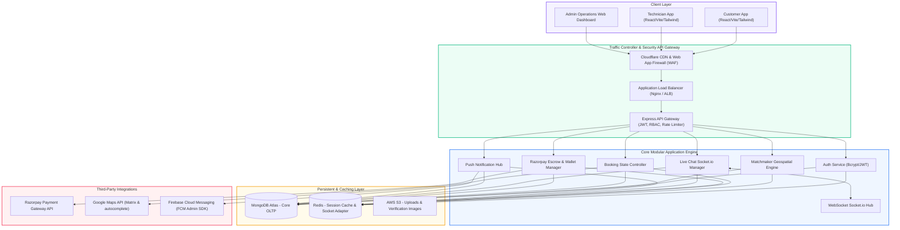
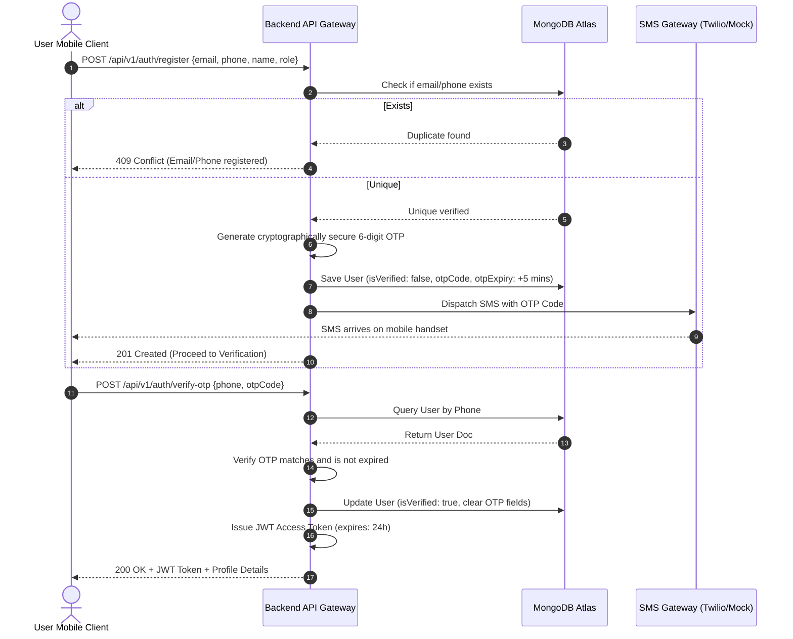
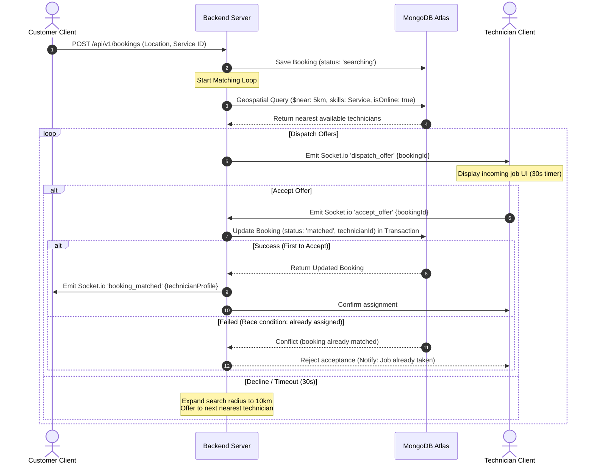
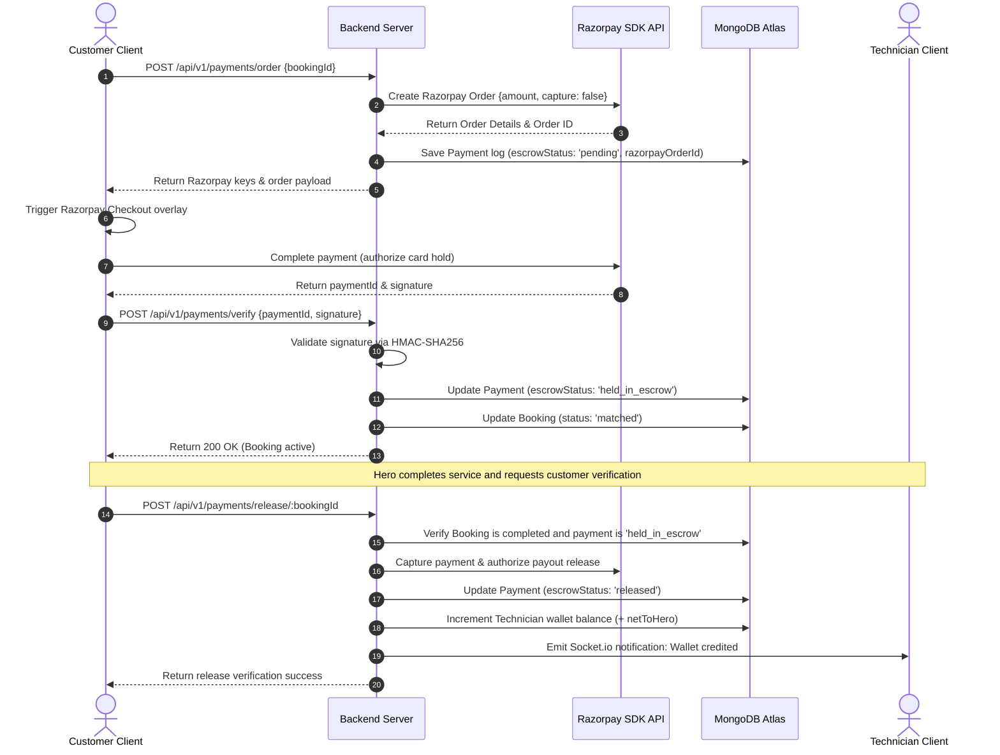
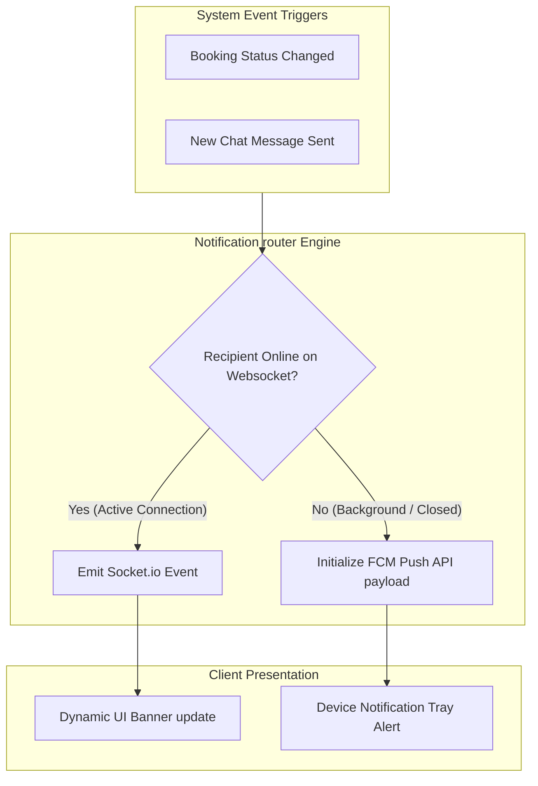
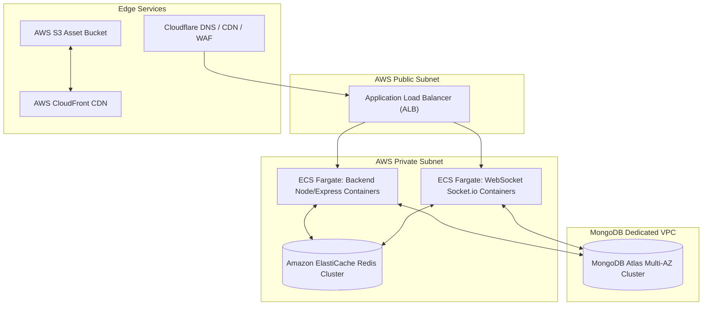

# HomeHero: Enterprise Software Architecture Specification
**Author:** Principal Software Architect (ex-Urban Company)  
**Version:** 1.3.0  
**Target Scale:** 1,000,000+ Active Users | 100,000+ Daily Bookings  
**Phase 1 Focus:** Electrician, Plumber, Carpenter, AC Repair

---

## 1. System Overview

HomeHero is an on-demand, hyperlocal marketplace connecting residential customers with skilled, verified technicians (Heroes). The platform manages the entire service lifecycle: upfront estimate calculations, real-time proximity matchmaking, live tracking, in-app messaging, secure escrow transactions via Razorpay, and customer-satisfaction ratings.

The platform is designed to solve three critical industry challenges:
* **The Geospatial Matching Problem**: Identifying and assigning the closest qualified, online technician within a dynamic 5-10km radius in under 30 seconds.
* **The Double-Booking/Race-Condition Problem**: Guaranteeing that only one technician can accept and be assigned to a dispatch order.
* **The Trust & Financial Integrity Problem**: Holding payment in escrow upon matching, verifying completion through customer checks, and releasing payments to technician wallets.

---

## 2. High-Level Architecture

The system uses a containerized, decoupled architecture to separate client applications, routing, core business logic, and transactional database layers.



---

## 3. Frontend Architecture

The frontend is a React 19 application built with Vite and Tailwind CSS. It is structured to handle customer bookings and technician operations efficiently.

```
┌────────────────────────────────────────────────────────┐
│               App.jsx Layout & Router                  │
└───────────────────────────┬────────────────────────────┘
                            ▼
┌────────────────────────────────────────────────────────┐
│                   Context Providers                    │
│   ┌────────────────────────────────────────────────┐   │
│   │  AuthContext.jsx  (JWT token memory, profile)  │   │
│   ├────────────────────────────────────────────────┤   │
│   │  SocketContext.jsx (Socket connections hook)   │   │
│   └────────────────────────────────────────────────┘   │
└───────────────────────────┬────────────────────────────┘
                            ▼
┌────────────────────────────────────────────────────────┐
│                    Route Gateways                      │
│   ┌────────────────────────────────────────────────┐   │
│   │  Protected Routes (Auth validations check)      │   │
│   ├────────────────────────────────────────────────┤   │
│   │  Role Guards (RBAC: Client / Hero / Admin)     │   │
│   └────────────────────────────────────────────────┘   │
└───────────────────────────┬────────────────────────────┘
                            ▼
┌───────────────────────────┼────────────────────────────┐
▼                           ▼                            ▼
┌──────────────────┐  ┌──────────────────┐  ┌──────────────────┐
│  Customer Views  │  │ Technician Views │  │   Admin Views    │
│ - Booking Canvas │  │ - Dispatch Screen│  │ - Vetting Queue  │
│ - Tracking Map   │  │ - Active Job Map │  │ - Pricing Config │
│ - Chat Panel     │  │ - Wallet Balance │  │ - SVG Charts     │
└──────────────────┘  └──────────────────┘  └──────────────────┘
```

### Key Technical Strategies
* **Dynamic Socket Hook**: Socket events are bound using React hooks. To prevent re-render loops and maintain React 19 compliance, WebSocket connections are initialized once and passed via context, rather than accessing `.current` directly during component renders.
* **Component Performance**: Views are decoupled into reusable components (e.g. `ChatPanel`, `Navbar`). Heavy maps and telemetry features are lazily loaded to minimize bundle sizes.

---

## 4. Backend Architecture

The backend consists of a Node.js and Express.js REST API server, supplemented by a Socket.io server for real-time bi-directional messaging.

```
                    ┌───────────────────────────────┐
                    │       HTTP/WS Request         │
                    └───────────────┬───────────────┘
                                    ▼
                    ┌───────────────────────────────┐
                    │      Cloudflare WAF / CDN     │
                    └───────────────┬───────────────┘
                                    ▼
                    ┌───────────────────────────────┐
                    │    Application Load Balancer  │
                    └───────────────┬───────────────┘
                                    ▼
                    ┌───────────────────────────────┐
                    │        API Gateway Router     │
                    │ - Helmet (Security Headers)   │
                    │ - Mongo Sanitize (NoSQL check)│
                    │ - Express Rate Limiter        │
                    └───────────────┬───────────────┘
                                    ▼
                    ┌───────────────────────────────┐
                    │     Authorization Filters     │
                    │ - protect (JWT Validate)      │
                    │ - authorize (Role-Based RBAC) │
                    └───────────────┬───────────────┘
                                    ▼
                    ┌───────────────────────────────┐
                    │       Controller Engine       │
                    └───────────────┬───────────────┘
                                    ▼
             ┌──────────────────────┴──────────────────────┐
             ▼                                             ▼
┌─────────────────────────┐                   ┌─────────────────────────┐
│     Business Domain     │                   │     WebSocket Hub       │
│ - Booking Engine        │                   │ - Socket.io Rooms       │
│ - Geospatial Matching   │                   │ - Real-time Chat        │
│ - Escrow & Wallet logic │                   │ - Live Location Updates │
└────────────┬────────────┘                   └────────────┬────────────┘
             │                                             │
             └──────────────────────┬──────────────────────┘
                                    ▼
                    ┌───────────────────────────────┐
                    │       Mongoose Schema         │
                    │  (Validation, Pool: 100 max)  │
                    └───────────────┬───────────────┘
                                    ▼
                    ┌───────────────────────────────┐
                    │      MongoDB Atlas Cluster    │
                    └───────────────────────────────┘
```

---

## 5. Database Architecture

HomeHero uses MongoDB Atlas as its primary datastore. The schema is designed to scale dynamically to 1 million users while maintaining transactional integrity.

### Collections Structure

```
[users] (OLTP Metadata)
 ├── _id: ObjectId
 ├── email: String (Unique)
 ├── phone: String (Unique)
 └── role: String ("customer" | "technician" | "admin")
      │
      └── (1:1 Relation via userId)
            ▼
[technicians] (GPS Telemetry & Vetting)
 ├── _id: ObjectId
 ├── userId: ObjectId (Ref: users)
 ├── skills: Array [String]
 ├── currentLocation: GeoJSON Point (2dsphere index)
 ├── isOnline: Boolean
 └── wallet: Object { balance: Decimal128 }
      │
      └── (1:Many Relation via technicianId)
            ▼
[bookings] (State Machine Engine)
 ├── _id: ObjectId
 ├── customerId: ObjectId (Ref: users)
 ├── technicianId: ObjectId (Ref: technicians, Nullable)
 ├── status: String ("searching" | "matched" | "en_route" | "active" | "completed")
 ├── billing: Object { totalAmount: Decimal128, netToHero: Decimal128 }
 ├── address: Object { geoPoint: GeoJSON Point }
 └── checklist: Array [ { task: String, completed: Boolean } ]
      │
      ├── (1:1 Relation via bookingId)
      │     ▼
      │ [payments] (Escrow ledger)
      │  ├── _id: ObjectId
      │  ├── razorpayOrderId: String (Unique)
      │  └── escrowStatus: String ("held_in_escrow" | "released" | "refunded")
      │
      ├── (1:Many Relation via bookingId)
      │     ▼
      │ [messages] (Chat History)
      │  ├── _id: ObjectId
      │  └── message: String
      │
      └── (1:1 Relation via bookingId)
            ▼
        [reviews] (Quality Check)
         ├── _id: ObjectId
         └── rating: Integer (1 - 5)
```

### Database Performance Rules
1. **Geospatial Processing**:
   * Index: `db.technicians.createIndex({ "currentLocation": "2dsphere" })`
   * Index: `db.technicians.createIndex({ "isOnline": 1, "skills": 1, "currentLocation": "2dsphere" })`
   * Purpose: Supports proximity matching queries in under 15ms.
2. **Dashboard Query Performance**:
   * Index: `db.bookings.createIndex({ "customerId": 1, "status": 1, "createdAt": -1 })`
   * Index: `db.bookings.createIndex({ "technicianId": 1, "status": 1, "createdAt": -1 })`
   * Purpose: Optimizes dashboard load times for customers and technicians.
3. **Data Retention Management**:
   * Index: `db.notifications.createIndex({ "createdAt": 1 }, { expireAfterSeconds: 2592000 })`
   * Purpose: Automatically prunes push notification logs after 30 days.

---

## 6. Authentication Flow

Authentication uses JWTs and OTP verification, removing the need for password entry on mobile devices.



---

## 7. Booking & Geospatial Dispatch Flow

This flow uses a dynamic geofencing strategy to match technicians and prevent race conditions.



---

## 8. Escrow Payment Flow

Holds customer funds securely during service delivery and manages payouts upon completion.



---

## 9. Notification Routing Flow

Integrates WebSockets and push notifications to maintain reliable communication across states.



---

## 10. Admin Operations Dashboard Architecture

The Admin Dashboard provides real-time visibility and control over platform operations.

```
┌────────────────────────────────────────────────────────┐
│             Admin Operations Portal                    │
├────────────────────────────────────────────────────────┤
│  ┌──────────────────────┐   ┌────────────────────────┐  │
│  │   Overview Panel     │   │     Vetting Panel      │  │
│  │ - Real-time analytics│   │ - Review technician    │  │
│  │ - Custom SVG charts  │   │   credentials          │  │
│  │   (commissions path) │   │ - Update status        │  │
│  │ - Category donut     │   │   (verify/deactivate)  │  │
│  └──────────────────────┘   └────────────────────────┘  │
│  ┌──────────────────────┐   ┌────────────────────────┐  │
│  │    Pricing Panel     │   │      Audits Panel      │  │
│  │ - Surge sliders      │   │ - Track transaction    │  │
│  │   (holiday/monsoon)  │   │   ledger status        │  │
│  │ - Surcharge settings │   │ - Active booking logs  │  │
│  └──────────────────────┘   └────────────────────────┘  │
└────────────────────────────────────────────────────────┘
```

* **Vetting Pipeline**: Ensures all technicians undergo verification before accepting jobs, maintaining platform service quality.
* **Pricing Engine**: Allows administrators to adjust pricing parameters dynamically to manage supply and demand.

---

## 11. Security Architecture

HomeHero implements security controls across all application layers:

* **Session Management**: Authentication uses short-lived JWT tokens (15-minute access, 7-day refresh) transmitted via secure, HTTP-only, `SameSite=Strict` cookies to mitigate Cross-Site Scripting (XSS) and CSRF risks.
* **Injection Prevention**: Input validations are enforced at the routing level. Request bodies are processed through `express-mongo-sanitize` to strip special characters (`$` and `.`), preventing NoSQL injection attempts.
* **Rate Limiting**: Integrated `express-rate-limit` middleware limits requests to 100 per 15 minutes per IP address to mitigate brute-force and Denial-of-Service (DoS) vectors.
* **Role-Based Access Control (RBAC)**: Middleware validates user roles (`customer`, `technician`, `admin`) on every route before executing database queries.

---

## 12. Scalability Strategy

As booking volume scales, the architecture is designed to scale horizontally across the web, socket, and database layers:

1. **WebSocket Scaling via Redis**: To support thousands of concurrent WebSocket connections, multiple Node.js socket instances are connected using the `socket.io-redis` adapter. This ensures event communication is shared across all app containers.
2. **MongoDB Sharded Zones**: Large collections like `bookings` are sharded using a key of `{ "address.city": 1, "createdAt": 1 }`. This partitions booking records by city, keeping query execution within local shards.
3. **Database Read Replicas**: Write-heavy matchmaking and location updates target the primary MongoDB node, while read-only dashboards, reviews, and transaction lookups query secondary replica sets to distribute the database load.

---

## 13. Deployment & CI/CD Architecture

HomeHero's deployment infrastructure is designed for high availability, zero-downtime deployments, and automated testing pipelines. The system is hosted on AWS in the `ap-south-1` (Mumbai) region to ensure low latency for Indian users.

### 13.1 Production Deployment Topology



### 13.2 CI/CD Pipeline
Every code integration to the repository follows an automated pipeline triggered by Git events (GitHub Actions):

```
  DEVELOPER PUSH ---> [GitHub Actions runner]
                             │
                             ├─► Run Linters (ESLint, Prettier)
                             ├─► Run Unit & Integration Tests (Jest)
                             │
                             ▼ (If Tests Pass)
                     [Build Docker Images]
                             │
                             ├─► Tag & Push to Amazon ECR (Elastic Container Registry)
                             │
                             ▼
                     [Update ECS Task Definition]
                             │
                             ▼
                     [ECS Fargate Rolling Update Deployment]
                             │
                             └─► Zero-Downtime Blue-Green Switch
```

### 13.3 Environment Configurations
*   **Development / Staging:** Local sandbox docker-compose environments mirroring production databases on MongoDB Atlas (Dev Cluster).
*   **Production:** Strict IaC (Infrastructure as Code) provisioning using Terraform to manage the AWS network topology, IAM policies, and Fargate scaling policies.

---

## 14. Project Folder Structure

```
homehero/
├── backend/
│   ├── src/
│   │   ├── config/             # DB settings, Socket.io hub, FCM Admin SDK
│   │   ├── controllers/        # Controllers (auth, bookings, payments, admin)
│   │   ├── middleware/         # JWT verify, RBAC authorize, error, rate limiters
│   │   ├── models/             # Mongoose Schemas (User, Technician, Booking, Payment, Review)
│   │   ├── routes/             # Route files (authRoutes, bookingRoutes, paymentRoutes)
│   │   └── utils/              # Helper utilities (surge calculators, OTP generators)
│   ├── index.js                # Express app bootstrapper
│   └── package.json            # Node backend dependencies
├── frontend/
│   ├── src/
│   │   ├── assets/             # Branding design resources
│   │   ├── components/         # Reusable UI (ChatPanel, Navbar, SVG graphs)
│   │   ├── context/            # Global React States (AuthContext, SocketContext)
│   │   ├── pages/              # Router views (TrackingPage, AdminDashboardPage)
│   │   ├── services/           # Axios HTTP Client service layers (api.js)
│   │   ├── App.jsx             # Main Router structure & workspace toggles
│   │   └── main.jsx            # React 19 bootstrap mount
│   ├── vite.config.js          # Vite configuration
│   └── package.json            # Frontend dependency specifications
└── docs/                       # Project system architecture documents
```

---

## 15. Third-Party Integrations

| Integration Service | Platform Module | Purpose |
| :--- | :--- | :--- |
| **Razorpay SDK** | Payments Module | Handles secure customer transactions, escrow card holds, and direct technician payouts. |
| **Google Maps Matrix API** | Booking & Matching | Provides address autocomplete and calculates travel times and routes for technician dispatch. |
| **Firebase FCM Admin SDK**| Notifications Module | Delivers push notifications to devices when client applications are in the background or offline. |
| **AWS S3 / GCS** | User & Vetting | Stores static media assets, technician background documents, and repair check-in photos. |

---

## 16. Future AI Architecture

Integrating AI will allow HomeHero to optimize matching efficiency and quality control as transaction volumes increase:

```
┌────────────────────────┐     ┌────────────────────────┐     ┌────────────────────────┐
│  Real-Time Pricing     │     │   Predictive Matching  │     │   Visual Quality Audit │
│                        │     │                        │     │                        │
│ - Supply/Demand ratio  │     │ - Acceptance histories │     │ - Job completion photos│
│ - Weather conditions   │────>│ - Proximity vectors    │────>│ - Computer Vision check│
│ - Local traffic grids  │     │ - Average response times│    │   (leakage/wiring verify)│
│                        │     │                        │     │                        │
└────────────────────────┘     └────────────────────────┘     └────────────────────────┘
```

1. **AI-Driven Dynamic Pricing**: Analyzes weather data, local traffic, and active supply-demand ratios to adjust surge pricing coefficients dynamically.
2. **Predictive Dispatch Logic**: Predicts technician response probability using historical job acceptance rates, rating scores, and average travel speeds.
3. **Computer Vision Verification**: Automatically reviews repair check-in photos uploaded by technicians to verify job completion before releasing escrow funds.
