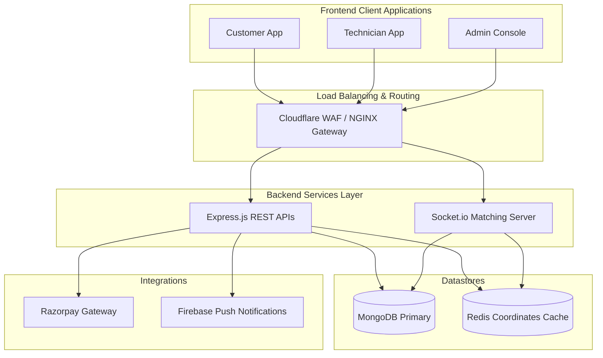
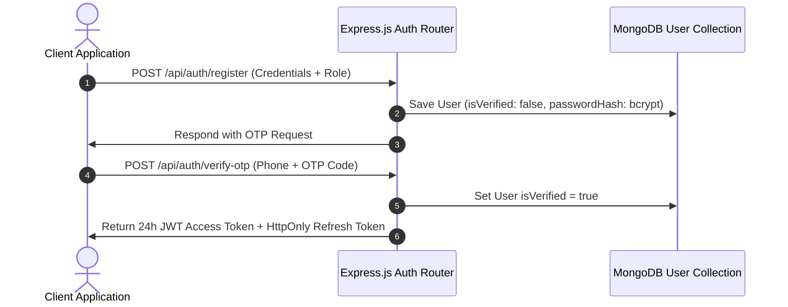
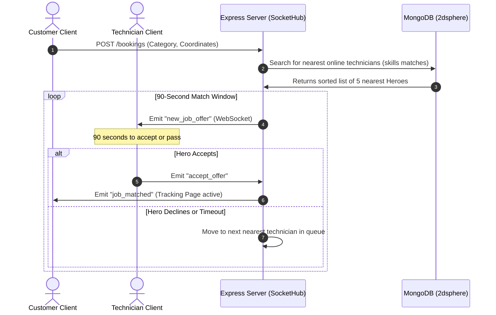

# System Architecture Document: HomeHero

**Author:** Principal Software Architect, HomeHero Technologies Pvt. Ltd.  
**Version:** 1.0.0  
**Date:** June 26, 2026  

---

## 1. High-Level Architecture Overview
HomeHero employs a decoupled client-server architecture designed to handle real-time geospatial matches and secure payments at scale. The platform uses a React SPA frontend, a Node.js/Express backend API gateway, and MongoDB with geospatial indexing.



---

## 2. Frontend Architecture
The frontend is constructed as a React Single Page Application (SPA) compiled via Vite, ensuring fast hot module replacement and small bundles.

*   **State Management:** Built on top of React Context APIs (`AuthContext` for credentials, `SocketContext` for active WebSocket lifecycles).
*   **Networking Layer:** Uses Axios with global interceptors to attach bearer JWT tokens to every outgoing request and auto-refresh expired sessions.
*   **Map Integrations:** Implements Google Maps JS APIs for client location geocoding, autocomplete search, and real-time technician route tracking.

---

## 3. Backend Architecture
The backend is a Node.js monolith structured for eventual microservices separation, leveraging Express.js for REST endpoints and Socket.io for WebSocket handshakes.

*   **REST Gateways:** Modular routers handling auth, user profiles, technicians matching parameters, booking cycles, and payment webhooks.
*   **Geospatial matching Loop:** An event-driven service that queries MongoDB using `$near` filters to find online technicians and broadcasts job offers via Socket.io rooms.
*   **Task Checklists Engine:** Verification logic that audits file uploads and saves completion photos to secure object storage.

---

## 4. Database Architecture
The primary database is MongoDB, chosen for its native support for GeoJSON geospatial operations.

### Data Models & Schemas:
1.  **User Model:** Holds authentication credentials (`email`, `phone`, `passwordHash`), role guards (`customer`, `provider`, `admin`), and saved addresses arrays.
2.  **Technician Model:** Maps to `userId`, contains skills arrays, wallet details (balance ledger), ratings averages, and telemetry points:
    ```javascript
    location: {
      type: { type: String, default: 'Point' },
      coordinates: { type: [Number], index: '2dsphere' } // [lng, lat]
    }
    ```
3.  **Booking Model:** Tracks job states (`searching`, `matched`, `en_route`, `active`, `completed`, `cancelled`), booking codes, task checklists, and billing objects.
4.  **Payment Model:** Secure transaction ledger mapping Razorpay Order IDs to payment verification statuses and escrow states (`held_in_escrow`, `released`, `refunded`).
5.  **Setting Model:** Simple key-value store managing dynamic pricing surge parameters system-wide.

---

## 5. Authentication Flow (OTP & JWT)



---

## 6. Geospatial Booking & Matching Flow



---

## 7. Payments & Escrow Payout Flow
HomeHero guarantees secure transactions using an upfront payment authorization model:

1.  **Authorization:** When a booking is created, the client pays the estimate via Razorpay.
2.  **Hold:** The webhook verifies the payment signature, updates the booking status to `matched`, and logs the funds as `held_in_escrow`.
3.  **Completion Verification:** Upon arrival and completion of the pre/post work checklists, the customer verifies the work.
4.  **Release:** The server releases the escrow hold: credits 85% of the total to the technician’s wallet balance, records 15% platform commission revenue, and issues the invoice.
5.  **Withdrawal:** The technician can trigger a payout to transfer their wallet balance to their bank account via UPI.

---

## 8. Security Design
*   **Transport Layer:** Strict HTTPS enforcement with TLS 1.3 across all client-server handshakes.
*   **API Security:** CORS policies restricting cross-origin requests to trusted client subdomains. Inputs are sanitized using express-validator to prevent SQL/NoSQL injections.
*   **Database Security:** MongoDB collection validation, IP-restricted clusters, and encrypted environment variables for credentials.

---

## 9. Deployment Architecture
*   **Containerization:** Multi-stage Dockerfiles compiling React into an NGINX container and packaging Express APIs for Node production runtimes.
*   **Cluster Scale:** Express services are orchestrated using PM2 cluster mode to utilize all available vCPU cores, running behind NGINX reverse proxies.
*   **CDN & Firewall:** Cloudflare acts as the DNS gateway, caching static client assets, handling SSL termination, and mitigating DDoS attacks.
