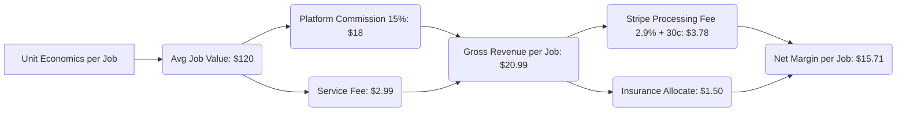

# HomeHero - Business Model & Monetization Strategy

## 1. Business Model Overview
HomeHero operates as a **dual-sided marketplace** that connects homeowners and renters seeking household services with skilled, verified local service professionals ("Heroes"). Our core business model is built around transactional commissions (take-rates), convenience fees, and a value-added subscription service for recurring home maintenance.

---

## 2. Business Model Canvas (BMC)

| **Key Partners** | **Key Activities** | **Value Propositions** | **Customer Relationships** | **Customer Segments** |
| :--- | :--- | :--- | :--- | :--- |
| • Background check vendors (e.g., Checkr) • Payment gateways (e.g., Stripe) • Liability insurance providers • Local hardware stores & suppliers | • Platform software dev & maintenance • Professional vetting & onboarding • Customer & provider support • Targeted regional marketing | **For Customers:** • Trusted, background-checked pros • Upfront, transparent pricing • Exact scheduling & real-time tracking **For Heroes:** • Zero-cost lead generation • Instant payout & prompt invoicing • Route optimization & scheduling tools | • Automated app-based support • Resolution management system • Rating & review feedback loop • Subscription program benefits | **Customers:** • Busy urban professionals • Independent active seniors • Property managers & landlords **Heroes:** • Freelance handymen & cleaners • Specialized trade workers (electrical, plumbing) |
| | **Key Resources** | | **Channels** | |
| | • Matching algorithms & mobile apps • Brand reputation & community trust • Qualified database of Heroes | | • iOS & Android Mobile Apps • Desktop Web Portal • Hyper-local SEO & Social Media • Referral programs | |

| **Cost Structure** | **Revenue Streams** |
| :--- | :--- |
| • **R&D / Engineering:** App development, hosting, and maps API integration. • **Operations:** Insurance premiums, background checks, and client support. • **Sales & Marketing:** Customer acquisition cost (CAC) and provider onboarding bonuses. | • **Commission:** 15% - 20% commission on all completed services. • **Service Fees:** $2.99 platform convenience fee per booking. • **Hero+ Subscription:** $14.99/month recurring membership fee. • **Premium Placements:** Paid listing booster fees for service providers. |

---

## 3. Revenue Streams (Detailed Breakdown)

### 3.1 Transactional Commission (The Take Rate)
Every time a transaction is completed on the platform, HomeHero retains a percentage fee:
*   **Standard Services (Cleaning, Lawn Care):** 15% commission.
*   **Skilled Trades (Electrical, Plumbing, HVAC):** 20% commission (justified by higher order value and technical complexity).

### 3.2 Platform Service Fee
A flat **$2.99 service fee** is added to every booking transaction to cover payment processing fees, Stripe integration costs, and transactional SMS/email delivery via Twilio.

### 3.3 Hero+ Subscription (SaaS & Recurring Revenue)
To stabilize cash flow and incentivize customer loyalty, we offer the **Hero+ membership** at **$14.99/month** (or **$119/year**):
*   **Benefits:**
    *   $0 service fees on all bookings.
    *   10% flat discount on all hourly service rates.
    *   1 free comprehensive annual home inspection (covering plumbing, electrical, and smoke alarms).
*   **Strategic Purpose:** Increases user retention and frequency of platform use.

### 3.4 Hero Promotion & Boost Fees
Service providers who want to expand their reach can pay a daily or weekly fee to be highlighted at the top of search results in their service category (similar to sponsored listings on Amazon or Yelp).

---

## 4. Key Metrics & Unit Economics

### 4.1 Target Customer Unit Economics
*   **Customer Acquisition Cost (CAC Target):** $45.00 (via hyper-local search ads and referral incentives).
*   **Average Order Value (AOV):** $120.00.
*   **Average Jobs per Customer / Year:** 4.2 bookings.
*   **Annual Customer Revenue (Gross Margin):** $15.71 net margin × 4.2 = $65.98.
*   **Payback Period:** ~8.2 months.
*   **Target Lifetime Value (LTV):** $200.00 (based on a 3-year average retention).
*   **LTV : CAC Ratio:** **4.4x** (ideal target range for venture sustainability).

---

## 5. Cost Structure & Operational Leverage

1.  **Variable Costs (Scales with Volume):**
    *   **Payment Gateway Charges:** Stripe charges 2.9% + $0.30 per charge.
    *   **Background Checks:** $15 per Hero verification.
    *   **Insurance Liability Pool:** Set aside $1.50 per job toward our corporate general liability safety net.
2.  **Fixed/Semi-Fixed Costs (Leverage Opportunities):**
    *   **Platform Cloud Infrastructure:** AWS hosting, databases, and geographic APIs (Google Maps Platform).
    *   **Customer Support & Ops:** Centralized support team handling disputes, matching issues, and Hero validation.
