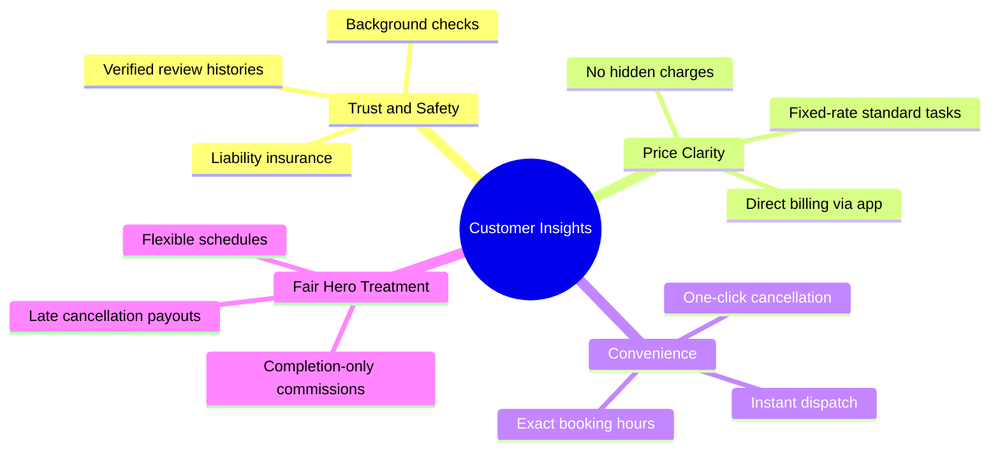

# HomeHero - Customer Interviews & Research Report

## 1. Research Overview & Methodology
To design a user-centric experience for **HomeHero**, we conducted a series of semi-structured interviews with target stakeholders. Our goal was to uncover key behaviors, frustrations, and expectations from both sides of the marketplace: **Homeowners/Renters (Customers)** and **Local Service Professionals (Heroes)**.

*   **Sample Size:** 8 participants (5 Customers, 3 Service Providers)
*   **Methodology:** 30-minute virtual interviews and contextual inquiries.
*   **Target Demographics:** Urban/suburban areas, ages 25–75.

---

## 2. Customer Interview Summaries (End Users)

### Interview 1: Sarah (34) — Busy Product Manager & Renting Tenant
*   **Context:** Lives in a high-rise downtown apartment. Has a small dog and works 50+ hours a week.
*   **Core Needs:** Needs quick, reliable, and hands-off help for deep cleaning, shelving installation, and minor plumbing.
*   **Key Quotes:**
    > *"I don't have the time to spend two hours calling plumbers during the workday. I just want someone who is qualified to show up when they say they will."*
*   **Pain Points:**
    *   **Scheduling Friction:** Frustrated by providers who only offer vague 4-hour window options (e.g., "between 12 PM and 4 PM").
    *   **Trust:** Anxious about letting strangers into her apartment, especially when she is home alone.
*   **HomeHero Takeaway:** Implement **precise booking slots** (within 1 hour) and display **verified background checks and client ratings** prominently in the Hero's profile.

### Interview 2: Rajesh (42) — Working Parent & Homeowner
*   **Context:** Recently bought a 4-bedroom suburban home. Balancing family life, kid activities, and home maintenance.
*   **Core Needs:** Requires periodic lawn care, electrical fixture installations, and gutter cleaning.
*   **Key Quotes:**
    > *"Every time I search online for a service, I get hit with five different follow-up phone calls from agencies trying to upsell me. I just want to see a price and click book."*
*   **Pain Points:**
    *   **Hidden Fees:** Dislikes "estimate-first" structures where the final bill is significantly higher than the initial guess.
    *   **Spam:** Tired of listing sites selling his contact details to third-party contractors.
*   **HomeHero Takeaway:** enforce an **upfront, flat-rate pricing builder** for standard tasks and protect user data from external lead-buyers.

### Interview 3: Evelyn (71) — Retired Independent Homeowner
*   **Context:** Lives alone in her suburban home. Loves gardening but struggles with heavy lifting and high-reach tasks (e.g., light bulb replacement, air filter changes).
*   **Core Needs:** Trustworthy help for recurring household maintenance tasks.
*   **Key Quotes:**
    > *"Sometimes I just need someone to help me shift furniture or change the high-up smoke detector battery. I have trouble with apps that have tiny fonts and too many steps."*
*   **Pain Points:**
    *   **Accessibility:** Finds modern app interfaces confusing, cluttered, and difficult to read.
    *   **Comfort with Technology:** Prefers voice confirmations or simple confirmations over complex chat systems.
*   **HomeHero Takeaway:** Design a **clean, high-contrast, simplified UI** option and consider integrating a voice-to-text or customer support fallback.

---

## 3. Service Provider Interview Summaries (Heroes)

### Interview 4: Marcus (29) — Freelance Carpenter & Handyman
*   **Context:** Has 5 years of carpentry experience. Operates an independent handyman business but struggles to find clients during winter months.
*   **Core Needs:** A consistent stream of local jobs without paying exorbitant marketing fees.
*   **Key Quotes:**
    > *"On Thumbtack, I get charged $25 just because someone clicked 'request quote', even if they never reply to me. It eats up all my profit."*
*   **Pain Points:**
    *   **Pay-per-Lead Models:** Paying for leads that do not convert to real jobs is highly discouraging.
    *   **Payment Delays:** Waiting weeks for clients to pay invoices.
*   **HomeHero Takeaway:** Shift to a **take-rate/commission model** (only charge when a job is successfully completed and paid) and offer **instant payout options** for completed work.

### Interview 5: Priya (38) — Residential Cleaning Professional
*   **Context:** Runs a small cleaning business with one partner. Wants to expand her customer base.
*   **Core Needs:** Safe working environments, optimized routes, and clear cancellation policies.
*   **Key Quotes:**
    > *"Last week, I drove 40 minutes for a deep clean only to find the client had forgotten and wasn't home. I lost a whole day's work and got nothing for it."*
*   **Pain Points:**
    *   **Last-Minute Cancellations:** No protection when customers cancel right before the service time.
    *   **Route Planning:** Wasting time and fuel driving back and forth across town between appointments.
*   **HomeHero Takeaway:** Enforce a **24-hour cancellation fee** and integrate **geographic route optimization** to help Heroes take jobs within close proximity.

---

## 4. Synthesis & Key Themes

---

## 5. Strategic Product Recommendations

1.  **Safety First ("SecureHero Badge"):**
    Display a badge on provider profiles showing they have passed criminal background checks, identity verification, and are covered under HomeHero's general liability insurance policy.
2.  **Upfront Estimator:**
    Implement a visual builder for services. For example, for cleaning: input the number of bedrooms, bathrooms, and select options like "Deep Clean" or "Pet Friendly" to see a guaranteed price instantly.
3.  **Hero Protection Program:**
    Charge a 50% cancellation fee for bookings cancelled within 12 hours of the scheduled time, passing 80% of this fee directly to the scheduled Hero to compensate for their time.
4.  **Route Matcher:**
    Allow Heroes to set their active "working radius" on a map. Recommend jobs that are within a 15-minute drive of their current location or their last scheduled job of the day.
