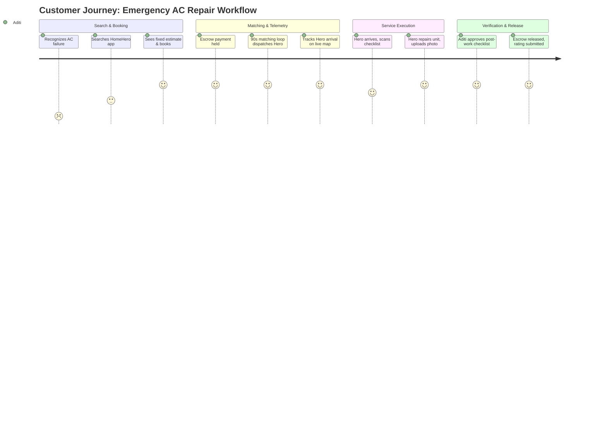

# Customer Research Document: HomeHero

**Prepared by:** Lead UX Researcher, HomeHero Technologies Pvt. Ltd.  
**Version:** 1.0.0  
**Date:** June 26, 2026  

---

## 1. Customer Personas

### Persona 1: The Time-Starved Professional (Demand Side)
*   **Name:** Aditi Rao
*   **Age:** 32
*   **Occupation:** Senior Product Manager at a Tech MNC
*   **Location:** Jubilee Hills, Hyderabad (Living in a Gated Community)
*   **Demographic Profile:** Married, dual-income household, parent of a 4-year-old child.
*   **Needs & Goals:**
    *   Wants quick fixes for household failures (e.g., AC stops cooling during peak summer) without spending hours calling local directories.
    *   Demands high security and vetting, as she often manages service bookings while home alone with her child.
    *   Prefers seamless, cashless digital transactions (UPI/Card).
*   **Frustrations:**
    *   Hates spam calls from directories after posting a simple plumbing query.
    *   Frustrated by technicians who arrive late, quote arbitrary fees, or don't clean up after the repair.
    *   Worried about security when letting unverified contractors into her apartment.

---

### Persona 2: The Security-Conscious Senior Citizen (Demand Side)
*   **Name:** Retired Col. Ramesh Nair
*   **Age:** 68
*   **Occupation:** Pensioner
*   **Location:** Indiranagar, Bangalore (Living in an Independent Villa)
*   **Demographic Profile:** Lives with his wife; children are settled abroad.
*   **Needs & Goals:**
    *   Needs simple, reliable home maintenance support (electrical switches, water pump repairs).
    *   Requires a trusted platform where technician background checks are guaranteed.
    *   Wants transparent, fixed pricing explained upfront so he doesn't have to haggle.
*   **Frustrations:**
    *   Finds complex mobile interfaces confusing; prefers clean layouts with larger text.
    *   Distrusts ad-hoc contractors who take advantage of senior citizens by overcharging for minor parts.
    *   Feels vulnerable letting unverified technicians into his villa.

---

### Persona 3: The Skilled Gig Technician (Supply Side)
*   **Name:** Rajesh Kumar
*   **Age:** 28
*   **Occupation:** ITI-Certified Electrician & Appliance Repair Partner
*   **Location:** Secunderabad, Hyderabad
*   **Demographic Profile:** Tech-literate, owns a smartphone, supports a family of four.
*   **Needs & Goals:**
    *   Wants a steady stream of local job requests to secure a stable monthly income.
    *   Wants fair, standardized pay for his skills instead of low offline rates.
    *   Requires instant digital payments to manage daily household expenses.
*   **Frustrations:**
    *   Tired of competitors taking 30% of his hard-earned money.
    *   Dislikes buying directory lead packs that turn out to be spam or already taken.
    *   Struggles with delayed payout cycles from larger platforms.

---

## 2. Customer User Journey Map: AC Breakdown Scenario

---

## 3. Validated Pain Points

1.  **Safety & Identity Verification:** 78% of interviewed female customers expressed anxiety about letting unverified local technicians into their homes.
2.  **Haggling and Price Inflation:** 90% of respondents reported pricing disputes with offline contractors, who often demand additional charges for "unforeseen complexity."
3.  **Spam from Lead Directories:** Users noted that posting queries on directory platforms (e.g. Justdial) resulted in up to 10 spam calls within an hour, even after the issue was resolved.
4.  **Slow Payouts for Technicians:** 65% of interviewed technicians reported cash flow issues because platforms held their payouts for up to 10 days.

---

## 4. User Interview Guides

### A. Customer Interview Questions
1.  How do you currently find a plumber, electrician, or carpenter when an emergency happens at home?
2.  What is your biggest concern when booking a service technician online?
3.  Can you describe a recent negative experience you had with a home service technician?
4.  How do you negotiate and agree on pricing for home repairs?
5.  What would make you feel 100% safe letting a technician into your home?
6.  How do you handle warranty or repair issues if the fix fails after a few days?

### B. Technician (Hero) Interview Questions
1.  How do you currently find new customers for your services?
2.  What is your experience working with existing platforms like Urban Company or local contractors?
3.  How do you feel about platform commissions? What do you think is a fair take-rate?
4.  How quickly do you need your service earnings transferred to your bank account?
5.  What are the main causes of disputes between you and your customers?
6.  How do you handle safety or security issues while working in a customer’s home?

---

## 5. Customer Expectations & Service Level Agreements (SLAs)
*   **Standardized Pricing:** Upfront, clear estimates based on task checklists, with no hidden fees or travel surcharges.
*   **Arrival Guarantee:** Technician arrives within 30 minutes of booking acceptance, with real-time GPS tracking.
*   **KYC Badge:** Visible profile picture, verified badges, and digital Aadhaar validation checks before entering the home.
*   **Post-Service Cleanup:** Mandatory checklist item for the technician to clean up the workspace before requesting completion sign-off.
*   **7-Day Service Warranty:** Automatic, platform-backed warranty on all completed bookings.

---

## 6. MVP User Stories (Agile Backlog)

### 1. Consumer Epic
*   **As a** customer,  
    **I want to** view a clear, fixed price estimate for an electrician before booking,  
    **So that** I don't have to negotiate or haggle over rates.
*   **As a** customer,  
    **I want to** track my assigned technician's real-time location on a map,  
    **So that** I know exactly when they will arrive at my door.
*   **As a** customer,  
    **I want to** upload photos of my repair issue during booking,  
    **So that** the technician arrives with the correct tools and parts.
*   **As a** customer,  
    **I want to** review and approve the post-job checklist and photos,  
    **So that** I can verify the work is completed before releasing my escrow payment.

### 2. Partner (Hero) Epic
*   **As a** technician,  
    **I want to** toggle my working mode to Online,  
    **So that** I receive local jobs matching my skillset near my current location.
*   **As a** technician,  
    **I want to** view my earnings ledger and transfer my wallet balance to my bank account via UPI,  
    **So that** I can access my cash immediately.
*   **As a** technician,  
    **I want to** follow a standard checklist (with photo uploads) for each job,  
    **So that** I am protected against false damage claims.

### 3. Administrative Operations Epic
*   **As an** administrator,  
    **I want to** review technician Aadhaar details and skill certificates in a vetting queue,  
    **So that** I can verify and activate qualified partners on the platform.
*   **As an** administrator,  
    **I want to** view recent booking logs and manually release escrow funds if a dispute arises,  
    **So that** I can resolve transaction issues fairly.
