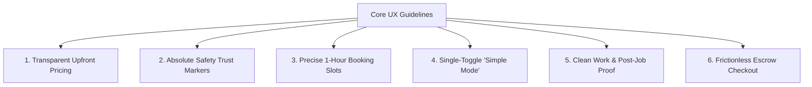

# HomeHero - Customer & User Experience (UX) Research Document
**Prepared by:** Lead UX Researcher & Product Designer  
**Date:** June 26, 2026  
**Project:** HomeHero Hyperlocal Services Platform (India)  
**Status:** Approved for Design & Engineering Hand-off  

---

## 1. Executive Summary
This document outlines the user research findings, personas, and journey mappings for HomeHero. Our goal is to translate raw customer insights and operational frustrations into concrete, actionable product designs. By understanding the distinct needs of the middle-class family, the independent senior citizen, the migrant tenant, and the trade professional, we establish a robust user experience (UX) framework.

---

## 2. Customer Personas

### 2.1 Customer Persona 1: Priya Sharma (34) — The Overwhelmed Urban Manager
*   **Segment:** Double-Income-No-Kids (DINKs) / Nuclear Family Parent  
*   **Location:** Gachibowli, Hyderabad (Tier-1 Tech Hub)  
*   **Profession:** Engineering Manager at a tech company  
*   **Income Bracket:** ₹15L - ₹25L per annum  

```
+-----------------------------------------------------------------------------------+
| PRIYA SHARMA (34) | "Time is my most valuable asset. I cannot spend half my day   |
|                      waiting for a repairman who might not show up."              |
+-----------------------------------------------------------------------------------+
| Demographics: Married, 1 child (5), living in a high-rise gated society.          |
| Tech Literacy: High. Daily user of quick-commerce, ride-hailing, and UPI apps.   |
| Core Motivation: Keep the home running smoothly with minimal manual coordination. |
+-----------------------------------------------------------------------------------+
```

#### Bio & Behavioral Profile
Priya works 50+ hours a week and manages a household. She is highly dependent on convenience services (grocery delivery, maid agencies). When household appliances break down, she is responsible for coordinating the repairs. She values cleanliness, safety, and precise scheduling above all else.

#### Daily Problems & Scenarios
*   **The Broken AC Crisis:** On a hot Tuesday morning, her guest bedroom AC stops cooling. She has back-to-back work meetings. She wants to book a technician who can arrive exactly during her lunch break (1:00 PM - 2:00 PM) rather than giving a vague "afternoon" window.
*   **Uncertified Material Anxiety:** A local plumber replaces a kitchen sink valve but uses a cheap plastic washer that bursts two days later, ruining her modular cabinets.

#### Pain Points
*   **Unreliable SLA Windows:** Standard aggregators or local vendors offer wide, 4-hour arrival windows, forcing her to stay home and miss work meetings.
*   **Messy Work Cleanups:** Technicians leaving wet floors, drywall dust, and packaging debris behind.
*   **Coordination Overhead:** Spending hours chatting on WhatsApp or calling multiple numbers to confirm a single repair.

#### Customer Expectations
*   **1-Hour Guaranteed Arrival:** Knowing exactly when the technician will tap the doorbell.
*   **Certified Spares & Warranty:** An explicit, digital guarantee on parts replaced.
*   **Cleanliness Guarantee:** Technicians carrying protective mats and cleaning up after themselves.

---

### 2.2 Customer Persona 2: Rajesh Nair (68) — The Independent Retired Officer
*   **Segment:** Senior Citizens / Living Independently  
*   **Location:** Malviya Nagar, Jaipur (Tier-2 Resident District)  
*   **Profession:** Retired Class-1 State Government Officer  
*   **Income Bracket:** Pension-driven, ₹6L - ₹8L per annum  

```
+-----------------------------------------------------------------------------------+
| RAJESH NAIR (68)  | "I want to feel safe opening my door, and I don't want to     |
|                      struggle with tiny buttons on my phone to get a bulb fixed." |
+-----------------------------------------------------------------------------------+
| Demographics: Widowed, children living in the United States and Bengaluru.        |
| Tech Literacy: Medium. Uses WhatsApp for family video calls and basic UPI apps.   |
| Core Motivation: Maintain independence and safety in his ancestral home.          |
+-----------------------------------------------------------------------------------+
```

#### Bio & Behavioral Profile
Rajesh lives alone in a large independent house. He suffers from minor arthritis and can no longer climb ladders to change bulbs, clean overhead fans, or fix rooftop water tanks. He is highly safety-conscious and is wary of letting unknown people into his home. He is easily frustrated by apps with complex navigation, small text, and multiple pop-ups.

#### Daily Problems & Scenarios
*   **The Flickering Tube Light:** A light in his hallway begins flickering. He needs someone to climb a 10-foot ladder to replace it. He is hesitant to ask neighbors and doesn't know a reliable electrician.
*   **Pricing Exploitation:** A passing handyman charges him ₹500 for a 5-minute task because he knows Rajesh cannot climb to check the work.

#### Pain Points
*   **Physical Safety Fears:** Fear of theft, harassment, or burglary from unverified service providers.
*   **Inaccessible UI Design:** Small fonts, low-contrast buttons, and complex checkout funnels that make independent booking impossible.
*   **Exploitative Dynamic Pricing:** Being overcharged due to perceived vulnerability.

#### Customer Expectations
*   **Verified Background Badges:** Seeing the government ID and criminal clearance of the technician on screen.
*   **Accessibility Mode:** A one-click toggle for large fonts, simple flows, and voice-guided support.
*   **Respect and Courtesy:** Polite, professional behavior from technicians who explain what they are doing.

---

### 2.3 Customer Persona 3: Aarav Mehta (24) — The Gig-Economy Tenant
*   **Segment:** Young Migrants / Rental Tenants  
*   **Location:** Andheri West, Mumbai (High-density rental corridor)  
*   **Profession:** UX Designer at a fintech startup  
*   **Income Bracket:** ₹8L - ₹12L per annum  

```
+-----------------------------------------------------------------------------------+
| AARAV MEHTA (24)  | "I just want a quick, cheap fix for my leaking bathroom tap   |
|                      before my landlord spots it during inspection next week."    |
+-----------------------------------------------------------------------------------+
| Demographics: Bachelor, sharing a 2BHK flat with two flatmates.                   |
| Tech Literacy: Advanced. Adopts new mobile apps instantly.                        |
| Core Motivation: Quick fix of rental damage without spending a fortune.           |
+-----------------------------------------------------------------------------------+
```

#### Bio & Behavioral Profile
Aarav recently moved to Mumbai for work. His rented apartment has aging fittings that break down regularly. He is highly budget-conscious and shares all house expenses with his flatmates. He wants instant invoicing so he can split bills with roommates.

#### Daily Problems & Scenarios
*   **The Leaking Tap Conflict:** The bathroom tap develops a persistent drip. His landlord insists that minor repairs are the tenant's responsibility. Aarav needs a plumber but doesn't want to pay a heavy diagnostic fee just to get an estimate.
*   **Expense Splitting:** Needs a formal digital receipt to split the plumbing costs with his two roommates on Splitwise.

#### Pain Points
*   **Minimum Call-Out Charges:** Being forced to pay high flat fees for very minor, 5-minute fixes.
*   **Lack of Digital Invoicing:** Getting hand-written chits that his flatmates or landlord refuse to accept as proof of expenditure.
*   **Haggling with Local Vendors:** Dislikes having to negotiate with local plumbers who change rates arbitrarily.

#### Customer Expectations
*   **Transparent Flat Rates:** Knowing the exact diagnostic and labor fee before the booking is confirmed.
*   **Shareable Digital Receipts:** Getting a PDF invoice with GST and service details sent directly to WhatsApp/Email.
*   **Fast Response:** Booking a technician within an hour to resolve urgent issues.

---

## 3. User Journey Mapping
The following User Journey Map details Priya Sharma's experience when booking a plumbing repair for a leaking kitchen faucet.

| Phase | 1. Trigger & Discovery | 2. Search & Evaluation | 3. Booking & Scheduling | 4. Service Execution | 5. Closeout & Feedback |
| :--- | :--- | :--- | :--- | :--- | :--- |
| **User Action** | • Notices water pooling under the kitchen sink.<br>• Realizes she has a busy workday ahead. | • Tries to find local plumber numbers.<br>• Checks WhatsApp group recommendations.<br>• Opens HomeHero app. | • Selects "Kitchen Leak Repair".<br>• Reviews upfront price estimate.<br>• Selects 1 PM slot.<br>• Pays via UPI. | • Hero arrives at 1 PM.<br>• Hero takes "before" photo.<br>• Performs repair.<br>• Cleans up. | • Hero uploads "after" photo.<br>• Priya verifies work.<br>• Approves escrow release.<br>• Leaves a 5-star review. |
| **Thoughts & Emotions** | *Anxious, annoyed.* "This leak will ruin the wood. I have no time to deal with this today." | *Overwhelmed.* "Everyone has different rates. Who can I trust in my home?" | *Relieved.* "₹350 flat rate. 1:00 PM slot is perfect. No phone calls required." | *Comfortable.* "Technician has an ID badge. He is wearing shoe covers. No mess." | *Satisfied.* "The wood is safe. Payout was simple. Receipt is on my email." |
| **Pain Points** | • Sudden disruption of schedule.<br>• Potential damage to property. | • Long call wait times.<br>• Directory spam calls.<br>• No upfront pricing. | • Rigid booking slots.<br>• Unsecure payment options.<br>• Complex checkout flows. | • Late arrival.<br>• Messy workspace.<br>• Lack of proper tools.<br>• Safety anxiety. | • Difficulties in getting invoices.<br>• Hidden fees added post-work.<br>• Failed payments. |
| **HomeHero UX Solution** | • Easy-to-use search bar on HomeHero home screen. | • Clear, itemized catalog pricing (No estimate haggling). | • 1-Hour guaranteed slots.<br>• Secure Razorpay UPI escrow integration. | • Live GPS map tracking.<br>• Mandatory verification badge.<br>• Shoe covers/cleanup toolkit. | • Single-click escrow release.<br>• Automatic PDF invoice via WhatsApp.<br>• In-app feedback form. |

---

## 4. User Research Interview Questions (Scripts)

### 4.1 Questions for Customers (End-Users)
To refine our consumer experience, researchers will use this interview script during user testing cohorts:

1.  **Warm-up:** "How do you currently handle home repairs (electrical, plumbing, cleaning) when they arise? Walk me through the last time something broke in your house."
2.  **Search & Booking:** "How did you find the technician for that repair? How did you agree on the price? How long did you have to wait for them to arrive?"
3.  **Trust & Safety:** "What are your main concerns when letting a service provider into your home? What makes you feel safe or unsafe during a home visit?"
4.  **Pricing & Payments:** "Have you ever felt overcharged for a service? How do you prefer to pay (cash, UPI, card)? What is your experience with pricing transparency on existing home services apps?"
5.  **Quality & Post-Service:** "What is your biggest frustration after the technician leaves? Have you ever had a repair fail shortly after completion? If so, what did you do?"
6.  **Accessibility (For Seniors):** "What apps do you use daily? What makes an app easy or difficult for you to use? How do you feel about voice commands or booking via a phone call versus typing on a screen?"

### 4.2 Questions for Service Providers (Heroes)
To optimize partner onboarding and reduce supply-side churn, researchers will interview local trade workers:

1.  **Background:** "How long have you been working in your trade (carpentry, plumbing, etc.)? How do you currently find most of your customers?"
2.  **Lead Sourcing Friction:** "If you use directory websites or apps, how much do you pay for leads? How often do those leads convert into real, paying jobs?"
3.  **Income & Seasonality:** "How steady is your income throughout the year? Which months are the busiest, and how do you manage during slow periods?"
4.  **Commission & Aggregators:** "If you have worked with platforms like Urban Company, what was your experience? How do you feel about their commission structure and scheduling rules?"
5.  **Safety & Equipment:** "What safety gear do you use? Have you ever felt unsafe or experienced an accident while on the job? Who provides your tools and materials?"
6.  **Cancellations & Disputes:** "What happens when a customer cancels a booking at the last minute after you have already traveled to their house? How do you handle disputes when a customer refuses to pay the agreed amount?"

---

## 5. Summary of Customer Expectations & UX Guidelines

Based on our UX research synthesis, we have established **Six Core UX Guidelines** that the product design team must adhere to:



1.  **Transparent Upfront Pricing:** No "starting from" or "request estimate" labels for standard jobs. The price displayed in the catalog must be the price charged on the final invoice.
2.  **Absolute Safety Trust Markers:** Display verified badges, ratings, and a clear photo of the matched technician. Give customers the option to share tracking links with family members.
3.  **Precise 1-Hour Booking Slots:** Avoid broad time windows. Allow customers to pick specific 1-hour slots, and notify them immediately via WhatsApp if the technician is delayed by even 5 minutes.
4.  **Single-Toggle "Simple Mode":** A highly visible toggle at the top of the app that switches the interface to high-contrast colors, larger tap targets, and voice message uploads for bookings.
5.  **Clean Work & Post-Job Proof:** Require technicians to upload "before" and "after" photos of the workspace. Include a mandatory checklist item in the partner app confirming they cleaned the work area.
6.  **Frictionless Escrow Checkout:** Implement a UPI-first checkout flow. Use an escrow system where the customer authorizes the payment upfront, but the funds are only transferred to the Hero after the customer reviews the work and taps "Release Payout".
