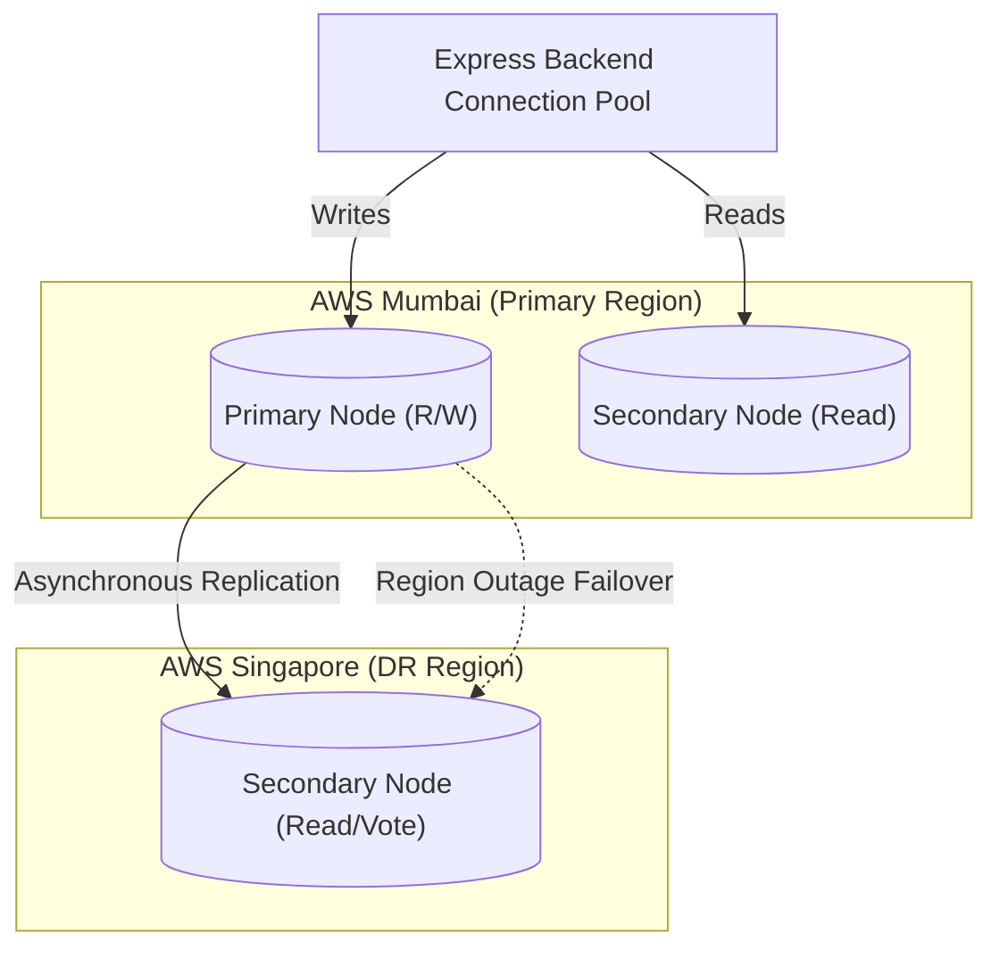

# MongoDB Backup & Disaster Recovery (DR) Specification - HomeHero

**Prepared by**: Cloud Database Administrator  
**Target Audience**: DevOps Engineers, Database Administrators, & Security Officers  
**Focus**: Snapshots schedules, restore procedures, RTO/RPO limits, and failover designs

---

## 1. Disaster Recovery Objectives (RTO & RPO)

To maintain business continuity and prevent data loss during catastrophic system outages:

*   **Recovery Point Objective (RPO)**: **$< 1$ minute**.
    - Meaning: The maximum tolerable period of data loss during an outage. Resolved via MongoDB Atlas continuous oplog tailing.
*   **Recovery Time Objective (RTO)**: **$< 15$ minutes**.
    - Meaning: The maximum duration allowed to restore the database to service after a catastrophic failure.

---

## 2. Backup Strategy & Snapshot Schedule

HomeHero leverages **MongoDB Atlas Cloud Backups** for scheduled and continuous snapshot snapshots:

```
┌─────────────────────────────────────────────────────────────┐
│                    SNAPSHOT RETENTION POLICY                │
├──────────────────┬──────────────────┬───────────────────────┤
│ Hourly Backups   │ Retained 24 hours│ Emergency rollback    │
│ Daily Snapshots  │ Retained 7 days  │ Standard operations   │
│ Weekly Snapshots │ Retained 4 weeks │ Weekly compliance     │
│ Monthly Snapshots│ Retained 1 year  │ Long-term auditing    │
└──────────────────┴──────────────────┴───────────────────────┘
```

- **Point-in-Time Recovery (PITR)**: Enabled continuously. This tails the MongoDB oplog to allow restores to any exact second within the last 7 days.

---

## 3. Disaster Recovery Failover Architecture

MongoDB Atlas is configured with a **Multi-Region Replica Set** to ensure automatic failover in the event of an entire cloud region going offline:



- **Automatic Election**: If AWS Mumbai experiences a total region outage, the Singapore node (Node 3) coordinates with voting replica nodes to automatically elect itself as the new Primary. This transition takes **$< 12$ seconds**, requiring zero code configuration changes from the Express backend.

---

## 4. Restore Procedures

### 4.1 Restoring via MongoDB Atlas Portal (Recommended)
1. Log into the MongoDB Atlas Console.
2. Select **Clusters** -> **HomeHero-Prod** -> **Backup**.
3. Under the **Point-in-Time** tab, select the exact date and target timezone down to the second.
4. Click **Restore** and select **Restore to a New Cluster** (this prevents overwriting live data during investigation).
5. Once the new cluster is active, update the backend Express database connection URI (`MONGO_URI`).

### 4.2 Restoring from Raw Snapshots (`mongorestore`)
If restoring a snapshot to a local development machine or isolated staging container:
```bash
# Extract the downloaded archive and run mongorestore
mongorestore --host=localhost:27017 --username=admin --password=secretpwd --dir=/path/to/extracted/snapshot/
```

---

## 5. Recovery Testing Drills & Validation

Backups are only as reliable as their last successful restore. HomeHero enforces the following testing strategy:
- **Bi-Monthly Recovery Drills**: On the first Saturday of every second month, the DevOps team must restore the previous Sunday's weekly snapshot to a temporary staging cluster.
- **Data Integrity Auditing**: Run automated test scripts on the restored database to verify schema compilation, indices alignment, and total document counts.
- **Duration Logging**: Log the total time taken to restore the database to verify it remains within our **15-minute RTO** target.
