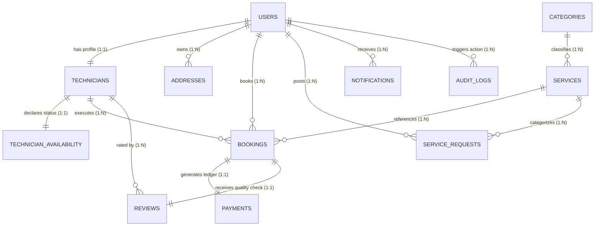

# HomeHero: Production-Grade Database Architecture Spec
**Author:** Principal Database Architect (ex-Urban Company, Uber, Amazon)  
**Version:** 1.5.0  
**Target Scale:** 10,000,000+ Active Users | 500,000+ Daily Transactions  
**Datastore Platform:** MongoDB Atlas Cluster (M40+ Instance Tier)

---

## 1. High-Level Entity Relationship Diagram (ERD)

The entity relationships are designed with a hybrid embedding-referencing approach. High-write, dynamic properties (like GPS location coordinate points and status flags) are isolated to optimize caching, while nested static structures (such as addresses, service line items, and transaction billing logs) are embedded to eliminate multi-document lookup query latency.



---

## 2. Database Relationships Matrix

### 2.1 One-to-One (1:1) Relationships
* **`users` ↔ `technicians`**: Modeled via a **foreign key reference** (`technicians.userId` pointing to `users._id`). Kept separate because technician profiles contain telemetry, ratings, and document screening records that are irrelevant to normal authentication flows.
* **`technicians` ↔ `technician_availability`**: Modeled via **referencing** for fast online/offline shifts.
* **`bookings` ↔ `payments`**: Modeled via **referencing** (`payments.bookingId` pointing to `bookings._id`). Enables clean transaction separation for auditing.

### 2.2 One-to-Many (1:N) Relationships
* **`users` ↔ `addresses`**: Modeled via **embedding** within `bookings.address` for transaction records, but stored as a referenced collection `addresses` for customer profile address books.
* **`categories` ↔ `services`**: Modeled via **referencing** (`services.categoryId` pointing to `categories._id`).
* **`users` ↔ `bookings`**: Modeled via **referencing** (`bookings.customerId`).

### 2.3 Many-to-Many (N:M) Relationships
* **`technicians` ↔ `services`**: Modeled as an **array of ObjectIds** (`technicians.skills` containing refs to `services._id`). This represents which services a technician can perform.

---

## 3. Collections Schema Specifications (12 Collections)

### 3.1 `users` Collection
* **Purpose**: Primary identity provider, authentication records, and authorization roles.
* **Validation Rules**: Mandatory email verification; strict role validations (`customer`, `technician`, `admin`).
* **Indexes**: Unique sparse indexes on `email` and `phone`.

#### Schema Specification & JSON Document
```json
{
  "_id": {"$oid": "60d5ec9f8f1b2c3d4e5f6g01"},
  "email": "rohan.das@homehero.com",
  "phone": "+919876543211",
  "passwordHash": "$2a$12$K1d84f90dFkSle982kd9eOujWwF1kS8m2P8lC4kL5mN6oP7qR8sT9u",
  "role": "customer",
  "firstName": "Rohan",
  "lastName": "Das",
  "isVerified": true,
  "createdAt": {"$date": "2026-06-17T10:00:00.000Z"},
  "updatedAt": {"$date": "2026-06-17T10:00:00.000Z"}
}
```

---

### 3.2 `technicians` Collection
* **Purpose**: Professional profile details, skills mapping, and payment settlement keys.
* **Validation Rules**: Rating range (1.00 to 5.00); array of specialized skills; background check state tracker.
* **Indexes**: 2dsphere index on `currentLocation`.

#### Schema Specification & JSON Document
```json
{
  "_id": {"$oid": "60d5ec9f8f1b2c3d4e5f6g02"},
  "userId": {"$oid": "60d5ec9f8f1b2c3d4e5f6g01"},
  "skills": [
    {"$oid": "60d5ec9f8f1b2c3d4e5f6g04"}
  ],
  "rating": {"$numberDecimal": "4.92"},
  "verification": {
    "status": "verified",
    "licenseVerified": true,
    "backgroundCheckStatus": "passed",
    "verifiedAt": {"$date": "2026-05-15T09:00:00.000Z"}
  },
  "currentLocation": {
    "type": "Point",
    "coordinates": [77.641201, 12.910382]
  },
  "serviceRadiusKm": 15,
  "wallet": {
    "balance": {"$numberDecimal": "5200.00"},
    "razorpayAccountId": "acc_Pv902kf89d"
  }
}
```

---

### 3.3 `services` Collection
* **Purpose**: Available service items within categories, detailing billing rules.
* **Validation Rules**: Explicit base rates and hourly rates.
* **Indexes**: Unique index on name.

#### Schema Specification & JSON Document
```json
{
  "_id": {"$oid": "60d5ec9f8f1b2c3d4e5f6g04"},
  "categoryId": {"$oid": "60d5ec9f8f1b2c3d4e5f6g08"},
  "name": "AC Condenser Repair",
  "description": "Thorough cleaning and repair of external condenser coils.",
  "isActive": true,
  "pricingRules": {
    "basePrice": {"$numberDecimal": "850.00"},
    "hourlyRate": {"$numberDecimal": "300.00"}
  }
}
```

---

### 3.4 `categories` Collection
* **Purpose**: Core taxonomies categorizing services.
* **Validation Rules**: Unique names with short URL slugs.
* **Indexes**: Unique index on slug.

#### Schema Specification & JSON Document
```json
{
  "_id": {"$oid": "60d5ec9f8f1b2c3d4e5f6g08"},
  "name": "AC Repair",
  "slug": "ac-repair",
  "iconUrl": "https://cdn.homehero.com/categories/ac-repair.svg",
  "isActive": true
}
```

---

### 3.5 `bookings` Collection
* **Purpose**: Tracks active transaction state machines, schedules, and job checklists.
* **Validation Rules**: Status transitions; embedded address; validation of total vs. commission amounts.
* **Indexes**: Compound index on customerId/status.

#### Schema Specification & JSON Document
```json
{
  "_id": {"$oid": "60d5ec9f8f1b2c3d4e5f6g05"},
  "bookingCode": "BKG-20261109",
  "customerId": {"$oid": "60d5ec9f8f1b2c3d4e5f6g01"},
  "technicianId": {"$oid": "60d5ec9f8f1b2c3d4e5f6g02"},
  "serviceId": {"$oid": "60d5ec9f8f1b2c3d4e5f6g04"},
  "status": "active",
  "billing": {
    "totalAmount": {"$numberDecimal": "1450.00"},
    "platformCommission": {"$numberDecimal": "217.50"},
    "netToHero": {"$numberDecimal": "1232.50"}
  },
  "scheduledTime": {"$date": "2026-06-18T11:00:00.000Z"},
  "address": {
    "street": "Flat 402, Sector 2",
    "city": "Bengaluru",
    "pincode": "560102",
    "geoPoint": {
      "type": "Point",
      "coordinates": [77.641201, 12.910382]
    }
  },
  "checklist": [
    { "task": "Pre-repair validation check", "completed": true, "timestamp": {"$date": "2026-06-18T11:05:00.000Z"} },
    { "task": "Condenser cleanout", "completed": false, "timestamp": null }
  ],
  "createdAt": {"$date": "2026-06-17T19:50:00.000Z"},
  "updatedAt": {"$date": "2026-06-17T20:00:00.000Z"}
}
```

---

### 3.6 `payments` Collection
* **Purpose**: Escrow logs mapping transaction intents to third-party APIs.
* **Validation Rules**: Razorpay Order ID uniqueness constraints.
* **Indexes**: Unique index on `razorpayOrderId`.

#### Schema Specification & JSON Document
```json
{
  "_id": {"$oid": "60d5ec9f8f1b2c3d4e5f6g06"},
  "bookingId": {"$oid": "60d5ec9f8f1b2c3d4e5f6g05"},
  "razorpayOrderId": "order_PK8490aBcd10fd",
  "razorpayPaymentId": "pay_PK8529f3d6a2e4",
  "razorpaySignature": "4fa8d9e18b82c3f4e5a6b7c8d9e01f...",
  "amount": {"$numberDecimal": "1450.00"},
  "currency": "INR",
  "escrowStatus": "held_in_escrow",
  "createdAt": {"$date": "2026-06-17T19:50:05.000Z"},
  "updatedAt": {"$date": "2026-06-17T19:51:00.000Z"}
}
```

---

### 3.7 `reviews` Collection
* **Purpose**: Rating and textual feedback logged by customers.
* **Validation Rules**: Review score must be an integer between 1 and 5.
* **Indexes**: Compound index on `revieweeId` and `rating`.

#### Schema Specification & JSON Document
```json
{
  "_id": {"$oid": "60d5ec9f8f1b2c3d4e5f6g07"},
  "bookingId": {"$oid": "60d5ec9f8f1b2c3d4e5f6g05"},
  "reviewerId": {"$oid": "60d5ec9f8f1b2c3d4e5f6g01"},
  "revieweeId": {"$oid": "60d5ec9f8f1b2c3d4e5f6g02"},
  "rating": 5,
  "comment": "Outstanding AC cooling repair, highly professional.",
  "createdAt": {"$date": "2026-06-18T13:00:00.000Z"}
}
```

---

### 3.8 `notifications` Collection
* **Purpose**: Push notification histories.
* **Validation Rules**: Enum validation for notification type (`push`, `sms`, `email`).
* **Indexes**: TTL index set to 30 days (`2592000` seconds).

#### Schema Specification & JSON Document
```json
{
  "_id": {"$oid": "60d5ec9f8f1b2c3d4e5f6g10"},
  "recipientId": {"$oid": "60d5ec9f8f1b2c3d4e5f6g01"},
  "type": "push",
  "title": "AC Tech Matched",
  "body": "Amit is assigned and is preparing tools.",
  "isRead": false,
  "createdAt": {"$date": "2026-06-17T19:50:10.000Z"}
}
```

---

### 3.9 `addresses` Collection
* **Purpose**: Customer profile address book.
* **Validation Rules**: Pincode format check; coordinates mapping check.
* **Indexes**: 2dsphere index on `geoPoint`.

#### Schema Specification & JSON Document
```json
{
  "_id": {"$oid": "60d5ec9f8f1b2c3d4e5f6g11"},
  "userId": {"$oid": "60d5ec9f8f1b2c3d4e5f6g01"},
  "label": "Home",
  "street": "Flat 402, Block C, Whitehouse Apts",
  "area": "Gachibowli",
  "city": "Hyderabad",
  "pincode": "500032",
  "geoPoint": {
    "type": "Point",
    "coordinates": [78.384010, 17.428100]
  }
}
```

---

### 3.10 `technician_availability` Collection
* **Purpose**: Real-time status tracker for online/offline shifts.
* **Validation Rules**: Shift timing constraints validation.
* **Indexes**: Index on `isOnline`.

#### Schema Specification & JSON Document
```json
{
  "_id": {"$oid": "60d5ec9f8f1b2c3d4e5f6g12"},
  "technicianId": {"$oid": "60d5ec9f8f1b2c3d4e5f6g02"},
  "isOnline": true,
  "lastActiveTime": {"$date": "2026-06-17T20:00:00.000Z"},
  "currentShift": {
    "startTime": "09:00",
    "endTime": "18:00"
  }
}
```

---

### 3.11 `service_requests` Collection
* **Purpose**: Customer job postings before technician matching.
* **Validation Rules**: Dynamic radius matching rules configuration.
* **Indexes**: 2dsphere index on location coordinates.

#### Schema Specification & JSON Document
```json
{
  "_id": {"$oid": "60d5ec9f8f1b2c3d4e5f6g13"},
  "customerId": {"$oid": "60d5ec9f8f1b2c3d4e5f6g01"},
  "serviceId": {"$oid": "60d5ec9f8f1b2c3d4e5f6g04"},
  "status": "searching",
  "location": {
    "type": "Point",
    "coordinates": [78.384010, 17.428100]
  },
  "searchRadiusKm": 5,
  "createdAt": {"$date": "2026-06-17T19:50:00.000Z"}
}
```

---

### 3.12 `audit_logs` Collection
* **Purpose**: System-wide operation tracking for compliance.
* **Validation Rules**: Strict capture of source IP, endpoint, and user roles.
* **Indexes**: Hashed index on `actorId`.

#### Schema Specification & JSON Document
```json
{
  "_id": {"$oid": "60d5ec9f8f1b2c3d4e5f6g14"},
  "actorId": {"$oid": "60d5ec9f8f1b2c3d4e5f6g01"},
  "action": "PAYMENT_RELEASE_AUTHORIZED",
  "targetCollection": "bookings",
  "targetId": {"$oid": "60d5ec9f8f1b2c3d4e5f6g05"},
  "ipAddress": "192.168.1.58",
  "userAgent": "Mozilla/5.0...",
  "timestamp": {"$date": "2026-06-17T20:01:00.000Z"}
}
```

---

## 4. Performance & MongoDB Indexing Strategy

To maintain sub-50ms query latencies at scale, the database uses a structured indexing layout:

### 4.1 Index Map Definitions
* **`technicians` Proximity queries**:
  `db.technicians.createIndex({ "currentLocation": "2dsphere" })`
* **Technician matching compound index**:
  `db.technicians.createIndex({ "isOnline": 1, "skills": 1, "currentLocation": "2dsphere" })`
  *Filters on availability and skills, then runs a geospatial range query.*
* **Customer Bookings Dashboard Sorting**:
  `db.bookings.createIndex({ "customerId": 1, "status": 1, "createdAt": -1 })`
* **Technician History Queries**:
  `db.bookings.createIndex({ "technicianId": 1, "status": 1, "createdAt": -1 })`
* **Audit Trail pruner**:
  `db.notifications.createIndex({ "createdAt": 1 }, { expireAfterSeconds: 2592000 })`

### 4.2 Query Optimization Strategies
* **Projection Enforcements**: Queries must explicitly request only required fields (e.g. `db.users.find({}, { passwordHash: 0 })`) to minimize network transfer overhead.
* **Aggregations Tuning**: Aggregation stages must start with filtering (`$match`) and sorting (`$sort`) steps to leverage index structures before executing `$lookup` operations.

---

## 5. Scalability & Multi-City Expansion Design

Scaling a hyperlocal platform from one city to multiple regions requires partitioning database loads while keeping operational data globally accessible.

```
                  ┌───────────────────────────────┐
                  │      mongos Query Router      │
                  └───────────────┬───────────────┘
                                  ▼
      ┌───────────────────────────┼───────────────────────────┐
      ▼                           ▼                           ▼
┌───────────────┐           ┌───────────────┐           ┌───────────────┐
│    Shard A    │           │    Shard B    │           │    Shard C    │
│ (Bengaluru)   │           │  (Hyderabad)  │           │   (Mumbai)    │
│               │           │               │           │               │
│ - Booking logs│           │ - Booking logs│           │ - Booking logs│
│ - Telemetry   │           │ - Telemetry   │           │ - Telemetry   │
└───────────────┘           └───────────────┘           └───────────────┘
```

1. **Range-Based Zone Sharding**:
   * Shard Key: `{ "address.city": 1, "createdAt": 1 }`
   * Strategy: Bookings and active dispatches are routed to the database shard physically closest to that municipality. A query for active technicians in "Bengaluru" is processed entirely on Shard A, avoiding cross-shard lookups.
2. **Read Replica Distribution**:
   * Strategy: Historical reviews and catalog details utilize replica set distribution, reading from secondary nodes (`readPreference=secondaryPreferred`) to reserve the primary node for write-heavy matchmaking and telemetry tasks.

---

## 6. Security, Backup, & Operations Best Practices

* **Network Isolation**: The MongoDB Atlas cluster is isolated within a private VPC network, accessible only via AWS/GCP VPC Peering or IP Access Lists.
* **Role-Based Access Control (RBAC)**: Applications connect using least-privilege credentials, restricting database writes to designated application roles.
* **Continuous Backups**: Configured with Atlas Continuous Backups (PITR - Point-in-Time Recovery), allowing the database to be restored to any second within the past 7 days to mitigate the risk of data loss.
* **TLS 1.3 Encryption**: All client-database communication is encrypted in transit using TLS 1.3, and data is encrypted at rest using AES-256 keys.
