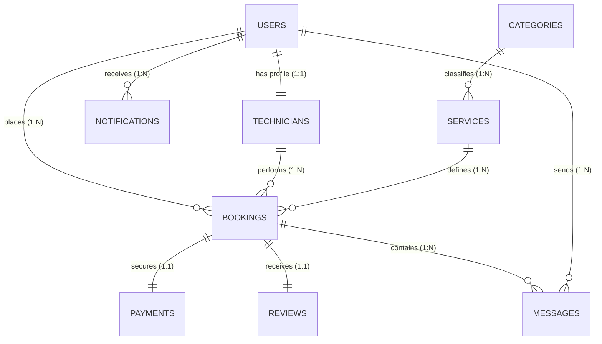

# HomeHero Hyperlocal Home Services - Production MongoDB Database Design

**Author:** Senior MongoDB Architect, HomeHero Technologies Pvt. Ltd.  
**Version:** 2.0.0  
**Date:** June 26, 2026  
**Status:** Approved for Production

---

## 1. Executive Summary & Design Philosophy

HomeHero is a hyperlocal, high-frequency, on-demand home services platform built for the Indian market. The database architecture is designed using **MongoDB** to handle highly dynamic workloads, including real-time technician location tracking, instant booking state transitions, escrowed payment flows via Razorpay, and rich user interactions.

### 1.1 Key Modeling Principles

1. **Embedded vs. Referenced Data (Hybrid Model):**
   * **Referenced Documents (`$lookup` / DBRefs):** Used for primary entities (`User`, `Technician`, `Booking`, `Payment`, `Review`, `Service`, `Category`) to prevent unbounded array growth, manage transaction limits, and ensure relational integrity.
   * **Embedded Documents (Denormalization):** Used for transient or tightly scoped data that changes together and is read together. For example:
     * `savedAddresses` embedded inside `User` (addresses are specific to the user and capped at a reasonable limit, typically < 10).
     * `billing` details, `statusHistory` logs, and `checklist` tasks embedded inside `Booking` to preserve the historical transaction state at the moment of completion, protecting it from future pricing or category updates.
2. **Hyperlocal Geospatial Queries:**
   * Utilizes MongoDB's native **2dsphere indexes** to enable sub-second spatial queries, matching customers with technicians based on GeoJSON `Point` coordinates (`[longitude, latitude]`) and service radiuses.
3. **Optimized Indexing & Write Performance:**
   * Compound indexes target the application's most frequent read patterns (e.g., querying pending bookings for a specific technician).
   * TTL (Time-to-Live) indexes are deployed on ephemeral collections like `notifications` to automatically prune data, reducing storage costs.
4. **Data Validation at Database Level:**
   * Utilizes MongoDB **JSON Schema Validation (`$jsonSchema`)** to enforce strict type checking, format compliance (e.g., regex for phone numbers, email addresses, and Aadhaar numbers), and required fields directly in the database engine, supplementing Mongoose validation.

---

## 2. High-Level Entity-Relationship (ER) Diagram



---

## 3. Collections Schemas & Validation Rules

Below are the production-grade schema specifications and the raw MongoDB `$jsonSchema` validators used during collection creation.

### 3.1 `users` Collection
Stores customers, technicians, and admin accounts. Includes authentication credentials, status flags, and embedded saved addresses.

* **Relationships:**
  * `savedAddresses`: Embedded array (1:N denormalized).
  * `technicianProfile`: 1:1 referenced relationship pointing to `technicians` (if role is `technician` or `provider`).
* **Indexes:**
  * `{ email: 1 }` (Unique) - Accelerates login queries.
  * `{ phone: 1 }` (Unique) - Accelerates OTP-based verification/login.

#### Collection Validation Schema (`$jsonSchema`)
```javascript
db.createCollection("users", {
  validator: {
    $jsonSchema: {
      bsonType: "object",
      required: ["email", "phone", "passwordHash", "role", "firstName", "lastName"],
      properties: {
        _id: { bsonType: "objectId" },
        email: { 
          bsonType: "string", 
          pattern: "^[a-zA-Z0-9._%+-]+@[a-zA-Z0-9.-]+\\.[a-zA-Z]{2,}$",
          description: "Must be a valid email address and is required"
        },
        phone: { 
          bsonType: "string", 
          pattern: "^\\+?[0-9]{10,12}$",
          description: "Must be a valid Indian or international phone number"
        },
        passwordHash: { 
          bsonType: "string",
          description: "Bcrypt hash of the user password"
        },
        role: { 
          enum: ["customer", "provider", "technician", "admin"],
          description: "Role limits authorization rights"
        },
        firstName: { bsonType: "string", minLength: 1, maxLength: 50 },
        lastName: { bsonType: "string", minLength: 1, maxLength: 50 },
        avatarUrl: { bsonType: "string" },
        isVerified: { bsonType: "bool" },
        otpCode: { bsonType: ["string", "null"] },
        otpExpiry: { bsonType: ["date", "null"] },
        savedAddresses: {
          bsonType: "array",
          items: {
            bsonType: "object",
            required: ["label", "street", "area", "city", "pincode"],
            properties: {
              label: { bsonType: "string" },
              street: { bsonType: "string" },
              area: { bsonType: "string" },
              city: { bsonType: "string" },
              pincode: { bsonType: "string", pattern: "^[0-9]{6}$" },
              isDefault: { bsonType: "bool" }
            }
          }
        },
        createdAt: { bsonType: "date" },
        updatedAt: { bsonType: "date" }
      }
    }
  }
});
```

---

### 3.2 `technicians` Collection
Houses professional details, skills, location tracking, KYC verification data, and wallet ledgers.

* **Relationships:**
  * `userId`: 1:1 referenced relationship pointing to `users`.
* **Indexes:**
  * `{ userId: 1 }` (Unique) - Ensures a single technician profile per user.
  * `{ currentLocation: "2dsphere" }` - Geospatial index for matching nearby technicians.
  * `{ availabilityStatus: 1, serviceCategory: 1 }` - Compound index to fetch active, matching professionals.

#### Collection Validation Schema (`$jsonSchema`)
```javascript
db.createCollection("technicians", {
  validator: {
    $jsonSchema: {
      bsonType: "object",
      required: ["userId", "fullName", "phone", "email", "serviceCategory"],
      properties: {
        _id: { bsonType: "objectId" },
        userId: { bsonType: "objectId" },
        fullName: { bsonType: "string", minLength: 2 },
        phone: { bsonType: "string", pattern: "^\\+?[0-9]{10,12}$" },
        email: { bsonType: "string", pattern: "^[a-zA-Z0-9._%+-]+@[a-zA-Z0-9.-]+\\.[a-zA-Z]{2,}$" },
        profilePhoto: { bsonType: "string" },
        serviceCategory: { 
          enum: ["Electrician", "Plumber", "Carpenter", "AC Repair"],
          description: "Hyperlocal service verticals available in Phase 1"
        },
        experienceYears: { bsonType: "number", minimum: 0 },
        skills: { bsonType: "array", items: { bsonType: "string" } },
        city: { bsonType: "string" },
        area: { bsonType: "string" },
        address: { bsonType: "string" },
        aadhaarNumber: { bsonType: "string", pattern: "^[0-9]{12}$" },
        aadhaarVerified: { bsonType: "bool" },
        rating: { bsonType: "number", minimum: 1.0, maximum: 5.0 },
        totalJobsCompleted: { bsonType: "int", minimum: 0 },
        availabilityStatus: { enum: ["available", "unavailable"] },
        earnings: { bsonType: "number", minimum: 0 },
        availability: {
          bsonType: "object",
          required: ["days", "startTime", "endTime"],
          properties: {
            days: { bsonType: "array", items: { bsonType: "string" } },
            startTime: { bsonType: "string" },
            endTime: { bsonType: "string" }
          }
        },
        verification: {
          bsonType: "object",
          required: ["status", "backgroundCheckStatus"],
          properties: {
            status: { enum: ["unverified", "pending", "verified"] },
            licenseVerified: { bsonType: "bool" },
            backgroundCheckStatus: { enum: ["pending", "passed", "failed"] },
            verifiedAt: { bsonType: ["date", "null"] }
          }
        },
        currentLocation: {
          bsonType: "object",
          required: ["type", "coordinates"],
          properties: {
            type: { enum: ["Point"] },
            coordinates: {
              bsonType: "array",
              minItems: 2,
              maxItems: 2,
              items: { bsonType: "number" } // [longitude, latitude]
            }
          }
        },
        isOnline: { bsonType: "bool" },
        serviceRadiusKm: { bsonType: "number", minimum: 1 },
        wallet: {
          bsonType: "object",
          required: ["balance"],
          properties: {
            balance: { bsonType: "number" },
            stripeAccountId: { bsonType: "string" }
          }
        },
        bio: { bsonType: "string" },
        createdAt: { bsonType: "date" },
        updatedAt: { bsonType: "date" }
      }
    }
  }
});
```

---

### 3.3 `categories` Collection
Stores high-level service divisions (e.g., AC Repair, Cleaning).

* **Relationships:**
  * Referenced by `services` (1:N).
* **Indexes:**
  * `{ slug: 1 }` (Unique) - For SEO-friendly routing and lookups.

#### Collection Validation Schema (`$jsonSchema`)
```javascript
db.createCollection("categories", {
  validator: {
    $jsonSchema: {
      bsonType: "object",
      required: ["name", "slug"],
      properties: {
        _id: { bsonType: "objectId" },
        name: { bsonType: "string", uniqueItems: true },
        slug: { bsonType: "string", uniqueItems: true },
        iconUrl: { bsonType: "string" },
        imageUrl: { bsonType: "string" },
        description: { bsonType: "string" },
        isActive: { bsonType: "bool" },
        createdAt: { bsonType: "date" },
        updatedAt: { bsonType: "date" }
      }
    }
  }
});
```

---

### 3.4 `services` Collection
Stores specific service offerings under categories (e.g., AC Deep Cleaning, Fan Installation).

* **Relationships:**
  * `categoryId`: 1:N referenced relationship pointing to `categories`.
* **Indexes:**
  * `{ name: 1 }` (Unique) - Restricts duplicated naming.
  * `{ categoryId: 1 }` - Fast filters for services inside a category.

#### Collection Validation Schema (`$jsonSchema`)
```javascript
db.createCollection("services", {
  validator: {
    $jsonSchema: {
      bsonType: "object",
      required: ["name", "pricingRules"],
      properties: {
        _id: { bsonType: "objectId" },
        name: { bsonType: "string" },
        categoryId: { bsonType: ["objectId", "null"] },
        description: { bsonType: "string" },
        isActive: { bsonType: "bool" },
        pricingRules: {
          bsonType: "object",
          required: ["basePrice", "hourlyRate"],
          properties: {
            basePrice: { bsonType: "number", minimum: 0 },
            hourlyRate: { bsonType: "number", minimum: 0 },
            modifiers: { bsonType: "object" } // Map of key-value pricing overrides
          }
        },
        createdAt: { bsonType: "date" },
        updatedAt: { bsonType: "date" }
      }
    }
  }
});
```

---

### 3.5 `bookings` Collection
Handles service orders placed by users. Contains embedded snapshots of address, billing formulas, and completion checklists.

* **Relationships:**
  * `customerId`: Referenced relationship pointing to `users` (Client).
  * `technicianId`: Referenced relationship pointing to `users` (assigned service provider).
  * `serviceId`: Referenced relationship pointing to `services`.
* **Indexes:**
  * `{ bookingCode: 1 }` (Unique) - Quick transactional indexing.
  * `{ customerId: 1, status: 1, scheduledTime: -1 }` - Compound index for customer dashboards.
  * `{ technicianId: 1, status: 1 }` - Compound index for technician dashboards.
  * `{ 'address.geoPoint': "2dsphere" }` - Allows location routing and proximity audits.

#### Collection Validation Schema (`$jsonSchema`)
```javascript
db.createCollection("bookings", {
  validator: {
    $jsonSchema: {
      bsonType: "object",
      required: ["bookingCode", "customerId", "serviceId", "status", "scheduledTime", "address", "billing"],
      properties: {
        _id: { bsonType: "objectId" },
        bookingCode: { bsonType: "string" },
        customerId: { bsonType: "objectId" },
        technicianId: { bsonType: ["objectId", "null"] },
        serviceId: { bsonType: "objectId" },
        status: { 
          enum: ["pending", "accepted", "rejected", "assigned", "in_progress", "completed", "cancelled"],
          description: "Workflow status of the booking"
        },
        statusHistory: {
          bsonType: "array",
          items: {
            bsonType: "object",
            required: ["status", "timestamp"],
            properties: {
              status: { enum: ["pending", "accepted", "rejected", "assigned", "in_progress", "completed", "cancelled"] },
              changedBy: { bsonType: ["objectId", "null"] },
              note: { bsonType: "string" },
              timestamp: { bsonType: "date" }
            }
          }
        },
        billing: {
          bsonType: "object",
          required: ["totalAmount", "platformCommission", "netToHero", "isPaid"],
          properties: {
            totalAmount: { bsonType: "number", minimum: 0, description: "Total customer price in INR" },
            platformCommission: { bsonType: "number", minimum: 0, description: "HomeHero fee in INR" },
            taxAmount: { bsonType: "number" },
            netToHero: { bsonType: "number", minimum: 0, description: "Payout amount for the technician" },
            isPaid: { bsonType: "bool" },
            paidAt: { bsonType: ["date", "null"] },
            paymentGateway: { enum: ["razorpay"] },
            couponCode: { bsonType: "string" },
            discountAmount: { bsonType: "number" }
          }
        },
        scheduledTime: { bsonType: "date" },
        originalScheduledTime: { bsonType: ["date", "null"] },
        address: {
          bsonType: "object",
          required: ["street", "area", "city", "pincode"],
          properties: {
            street: { bsonType: "string" },
            area: { bsonType: "string" },
            city: { bsonType: "string" },
            pincode: { bsonType: "string", pattern: "^[0-9]{6}$" },
            geoPoint: {
              bsonType: "object",
              required: ["type", "coordinates"],
              properties: {
                type: { enum: ["Point"] },
                coordinates: {
                  bsonType: "array",
                  minItems: 2,
                  maxItems: 2,
                  items: { bsonType: "number" }
                }
              }
            }
          }
        },
        notes: { bsonType: "string", maxLength: 500 },
        cancellation: {
          bsonType: "object",
          properties: {
            reason: { bsonType: "string" },
            cancelledBy: { bsonType: ["objectId", "null"] },
            cancelledAt: { bsonType: ["date", "null"] },
            feeCharged: { bsonType: "number" }
          }
        },
        checklist: {
          bsonType: "array",
          items: {
            bsonType: "object",
            required: ["task", "completed"],
            properties: {
              task: { bsonType: "string" },
              completed: { bsonType: "bool" },
              timestamp: { bsonType: ["date", "null"] }
            }
          }
        },
        createdAt: { bsonType: "date" },
        updatedAt: { bsonType: "date" }
      }
    }
  }
});
```

---

### 3.6 `payments` Collection
Logs billing invoices, Razorpay references, and commission allocations.

* **Relationships:**
  * `bookingId`: Referenced relationship pointing to `bookings`.
  * `customerId`: Referenced relationship pointing to `users` (Client).
  * `technicianId`: Referenced relationship pointing to `users` (Technician).
* **Indexes:**
  * `{ paymentId: 1 }` (Unique, Sparse) - Fast search of Razorpay Payment IDs.
  * `{ razorpayOrderId: 1 }` (Unique) - Fast matching of Razorpay Order webhooks.
  * `{ bookingId: 1 }` - Quick retrieval of billing info for a booking.
  * `{ customerId: 1, createdAt: -1 }` - Fast loading of user payment logs.

#### Collection Validation Schema (`$jsonSchema`)
```javascript
db.createCollection("payments", {
  validator: {
    $jsonSchema: {
      bsonType: "object",
      required: ["paymentId", "bookingId", "customerId", "technicianId", "razorpayOrderId", "amount", "platformCommission", "technicianAmount", "paymentStatus"],
      properties: {
        _id: { bsonType: "objectId" },
        paymentId: { bsonType: "string" },
        bookingId: { bsonType: "objectId" },
        customerId: { bsonType: "objectId" },
        technicianId: { bsonType: "objectId" },
        razorpayOrderId: { bsonType: "string" },
        razorpayPaymentId: { bsonType: "string" },
        razorpaySignature: { bsonType: "string" },
        amount: { bsonType: "number", description: "Payment amount in paise (to prevent decimal precision issues)" },
        platformCommission: { bsonType: "number" },
        technicianAmount: { bsonType: "number" },
        paymentMethod: { enum: ["UPI", "Credit Card", "Debit Card", "Net Banking", "Wallet"] },
        paymentStatus: { enum: ["created", "successful", "failed", "refunded"] },
        transactionDate: { bsonType: "date" },
        refundId: { bsonType: "string" },
        refundAmount: { bsonType: "number" },
        refundStatus: { enum: ["pending", "processed", "failed"] },
        createdAt: { bsonType: "date" },
        updatedAt: { bsonType: "date" }
      }
    }
  }
});
```

---

### 3.7 `reviews` Collection
Stores reviews submitted by customers regarding technicians.

* **Relationships:**
  * `bookingId`: Referenced relationship pointing to `bookings` (unique constraint ensures a review is only submitted once per service).
  * `reviewerId`: Referenced relationship pointing to `users` (the Customer).
  * `revieweeId`: Referenced relationship pointing to `users` (the Technician).
* **Indexes:**
  * `{ bookingId: 1 }` (Unique) - Prevents duplicate reviews.
  * `{ revieweeId: 1 }` - Fetch ratings to compute average technician scores.

#### Collection Validation Schema (`$jsonSchema`)
```javascript
db.createCollection("reviews", {
  validator: {
    $jsonSchema: {
      bsonType: "object",
      required: ["bookingId", "reviewerId", "revieweeId", "rating"],
      properties: {
        _id: { bsonType: "objectId" },
        bookingId: { bsonType: "objectId" },
        reviewerId: { bsonType: "objectId" },
        revieweeId: { bsonType: "objectId" },
        rating: { bsonType: "number", minimum: 1, maximum: 5 },
        comment: { bsonType: "string" },
        photos: { bsonType: "array", items: { bsonType: "string" } },
        createdAt: { bsonType: "date" },
        updatedAt: { bsonType: "date" }
      }
    }
  }
});
```

---

### 3.8 `messages` Collection
Stores real-time conversation messages sent between customers and technicians regarding a booking.

* **Relationships:**
  * `bookingId`: Referenced relationship pointing to `bookings`.
  * `senderId`: Referenced relationship pointing to `users`.
* **Indexes:**
  * `{ bookingId: 1, createdAt: 1 }` - For sorting message logs.

#### Collection Validation Schema (`$jsonSchema`)
```javascript
db.createCollection("messages", {
  validator: {
    $jsonSchema: {
      bsonType: "object",
      required: ["bookingId", "senderId", "senderName", "message"],
      properties: {
        _id: { bsonType: "objectId" },
        bookingId: { bsonType: "objectId" },
        senderId: { bsonType: "objectId" },
        senderName: { bsonType: "string" },
        message: { bsonType: "string", minLength: 1 },
        createdAt: { bsonType: "date" },
        updatedAt: { bsonType: "date" }
      }
    }
  }
});
```

---

### 3.9 `notifications` Collection
Holds system-wide alert dispatches. Configured with a TTL index to prune older alerts automatically.

* **Relationships:**
  * `recipientId`: Referenced relationship pointing to `users`.
* **Indexes:**
  * `{ recipientId: 1, isRead: 1 }` - Fetches unread push updates.
  * `{ createdAt: 1 }` (TTL: `expireAfterSeconds: 2592000`) - Automatically deletes notifications older than 30 days.

#### Collection Validation Schema (`$jsonSchema`)
```javascript
db.createCollection("notifications", {
  validator: {
    $jsonSchema: {
      bsonType: "object",
      required: ["recipientId", "title", "body"],
      properties: {
        _id: { bsonType: "objectId" },
        recipientId: { bsonType: "objectId" },
        type: { enum: ["push", "email", "sms"] },
        title: { bsonType: "string", minLength: 1 },
        body: { bsonType: "string", minLength: 1 },
        isRead: { bsonType: "bool" },
        readAt: { bsonType: ["date", "null"] },
        createdAt: { bsonType: "date" },
        updatedAt: { bsonType: "date" }
      }
    }
  }
});
```

---

### 3.10 `settings` Collection
A dynamic key-value configuration system for system parameters (e.g., commission rates, search radius, pricing multipliers).

* **Indexes:**
  * `{ key: 1 }` (Unique) - Quick configuration lookups.

#### Collection Validation Schema (`$jsonSchema`)
```javascript
db.createCollection("settings", {
  validator: {
    $jsonSchema: {
      bsonType: "object",
      required: ["key", "value"],
      properties: {
        _id: { bsonType: "objectId" },
        key: { bsonType: "string" },
        value: { bsonType: ["string", "number", "bool", "object", "array"] },
        createdAt: { bsonType: "date" },
        updatedAt: { bsonType: "date" }
      }
    }
  }
});
```

---

## 4. Production Indexing & Query Optimizations

### 4.1 Index Catalog Summary Table

| Collection | Index Key Pattern | Type | Unique | Index Purpose |
| :--- | :--- | :--- | :--- | :--- |
| **users** | `{ "email": 1 }` | Single Field | Yes | Login & Unique check |
| **users** | `{ "phone": 1 }` | Single Field | Yes | OTP login & SMS routing |
| **technicians**| `{ "userId": 1 }` | Single Field | Yes | 1:1 user linkage resolution |
| **technicians**| `{ "currentLocation": "2dsphere" }` | Geospatial | No | Proximity dispatch queries |
| **technicians**| `{ "availabilityStatus": 1, "serviceCategory": 1 }` | Compound | No | Dispatch and search filtering |
| **categories** | `{ "slug": 1 }` | Single Field | Yes | SEO-friendly Category pages |
| **services** | `{ "name": 1 }` | Single Field | Yes | Unique naming checking |
| **services** | `{ "categoryId": 1 }` | Single Field | No | Loading services for a category |
| **bookings** | `{ "bookingCode": 1 }` | Single Field | Yes | Booking verification checks |
| **bookings** | `{ "customerId": 1, "status": 1, "scheduledTime": -1 }` | Compound | No | Customer job listing |
| **bookings** | `{ "technicianId": 1, "status": 1 }` | Compound | No | Technician agenda checklist |
| **bookings** | `{ "address.geoPoint": "2dsphere" }` | Geospatial | No | Auditing coordinates of job sites |
| **payments** | `{ "paymentId": 1 }` | Single Field | Yes (Sparse) | Razorpay Webhook lookups |
| **payments** | `{ "razorpayOrderId": 1 }` | Single Field | Yes | Correlating orders |
| **payments** | `{ "bookingId": 1 }` | Single Field | No | Booking ledger reviews |
| **reviews** | `{ "bookingId": 1 }` | Single Field | Yes | Prevents duplicate reviews |
| **reviews** | `{ "revieweeId": 1 }` | Single Field | No | Aggregating technician metrics |
| **messages** | `{ "bookingId": 1, "createdAt": 1 }` | Compound | No | Chat history loading |
| **notifications**| `{ "recipientId": 1, "isRead": 1 }` | Compound | No | Dashboard badge count queries |
| **notifications**| `{ "createdAt": 1 }` | TTL | No | Deletes logs older than 30 days |
| **settings** | `{ "key": 1 }` | Single Field | Yes | System Configuration retrieval |

### 4.2 Query Execution Optimization Plans (Examples)

#### Scenario A: Match Nearby Electricians (Hyperlocal Dispatch)
The system matches open electrical work bookings to active, available technicians within 10km of Madhapur, Hyderabad.

* **Target Collection:** `technicians`
* **Query Implementation:**
```javascript
db.technicians.find({
  availabilityStatus: "available",
  serviceCategory: "Electrician",
  currentLocation: {
    $near: {
      $geometry: { type: "Point", coordinates: [78.382021, 17.426210] }, // Madhapur Coordinate
      $maxDistance: 10000 // Distance in meters (10 Km)
    }
  }
}).hint({ currentLocation: "2dsphere" });
```
* **Performance Gain:** Resolves scan from $O(N)$ (scanning all technicians) to $O(\log N)$ by utilizing the `2dsphere` index to locate matches within the spatial bounding box.

#### Scenario B: Render Customer Dashboard Bookings
Retrieve the 5 most recent completed service bookings for a customer.

* **Target Collection:** `bookings`
* **Query Implementation:**
```javascript
db.bookings.find({
  customerId: ObjectId("60d5ec4b1f48c34f3b2591a1"),
  status: "completed"
})
.sort({ scheduledTime: -1 })
.limit(5);
```
* **Performance Gain:** Utilizes the compound index `{ customerId: 1, status: 1, scheduledTime: -1 }`. Since the sorting matches the index structure, this is a **covered query** that avoids in-memory sorts (blocking sorting stage).

---

## 5. Sample Documents (BSON Representation)

The following sample BSON/JSON records show standard documents populated with realistic Indian hyperlocal metrics.

### 5.1 `users` Document
```json
{
  "_id": {"$oid": "60d5ec4b1f48c34f3b2591a1"},
  "email": "priya.sharma@example.com",
  "phone": "+919876543210",
  "passwordHash": "$2a$10$3zJ2P.4zE6.7U5tT6Zt6OuL8Vd/3Pz1Uf/qGkG8oE9hJmG/G/y.2y",
  "role": "customer",
  "firstName": "Priya",
  "lastName": "Sharma",
  "avatarUrl": "https://assets.homehero.in/avatars/customer_priya.webp",
  "isVerified": true,
  "savedAddresses": [
    {
      "label": "Home",
      "street": "Flat 402, Oakwood Towers",
      "area": "Jubilee Hills",
      "city": "Hyderabad",
      "pincode": "500081",
      "isDefault": true
    },
    {
      "label": "Office",
      "street": "10th Floor, Building 12C, Mindspace IT Park",
      "area": "Madhapur",
      "city": "Hyderabad",
      "pincode": "500081",
      "isDefault": false
    }
  ],
  "createdAt": {"$date": "2026-06-20T08:30:00.000Z"},
  "updatedAt": {"$date": "2026-06-26T12:00:00.000Z"}
}
```

### 5.2 `technicians` Document
```json
{
  "_id": {"$oid": "60d5ec4b1f48c34f3b2591b1"},
  "userId": {"$oid": "60d5ec4b1f48c34f3b2591b0"},
  "fullName": "Rajesh Kumar",
  "phone": "+918765432109",
  "email": "rajesh.kumar@homehero.in",
  "profilePhoto": "https://assets.homehero.in/avatars/hero_rajesh.webp",
  "serviceCategory": "AC Repair",
  "experienceYears": 6,
  "skills": ["AC Installation", "Gas Refilling", "Split AC Servicing", "Leakage Repair"],
  "city": "Hyderabad",
  "area": "Gachibowli",
  "address": "House 12-4, Telecom Nagar, Gachibowli, Hyderabad",
  "aadhaarNumber": "583920194820",
  "aadhaarVerified": true,
  "rating": 4.88,
  "totalJobsCompleted": 142,
  "availabilityStatus": "available",
  "earnings": 48200,
  "availability": {
    "days": ["Monday", "Tuesday", "Wednesday", "Thursday", "Friday", "Saturday"],
    "startTime": "09:00",
    "endTime": "18:30"
  },
  "verification": {
    "status": "verified",
    "licenseVerified": true,
    "backgroundCheckStatus": "passed",
    "verifiedAt": {"$date": "2026-06-01T10:00:00.000Z"}
  },
  "currentLocation": {
    "type": "Point",
    "coordinates": [78.3489, 17.4483]
  },
  "isOnline": true,
  "serviceRadiusKm": 12,
  "wallet": {
    "balance": 1850,
    "stripeAccountId": "acct_1NJ248FHJ203KS"
  },
  "bio": "Experienced AC technician certified by Daikin. Speaks Telugu, Hindi, and English.",
  "createdAt": {"$date": "2026-06-01T10:15:00.000Z"},
  "updatedAt": {"$date": "2026-06-26T17:40:00.000Z"}
}
```

### 5.3 `categories` Document
```json
{
  "_id": {"$oid": "60d5ec4b1f48c34f3b2591a5"},
  "name": "AC Repair & Service",
  "slug": "ac-repair",
  "iconUrl": "https://assets.homehero.in/categories/icons/ac.svg",
  "imageUrl": "https://assets.homehero.in/categories/banners/ac.webp",
  "description": "Expert cooling servicing, repair, gas charging & installation.",
  "isActive": true,
  "createdAt": {"$date": "2026-05-15T09:00:00.000Z"},
  "updatedAt": {"$date": "2026-05-15T09:00:00.000Z"}
}
```

### 5.4 `services` Document
```json
{
  "_id": {"$oid": "60d5ec4b1f48c34f3b2591c0"},
  "name": "Split AC Deep Cleaning (Jet Wash)",
  "categoryId": {"$oid": "60d5ec4b1f48c34f3b2591a5"},
  "description": "Advanced jet water cleaning of indoor and outdoor coils to restore optimal cooling efficiency.",
  "isActive": true,
  "pricingRules": {
    "basePrice": 499,
    "hourlyRate": 150,
    "modifiers": {
      "weekendSurge": 50,
      "nightSurge": 100
    }
  },
  "createdAt": {"$date": "2026-05-16T11:00:00.000Z"},
  "updatedAt": {"$date": "2026-05-16T11:00:00.000Z"}
}
```

### 5.5 `bookings` Document
```json
{
  "_id": {"$oid": "60d5ec4b1f48c34f3b2591d1"},
  "bookingCode": "HH-2026-9831",
  "customerId": {"$oid": "60d5ec4b1f48c34f3b2591a1"},
  "technicianId": {"$oid": "60d5ec4b1f48c34f3b2591b0"},
  "serviceId": {"$oid": "60d5ec4b1f48c34f3b2591c0"},
  "status": "completed",
  "statusHistory": [
    {
      "status": "pending",
      "timestamp": {"$date": "2026-06-26T10:00:00.000Z"},
      "changedBy": {"$oid": "60d5ec4b1f48c34f3b2591a1"},
      "note": "Booking initiated by customer."
    },
    {
      "status": "assigned",
      "timestamp": {"$date": "2026-06-26T10:05:00.000Z"},
      "changedBy": {"$oid": "60d5ec4b1f48c34f3b2591b0"},
      "note": "Technician accepted request."
    },
    {
      "status": "in_progress",
      "timestamp": {"$date": "2026-06-26T10:30:00.000Z"},
      "changedBy": {"$oid": "60d5ec4b1f48c34f3b2591b0"},
      "note": "AC service started."
    },
    {
      "status": "completed",
      "timestamp": {"$date": "2026-06-26T11:15:00.000Z"},
      "changedBy": {"$oid": "60d5ec4b1f48c34f3b2591b0"},
      "note": "Service finished successfully."
    }
  ],
  "billing": {
    "totalAmount": 649,
    "platformCommission": 97,
    "taxAmount": 18,
    "netToHero": 534,
    "isPaid": true,
    "paidAt": {"$date": "2026-06-26T10:00:05.000Z"},
    "paymentGateway": "razorpay",
    "couponCode": "FIRST100",
    "discountAmount": 100
  },
  "scheduledTime": {"$date": "2026-06-26T10:30:00.000Z"},
  "originalScheduledTime": null,
  "address": {
    "street": "Flat 402, Oakwood Towers",
    "area": "Jubilee Hills",
    "city": "Hyderabad",
    "pincode": "500081",
    "geoPoint": {
      "type": "Point",
      "coordinates": [78.3824, 17.4321]
    }
  },
  "notes": "AC cooling is weak. Please bring gas refilling tools.",
  "cancellation": {
    "reason": "",
    "cancelledBy": null,
    "cancelledAt": null,
    "feeCharged": 0
  },
  "checklist": [
    {
      "task": "Pre-service inspection photo uploaded",
      "completed": true,
      "timestamp": {"$date": "2026-06-26T10:31:12.000Z"}
    },
    {
      "task": "Duct cleaning completed",
      "completed": true,
      "timestamp": {"$date": "2026-06-26T10:55:00.000Z"}
    },
    {
      "task": "Final thermal scan test passed",
      "completed": true,
      "timestamp": {"$date": "2026-06-26T11:10:45.000Z"}
    }
  ],
  "createdAt": {"$date": "2026-06-26T10:00:00.000Z"},
  "updatedAt": {"$date": "2026-06-26T11:15:00.000Z"}
}
```

### 5.6 `payments` Document
```json
{
  "_id": {"$oid": "60d5ec4b1f48c34f3b2591e1"},
  "paymentId": "pay_O1h92kfh293k",
  "bookingId": {"$oid": "60d5ec4b1f48c34f3b2591d1"},
  "customerId": {"$oid": "60d5ec4b1f48c34f3b2591a1"},
  "technicianId": {"$oid": "60d5ec4b1f48c34f3b2591b0"},
  "razorpayOrderId": "order_O1h83hf20kdh1",
  "razorpayPaymentId": "pay_O1h92kfh293k",
  "razorpaySignature": "82f93d4a0db2a554a938c82de940fa3214e9f029c",
  "amount": 64900, 
  "platformCommission": 9700,
  "technicianAmount": 53400,
  "paymentMethod": "UPI",
  "paymentStatus": "successful",
  "transactionDate": {"$date": "2026-06-26T10:00:05.000Z"},
  "createdAt": {"$date": "2026-06-26T10:00:00.000Z"},
  "updatedAt": {"$date": "2026-06-26T10:00:05.000Z"}
}
```

### 5.7 `reviews` Document
```json
{
  "_id": {"$oid": "60d5ec4b1f48c34f3b2591f1"},
  "bookingId": {"$oid": "60d5ec4b1f48c34f3b2591d1"},
  "reviewerId": {"$oid": "60d5ec4b1f48c34f3b2591a1"},
  "revieweeId": {"$oid": "60d5ec4b1f48c34f3b2591b0"},
  "rating": 5,
  "comment": "Excellent service! Rajesh was professional, cleaned the area afterward, and fixed the AC in under an hour. Highly recommended.",
  "photos": [
    "https://assets.homehero.in/reviews/bookings_9831_complete1.webp"
  ],
  "createdAt": {"$date": "2026-06-26T11:30:00.000Z"},
  "updatedAt": {"$date": "2026-06-26T11:30:00.000Z"}
}
```

### 5.8 `messages` Document
```json
{
  "_id": {"$oid": "60d5ec4b1f48c34f3b259201"},
  "bookingId": {"$oid": "60d5ec4b1f48c34f3b2591d1"},
  "senderId": {"$oid": "60d5ec4b1f48c34f3b2591a1"},
  "senderName": "Priya Sharma",
  "message": "Hi Rajesh, I have parked the car outside. You can ring bell number 402 directly.",
  "createdAt": {"$date": "2026-06-26T10:18:22.000Z"},
  "updatedAt": {"$date": "2026-06-26T10:18:22.000Z"}
}
```

### 5.9 `notifications` Document
```json
{
  "_id": {"$oid": "60d5ec4b1f48c34f3b259211"},
  "recipientId": {"$oid": "60d5ec4b1f48c34f3b2591a1"},
  "type": "push",
  "title": "Booking Assigned!",
  "body": "AC technician Rajesh Kumar has accepted your booking code HH-2026-9831 and is scheduled to arrive at 10:30 AM.",
  "isRead": true,
  "readAt": {"$date": "2026-06-26T10:06:12.000Z"},
  "createdAt": {"$date": "2026-06-26T10:05:01.000Z"},
  "updatedAt": {"$date": "2026-06-26T10:06:12.000Z"}
}
```

### 5.10 `settings` Document
```json
{
  "_id": {"$oid": "60d5ec4b1f48c34f3b259221"},
  "key": "surge_pricing_multiplier",
  "value": 1.25,
  "createdAt": {"$date": "2026-06-01T00:00:00.000Z"},
  "updatedAt": {"$date": "2026-06-26T17:30:00.000Z"}
}
```
