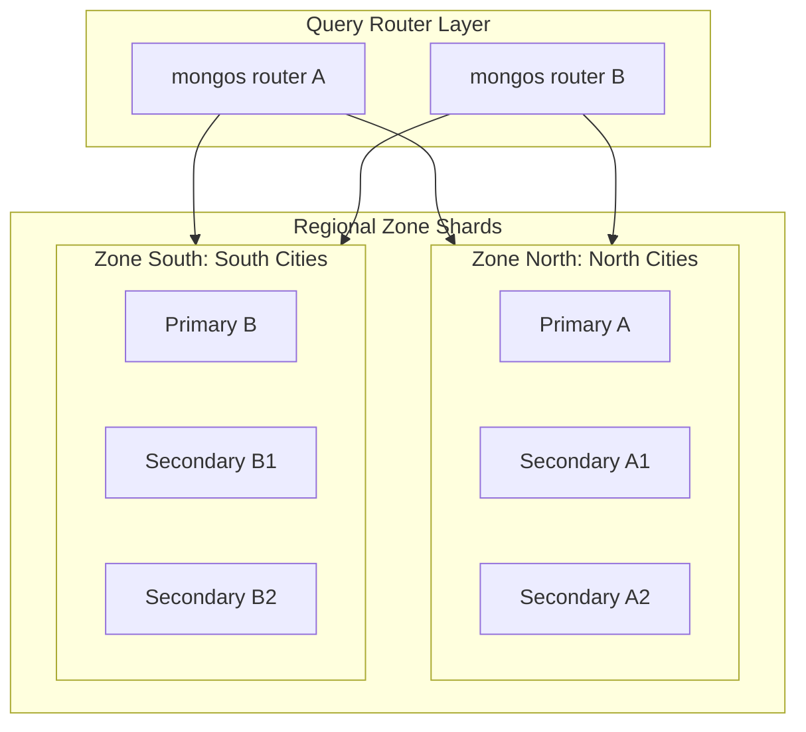

# MongoDB Production Database Design Specification
**Version:** 1.1.0  
**Target Scale:** 1,000,000+ Users (Customers + Technicians)  
**Database Platform:** MongoDB Atlas (M30+ Cluster Instance Tier)

---

## 1. Database Architecture & Scalability Rationale for 1M Users

Scaling a hyperlocal home services platform to 1 million users requires handling two distinct workloads:
1. **High-Frequency Read/Write Telemetry**: Technicians reporting real-time location pings (every 10–30 seconds) while active.
2. **Transactional Booking State Machine**: Creating bookings, managing escrow holds, and executing payouts with zero tolerance for state failures.

To achieve this at scale:
* **Hybrid Schema Design**: We use normalized referencing for core entities (Users, Technicians, Services) to ensure data consistency, while leveraging nested embedding for checklist items, billing records, and address details to reduce joint lookup overhead.
* **Geospatial Optimization**: The `technicians` collection is indexed with a `2dsphere` index to compute near-field matches in under 15ms.
* **Write Segregation**: GPS telemetry writes utilize low-overhead `$set` updates targeting only the location coordinates, avoiding full document write locks.

---

## 2. Collections & Schema Specifications

### 2.1 `users` Collection
Stores authentication, authorization credentials, and basic contact details.

#### A. Fields & Data Types
* `_id`: `ObjectId` - Unique system identifier.
* `email`: `String` - Unique login email address.
* `phone`: `String` - Unique phone number used for OTP matching.
* `passwordHash`: `String` - Hashed password (Bcrypt).
* `role`: `String` - Role validation: `customer`, `technician`, or `admin`.
* `firstName`: `String` - First name.
* `lastName`: `String` - Last name.
* `avatarUrl`: `String` - URL to CDN profile image.
* `isVerified`: `Boolean` - Verification status flag.
* `createdAt`: `Date` - Record creation timestamp.
* `updatedAt`: `Date` - Record modification timestamp.

#### B. MongoDB `$jsonSchema` Validation Rules
```json
{
  "$jsonSchema": {
    "bsonType": "object",
    "required": ["email", "phone", "passwordHash", "role", "firstName", "lastName", "isVerified", "createdAt", "updatedAt"],
    "properties": {
      "email": {
        "bsonType": "string",
        "pattern": "^[^\\s@]+@[^\\s@]+\\.[^\\s@]+$",
        "description": "Must be a valid, unique email address"
      },
      "phone": {
        "bsonType": "string",
        "pattern": "^\\+?[1-9]\\d{1,14}$",
        "description": "E.164 compliant international phone format"
      },
      "passwordHash": {
        "bsonType": "string",
        "pattern": "^\\$2[ayb]\\$\\d{2}\\$[./A-Za-z0-9]{53}$",
        "description": "Valid Bcrypt hash signature"
      },
      "role": {
        "enum": ["customer", "technician", "admin"],
        "description": "Access privileges designation"
      },
      "firstName": {
        "bsonType": "string",
        "minLength": 1,
        "maxLength": 50
      },
      "lastName": {
        "bsonType": "string",
        "minLength": 1,
        "maxLength": 50
      },
      "isVerified": {
        "bsonType": "boolean"
      }
    }
  }
}
```

#### C. Indexes
1. `email_1` (Unique):
   `db.users.createIndex({ "email": 1 }, { unique: true })`
   *Purpose: Quick login routing; prevents duplicate account registration.*
2. `phone_1` (Unique):
   `db.users.createIndex({ "phone": 1 }, { unique: true })`
   *Purpose: Rapid OTP lookup and registration verification.*

#### D. Relationships
* One-to-One with `technicians` (if role is `technician`).
* One-to-Many with `bookings` (as customer or provider).
* One-to-Many with `notifications` (as recipient).

#### E. Sample Document
```json
{
  "_id": {"$oid": "651f8a2e3f4e5a6b7c8d9e01"},
  "email": "amit.patel@gmail.com",
  "phone": "+919876543210",
  "passwordHash": "$2a$12$R9hKbG90sKaJ28sF89sJeOuWwF1kS8m2P8lC4kL5mN6oP7qR8sT9u",
  "role": "customer",
  "firstName": "Amit",
  "lastName": "Patel",
  "avatarUrl": "https://cdn.homehero.com/avatars/amit_patel.png",
  "isVerified": true,
  "createdAt": {"$date": "2026-06-17T10:00:00.000Z"},
  "updatedAt": {"$date": "2026-06-17T10:00:00.000Z"}
}
```

---

### 2.2 `technicians` Collection
Stores professional credentials, verification states, service radius config, and real-time GPS coordinates.

#### A. Fields & Data Types
* `_id`: `ObjectId` - Unique system identifier.
* `userId`: `ObjectId` - Reference to `users._id` (Unique).
* `skills`: `Array` of `String` - List of service specialties.
* `rating`: `Decimal128` - Cumulative feedback score (1.0 to 5.0).
* `verification`: `Object` - Status object containing background checks and audits:
  * `status`: `String` - Verification state: `unverified`, `pending`, or `verified`.
  * `licenseVerified`: `Boolean` - Professional license validation check flag.
  * `backgroundCheckStatus`: `String` - Background check: `pending`, `passed`, or `failed`.
  * `verifiedAt`: `Date` - Approval timestamp.
* `currentLocation`: `GeoJSON Point` - Geospatial location coordinates for real-time dispatch queries.
* `isOnline`: `Boolean` - Flag indicating if technician is active and accepting dispatches.
* `serviceRadiusKm`: `Int` - Query matching radius limit.
* `wallet`: `Object` - Escrow wallet metadata:
  * `balance`: `Decimal128` - Current wallet earnings balance.
  * `razorpayAccountId`: `String` - Razorpay Route payout ID mapping.

#### B. MongoDB `$jsonSchema` Validation Rules
```json
{
  "$jsonSchema": {
    "bsonType": "object",
    "required": ["userId", "skills", "rating", "verification", "currentLocation", "isOnline", "serviceRadiusKm", "wallet"],
    "properties": {
      "userId": {
        "bsonType": "objectId",
        "description": "Must reference a valid record inside the users collection"
      },
      "skills": {
        "bsonType": "array",
        "items": {
          "enum": ["Electrician", "Plumber", "Carpenter", "AC Repair"]
        }
      },
      "rating": {
        "bsonType": "decimal"
      },
      "verification": {
        "bsonType": "object",
        "required": ["status", "licenseVerified", "backgroundCheckStatus"],
        "properties": {
          "status": { "enum": ["unverified", "pending", "verified"] },
          "licenseVerified": { "bsonType": "boolean" },
          "backgroundCheckStatus": { "enum": ["pending", "passed", "failed"] }
        }
      },
      "currentLocation": {
        "bsonType": "object",
        "required": ["type", "coordinates"],
        "properties": {
          "type": { "enum": ["Point"] },
          "coordinates": {
            "bsonType": "array",
            "minItems": 2,
            "maxItems": 2,
            "items": { "bsonType": "double" }
          }
        }
      },
      "isOnline": { "bsonType": "boolean" },
      "serviceRadiusKm": { "bsonType": "int", "minimum": 1, "maximum": 50 }
    }
  }
}
```

#### C. Indexes
1. `currentLocation_2dsphere`:
   `db.technicians.createIndex({ "currentLocation": "2dsphere" })`
   *Purpose: Enables near-sphere geospatial queries for proximity dispatching.*
2. `userId_1` (Unique):
   `db.technicians.createIndex({ "userId": 1 }, { unique: true })`
   *Purpose: Ensures a user can register only one technician profile.*
3. `isOnline_1_skills_1_currentLocation_2dsphere`:
   `db.technicians.createIndex({ "isOnline": 1, "skills": 1, "currentLocation": "2dsphere" })`
   *Purpose: Compound index optimizing geographic queries for matching available, skilled technicians.*

#### D. Relationships
* References `users._id` (One-to-One).

#### E. Sample Document
```json
{
  "_id": {"$oid": "651f8a2e3f4e5a6b7c8d9e02"},
  "userId": {"$oid": "651f8a2e3f4e5a6b7c8d9e03"},
  "skills": ["Plumber", "AC Repair"],
  "rating": {"$numberDecimal": "4.85"},
  "verification": {
    "status": "verified",
    "licenseVerified": true,
    "backgroundCheckStatus": "passed",
    "verifiedAt": {"$date": "2026-05-15T09:30:00.000Z"}
  },
  "currentLocation": {
    "type": "Point",
    "coordinates": [78.382021, 17.426210]
  },
  "isOnline": true,
  "serviceRadiusKm": 10,
  "wallet": {
    "balance": {"$numberDecimal": "3850.50"},
    "razorpayAccountId": "acc_Pv902kf89d"
  }
}
```

---

### 2.3 `services` Collection
Stores standard service categories and dynamic base pricing parameters.

#### A. Fields & Data Types
* `_id`: `ObjectId` - Unique system identifier.
* `name`: `String` - Unique name of the category.
* `isActive`: `Boolean` - Active status configuration flag.
* `pricingRules`: `Object` - Pricing settings:
  * `basePrice`: `Decimal128` - Minimum charge for service call.
  * `hourlyRate`: `Decimal128` - Cost per hour of work.
  * `modifiers`: `Map` of `String` keys to `Decimal128` values - Modifiers for surge, location, or task scale.

#### B. MongoDB `$jsonSchema` Validation Rules
```json
{
  "$jsonSchema": {
    "bsonType": "object",
    "required": ["name", "isActive", "pricingRules"],
    "properties": {
      "name": {
        "enum": ["Electrician", "Plumber", "Carpenter", "AC Repair"],
        "description": "Core services classification list"
      },
      "isActive": { "bsonType": "boolean" },
      "pricingRules": {
        "bsonType": "object",
        "required": ["basePrice", "hourlyRate"],
        "properties": {
          "basePrice": { "bsonType": "decimal" },
          "hourlyRate": { "bsonType": "decimal" }
        }
      }
    }
  }
}
```

#### C. Indexes
1. `name_1` (Unique):
   `db.services.createIndex({ "name": 1 }, { unique: true })`
   *Purpose: Quick verification lookup for booking requests.*

#### D. Relationships
* Referenced by `bookings.serviceId` (One-to-Many).

#### E. Sample Document
```json
{
  "_id": {"$oid": "651f8a2e3f4e5a6b7c8d9e04"},
  "name": "Plumber",
  "isActive": true,
  "pricingRules": {
    "basePrice": {"$numberDecimal": "500.00"},
    "hourlyRate": {"$numberDecimal": "250.00"},
    "modifiers": {
      "monsoonSurge": {"$numberDecimal": "1.50"},
      "holidaySurge": {"$numberDecimal": "1.20"}
    }
  }
}
```

---

### 2.4 `bookings` Collection
The core transactional collection tracking coordinates, state machines, address structures, and service checklists.

#### A. Fields & Data Types
* `_id`: `ObjectId` - Unique system identifier.
* `bookingCode`: `String` - Unique human-readable code.
* `customerId`: `ObjectId` - Reference to the customer in `users._id`.
* `technicianId`: `ObjectId` - Reference to the assigned technician in `technicians._id` (Nullable).
* `serviceId`: `ObjectId` - Reference to the booked category in `services._id`.
* `status`: `String` - Dispatch state: `searching`, `matched`, `en_route`, `active`, `completed`, `cancelled`.
* `billing`: `Object` - Escrow fee splits:
  * `totalAmount`: `Decimal128` - Total cost charged to customer.
  * `platformCommission`: `Decimal128` - Platform commission take (15%).
  * `netToHero`: `Decimal128` - Net payout amount allocated to technician.
* `scheduledTime`: `Date` - Date and time of service appointment.
* `address`: `Object` - Address schema:
  * `street`: `String` - Detailed street location.
  * `area`: `String` - Neighborhood identifier.
  * `city`: `String` - City identifier (used for sharding).
  * `pincode`: `String` - Postal code.
  * `geoPoint`: `GeoJSON Point` - Exact coordinate coordinates of the service location.
* `checklist`: `Array` of `Object` - Job completion tracking list:
  * `task`: `String` - Description of task.
  * `completed`: `Boolean` - Completion state.
  * `timestamp`: `Date` - Completion timestamp.
* `createdAt`: `Date` - Creation timestamp.
* `updatedAt`: `Date` - Modification timestamp.

#### B. MongoDB `$jsonSchema` Validation Rules
```json
{
  "$jsonSchema": {
    "bsonType": "object",
    "required": ["bookingCode", "customerId", "serviceId", "status", "billing", "scheduledTime", "address", "checklist", "createdAt", "updatedAt"],
    "properties": {
      "bookingCode": {
        "bsonType": "string",
        "pattern": "^BKG-[0-9]{8}$"
      },
      "customerId": { "bsonType": "objectId" },
      "technicianId": { "bsonType": ["objectId", "null"] },
      "serviceId": { "bsonType": "objectId" },
      "status": {
        "enum": ["searching", "matched", "en_route", "active", "completed", "cancelled"]
      },
      "billing": {
        "bsonType": "object",
        "required": ["totalAmount", "platformCommission", "netToHero"],
        "properties": {
          "totalAmount": { "bsonType": "decimal" },
          "platformCommission": { "bsonType": "decimal" },
          "netToHero": { "bsonType": "decimal" }
        }
      },
      "address": {
        "bsonType": "object",
        "required": ["street", "city", "pincode", "geoPoint"],
        "properties": {
          "street": { "bsonType": "string" },
          "city": { "bsonType": "string" },
          "pincode": { "bsonType": "string", "pattern": "^[0-9]{6}$" },
          "geoPoint": {
            "bsonType": "object",
            "required": ["type", "coordinates"],
            "properties": {
              "type": { "enum": ["Point"] },
              "coordinates": {
                "bsonType": "array",
                "minItems": 2,
                "maxItems": 2,
                "items": { "bsonType": "double" }
              }
            }
          }
        }
      },
      "checklist": {
        "bsonType": "array",
        "items": {
          "bsonType": "object",
          "required": ["task", "completed"],
          "properties": {
            "task": { "bsonType": "string" },
            "completed": { "bsonType": "boolean" },
            "timestamp": { "bsonType": ["date", "null"] }
          }
        }
      }
    }
  }
}
```

#### C. Indexes
1. `bookingCode_1` (Unique):
   `db.bookings.createIndex({ "bookingCode": 1 }, { unique: true })`
   *Purpose: Quick lookup for booking confirmation and invoices.*
2. `customerId_1_status_1_createdAt_-1`:
   `db.bookings.createIndex({ "customerId": 1, "status": 1, "createdAt": -1 })`
   *Purpose: Optimizes customer dashboard queries showing active or past bookings.*
3. `technicianId_1_status_1_createdAt_-1`:
   `db.bookings.createIndex({ "technicianId": 1, "status": 1, "createdAt": -1 })`
   *Purpose: Optimizes technician history queries showing pending or completed jobs.*

#### D. Relationships
* References `users._id` (Customer) (Many-to-One).
* References `technicians._id` (Technician) (Many-to-One, Nullable).
* References `services._id` (Service Type) (Many-to-One).

#### E. Sample Document
```json
{
  "_id": {"$oid": "651f8a2e3f4e5a6b7c8d9e05"},
  "bookingCode": "BKG-20260617",
  "customerId": {"$oid": "651f8a2e3f4e5a6b7c8d9e01"},
  "technicianId": {"$oid": "651f8a2e3f4e5a6b7c8d9e02"},
  "serviceId": {"$oid": "651f8a2e3f4e5a6b7c8d9e04"},
  "status": "active",
  "billing": {
    "totalAmount": {"$numberDecimal": "750.00"},
    "platformCommission": {"$numberDecimal": "112.50"},
    "netToHero": {"$numberDecimal": "637.50"}
  },
  "scheduledTime": {"$date": "2026-06-17T11:00:00.000Z"},
  "address": {
    "street": "Flat 202, Sector 4, HSR Layout",
    "area": "HSR Layout",
    "city": "Bengaluru",
    "pincode": "560102",
    "geoPoint": {
      "type": "Point",
      "coordinates": [77.641201, 12.910382]
    }
  },
  "checklist": [
    { "task": "Initial inspection", "completed": true, "timestamp": {"$date": "2026-06-17T11:05:00.000Z"} },
    { "task": "Leakage valve fix", "completed": true, "timestamp": {"$date": "2026-06-17T11:25:00.000Z"} },
    { "task": "Post-repair pressure check", "completed": false, "timestamp": null }
  ],
  "createdAt": {"$date": "2026-06-17T09:45:00.000Z"},
  "updatedAt": {"$date": "2026-06-17T11:25:00.000Z"}
}
```

---

### 2.5 `payments` Collection
Tracks financial operations, escrow holds, and payment routing using Razorpay.

#### A. Fields & Data Types
* `_id`: `ObjectId` - Unique system identifier.
* `bookingId`: `ObjectId` - Reference to `bookings._id`.
* `razorpayOrderId`: `String` - Unique order identifier returned by Razorpay (Unique).
* `razorpayPaymentId`: `String` - Razorpay verification payment identifier (Nullable).
* `razorpaySignature`: `String` - Secure callback verification signature.
* `amount`: `Decimal128` - Payment amount (held or captured).
* `currency`: `String` - Settlement currency (default: `INR`).
* `escrowStatus`: `String` - Escrow state: `held_in_escrow`, `released`, `refunded`, `failed`.
* `createdAt`: `Date` - Creation timestamp.
* `updatedAt`: `Date` - Modification timestamp.

#### B. MongoDB `$jsonSchema` Validation Rules
```json
{
  "$jsonSchema": {
    "bsonType": "object",
    "required": ["bookingId", "razorpayOrderId", "amount", "currency", "escrowStatus", "createdAt", "updatedAt"],
    "properties": {
      "bookingId": { "bsonType": "objectId" },
      "razorpayOrderId": {
        "bsonType": "string",
        "pattern": "^order_[a-zA-Z0-9]+$"
      },
      "razorpayPaymentId": {
        "bsonType": ["string", "null"],
        "pattern": "^pay_[a-zA-Z0-9]+$"
      },
      "amount": { "bsonType": "decimal" },
      "currency": { "enum": ["INR"] },
      "escrowStatus": {
        "enum": ["held_in_escrow", "released", "refunded", "failed"]
      }
    }
  }
}
```

#### C. Indexes
1. `razorpayOrderId_1` (Unique):
   `db.payments.createIndex({ "razorpayOrderId": 1 }, { unique: true })`
   *Purpose: Speeds up webhook verification callbacks and prevents duplicate payments.*
2. `bookingId_1`:
   `db.payments.createIndex({ "bookingId": 1 })`
   *Purpose: Quick verification audit lookup for bookings.*

#### D. Relationships
* References `bookings._id` (One-to-One).

#### E. Sample Document
```json
{
  "_id": {"$oid": "651f8a2e3f4e5a6b7c8d9e06"},
  "bookingId": {"$oid": "651f8a2e3f4e5a6b7c8d9e05"},
  "razorpayOrderId": "order_PK8490aBcd10fd",
  "razorpayPaymentId": "pay_PK8529f3d6a2e4",
  "razorpaySignature": "4fa8d9e18b82c3f4e5a6b7c8d9e01f2e3a4b5c6d7e8f90123456789abcdef",
  "amount": {"$numberDecimal": "750.00"},
  "currency": "INR",
  "escrowStatus": "held_in_escrow",
  "createdAt": {"$date": "2026-06-17T09:46:00.000Z"},
  "updatedAt": {"$date": "2026-06-17T09:47:00.000Z"}
}
```

---

### 2.6 `reviews` Collection
Stores user reviews, star ratings, and feedback comments.

#### A. Fields & Data Types
* `_id`: `ObjectId` - Unique system identifier.
* `bookingId`: `ObjectId` - Reference to `bookings._id` (Unique).
* `reviewerId`: `ObjectId` - Reference to the customer in `users._id`.
* `revieweeId`: `ObjectId` - Reference to the technician in `technicians._id`.
* `rating`: `Int` - Star rating (integer 1 to 5).
* `comment`: `String` - Review text comment.
* `createdAt`: `Date` - Creation timestamp.

#### B. MongoDB `$jsonSchema` Validation Rules
```json
{
  "$jsonSchema": {
    "bsonType": "object",
    "required": ["bookingId", "reviewerId", "revieweeId", "rating", "comment", "createdAt"],
    "properties": {
      "bookingId": { "bsonType": "objectId" },
      "reviewerId": { "bsonType": "objectId" },
      "revieweeId": { "bsonType": "objectId" },
      "rating": {
        "bsonType": "int",
        "minimum": 1,
        "maximum": 5
      },
      "comment": {
        "bsonType": "string",
        "maxLength": 1000
      }
    }
  }
}
```

#### C. Indexes
1. `bookingId_1` (Unique):
   `db.reviews.createIndex({ "bookingId": 1 }, { unique: true })`
   *Purpose: Ensures only one review can be submitted per booking.*
2. `revieweeId_1_rating_1`:
   `db.reviews.createIndex({ "revieweeId": 1, "rating": -1 })`
   *Purpose: Speeds up calculation profiles for high-rated technicians.*

#### D. Relationships
* References `bookings._id` (One-to-One).
* References `users._id` (Reviewer) (Many-to-One).
* References `technicians._id` (Reviewee) (Many-to-One).

#### E. Sample Document
```json
{
  "_id": {"$oid": "651f8a2e3f4e5a6b7c8d9e07"},
  "bookingId": {"$oid": "651f8a2e3f4e5a6b7c8d9e05"},
  "reviewerId": {"$oid": "651f8a2e3f4e5a6b7c8d9e01"},
  "revieweeId": {"$oid": "651f8a2e3f4e5a6b7c8d9e02"},
  "rating": 5,
  "comment": "Amit arrived on time, was extremely professional, and resolved the electrical issue quickly.",
  "createdAt": {"$date": "2026-06-17T12:00:00.000Z"}
}
```

---

### 2.7 `notifications` Collection
Stores notification logs for customer and technician users.

#### A. Fields & Data Types
* `_id`: `ObjectId` - Unique system identifier.
* `recipientId`: `ObjectId` - Reference to recipient in `users._id`.
* `type`: `String` - Delivery channel: `push`, `email`, `sms`.
* `title`: `String` - Notification title.
* `body`: `String` - Notification message body text.
* `isRead`: `Boolean` - Read status indicator flag.
* `readAt`: `Date` - Read timestamp (Nullable).
* `createdAt`: `Date` - Creation timestamp.

#### B. MongoDB `$jsonSchema` Validation Rules
```json
{
  "$jsonSchema": {
    "bsonType": "object",
    "required": ["recipientId", "type", "title", "body", "isRead", "createdAt"],
    "properties": {
      "recipientId": { "bsonType": "objectId" },
      "type": { "enum": ["push", "email", "sms"] },
      "title": { "bsonType": "string", "maxLength": 100 },
      "body": { "bsonType": "string", "maxLength": 500 },
      "isRead": { "bsonType": "boolean" },
      "readAt": { "bsonType": ["date", "null"] }
    }
  }
}
```

#### C. Indexes
1. `recipientId_1_isRead_1_createdAt_-1`:
   `db.notifications.createIndex({ "recipientId": 1, "isRead": 1, "createdAt": -1 })`
   *Purpose: Speeds up loading of unread notifications in client lists.*
2. `createdAt_1` (TTL Index):
   `db.notifications.createIndex({ "createdAt": 1 }, { expireAfterSeconds: 2592000 })`
   *Purpose: Automatically prunes notification records older than 30 days to manage storage.*

#### D. Relationships
* References `users._id` (Many-to-One).

#### E. Sample Document
```json
{
  "_id": {"$oid": "651f8a2e3f4e5a6b7c8d9e08"},
  "recipientId": {"$oid": "651f8a2e3f4e5a6b7c8d9e01"},
  "type": "push",
  "title": "Technician Dispatched",
  "body": "Your plumber Suresh Kumar has departed and is en route to your location.",
  "isRead": false,
  "readAt": null,
  "createdAt": {"$date": "2026-06-17T10:05:00.000Z"}
}
```

---

## 3. Sharding & Partitioning Strategy

For a deployment scaling to 1 million users, a single replica set will eventually face memory and disk I/O limits. We use MongoDB sharding to scale database capacity horizontally.



### 3.1 Rationale for Key Shard Assignments
1. **`bookings` Collection**:
   * **Shard Key**: `{ "address.city": 1, "createdAt": 1 }`
   * **Strategy**: Range-based zone sharding. City clusters group bookings locally. This ensures that dispatch processes querying bookings by city are routed to the local shard, minimizing cross-shard queries.
2. **`technicians` Collection**:
   * **Shard Key**: `{ "isOnline": 1, "userId": 1 }`
   * **Strategy**: Scatter-gather queries are avoided for active dispatch queries by grouping online technicians. The matching engine queries only active technicians (`isOnline: true`), focusing search parameters on a smaller subset of shards.
3. **`users` Collection**:
   * **Shard Key**: `{ "email": "hashed" }`
   * **Strategy**: Hashed sharding keys distribute write loads and account verifications evenly across all shards, preventing write bottlenecks on single shards.

---

## 4. Sizing & Capacity Estimation (1,000,000 Users)

The following estimates plan resource allocations for 1 million active users:

### 4.1 Document Storage Footprint Calculations

| Collection | Average Doc Size | Est. Quantity | Storage Size (Raw) | Compression (WiredTiger 3x) | Memory Cache Buffer |
| :--- | :--- | :--- | :--- | :--- | :--- |
| **`users`** | 450 Bytes | 1,000,000 | 450 MB | ~150 MB | ~50 MB |
| **`technicians`** | 600 Bytes | 50,000 | 30 MB | ~10 MB | ~30 MB (High GPS writes) |
| **`bookings`** | 1.2 KB | 5,000,000 (yearly) | 6.0 GB | ~2.0 GB | ~600 MB |
| **`payments`** | 500 Bytes | 5,000,000 | 2.5 GB | ~833 MB | ~100 MB |
| **`reviews`** | 400 Bytes | 2,000,000 | 800 MB | ~266 MB | ~50 MB |
| **`notifications`**| 350 Bytes | 15,000,000 (30d TTL)| 5.25 GB | ~1.75 GB | ~100 MB |
| **Total** | | | **15.03 GB** | **~5.01 GB** | **~930 MB** |

### 4.2 RAM and Working Set Recommendation
To maintain low latency (<10ms index traversal times), the database cluster's RAM must fit the **Working Set** (indexes + frequently accessed data).
* **Total Index Sizes**: ~4.5 GB.
* **Active Working Set**: ~6.0 GB (consisting of online users, active bookings, and active technician location indexes).
* **Total Target RAM Size**: **16 GB RAM** (M30/M40 tier instance in MongoDB Atlas). This ensures the working set remains cached in RAM, avoiding slower disk reads.

---

## 5. Referential Integrity & Consistency Controls

Since MongoDB lacks foreign key constraints, referential integrity and consistency are managed through application design and transactional mechanisms:

1. **ACID Transactions**: For escrow releases and wallet updates, we use MongoDB multi-document transactions to ensure updates to both collections succeed or fail together:
   ```javascript
   const session = await db.getMongo().startSession();
   session.startTransaction();
   try {
     await Booking.updateOne({ _id: bookingId }, { status: 'completed' }, { session });
     await Technician.updateOne({ _id: techId }, { $inc: { "wallet.balance": netAmount } }, { session });
     await session.commitTransaction();
   } catch (error) {
     await session.abortTransaction();
     throw error;
   } finally {
     session.endSession();
   }
   ```
2. **Cascading Pruning via Change Streams**: When a user account is deleted, a MongoDB Change Stream listener detects the event and automatically deletes the associated profile, reviews, and active notification tokens to prevent orphan records.
