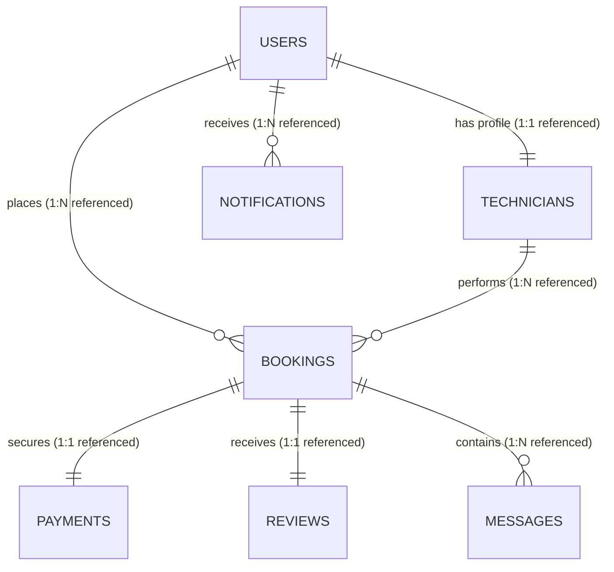
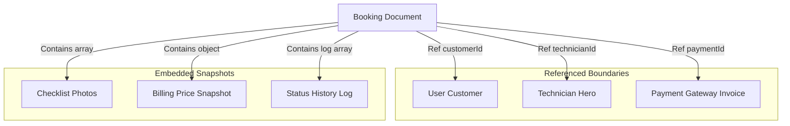

# MongoDB Relationships & Entity Mapping Design - HomeHero

**Prepared by**: Database Solution Architect  
**Target Audience**: Backend Engineers, Software Architects, & Technical Leads  
**Focus**: Relationship cardinality mapping, referencing vs embedding criteria, and Mermaid ERDs

---

## 1. Relational Modeling Strategy in Document Databases

HomeHero balances database normalization rules with MongoDB document capabilities, mapping relationships based on data read patterns and growth profiles:

### 1.1 Embedding vs. Referencing Criteria

*   **When to Embed**:
    - **1:Few Relationships**: The child documents are limited in size and number (e.g. `savedAddresses` inside a user profile, max 10 entries).
    - **Transient Transaction Snapshots**: Data must be frozen in time to protect against future modifications (e.g. copying the current service price into the booking document).
    - **Read-Together Operations**: Child items are always queried along with the parent document.
*   **When to Reference**:
    - **Unbounded Growth**: The child documents can grow indefinitely (e.g. bookings placed by a customer over time).
    - **Independent Existence**: The child entity is queried separately (e.g. searching for a technician independently of their user account).
    - **Shared Data Integrity**: The data is shared and referenced by multiple entities.

---

## 2. Core Entity Relationship Diagram (ERD)

This diagram visualizes the primary references and embedded structures across the database:

---

## 3. Transactional Relationship Deep-Dive

### 3.1 Booking Relationships
The Booking entity connects several components of the platform:

*   **Customer & Technician**: Modeled as **Many-to-One** relationships using Mongoose object IDs (`Ref: User` and `Ref: Technician`).
*   **Billing Price Snapshot**: Embedded object containing the exact base and surge prices at the time of booking to protect against future catalog updates.
*   **Checklist & Status History**: Embedded arrays that track job progression without requiring multiple database lookups.

### 3.2 Payment Relationships
- **Cardinality**: **One-to-One** relationship linking payments to bookings (`Ref: Booking`).
- **Escrow Reference**: Holds external gateway IDs (Razorpay order ID, signature verification string) to verify transactions.

### 3.3 Review & Notification Relationships
- **Review**: Modeled as a **One-to-One** relationship to the booking to prevent multiple submissions, and a **Many-to-One** relationship to the technician to calculate average ratings.
- **Notification**: Modeled as a **Many-to-One** relationship pointing to the recipient's user ID. Includes a 30-day TTL index to automatically clean up old notifications.
