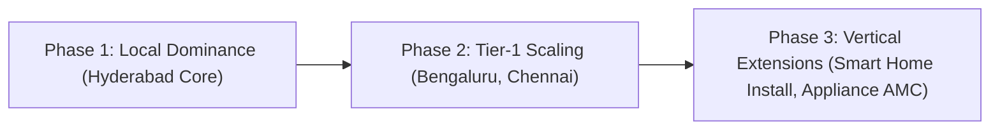

# HomeHero - Business Model Canvas & Growth Roadmap

**Prepared by**: Startup Business Consultant  
**Target Audience**: Founders, Stakeholders, & Investors  
**Focus**: Revenue Modeling, Operational Canvas, & Scaling Strategy

---

## 1. Business Model Canvas (BMC)

This section maps out the operational, customer, and financial mechanics of the **HomeHero** hyperlocal services platform.

```
┌────────────────────────────────────────────────────────────────────────────────────────┐
│                                  BUSINESS MODEL CANVAS                                 │
├──────────────────────┬──────────────────────┬──────────────────┬──────────────────────┬──────────────────────┤
│ KEY PARTNERS         │ KEY ACTIVITIES       │ VALUE            │ CUSTOMER             │ CUSTOMER             │
│ - Professional guilds│ - Real-time matching │ PROPOSITIONS     │ RELATIONSHIPS        │ SEGMENTS             │
│ - Background checkers│ - Supply onboarding  │ - 15-min emergency│ - Self-service app  │ - Busy urban families│
│ - Payment processors │ - Quality assurance  │   dispatches     │ - 24/7 chat support  │ - Elderly residents  │
│ - Hardware suppliers │ - Platform marketing │ - Escrow security│ - Rating guarantees  │ - Property managers  │
│                      ├──────────────────────┤ - Flat 15% fee   ├──────────────────────┼──────────────────────┤
│                      │ KEY RESOURCES        │                  │ CHANNELS             │ KEY PROVIDERS        │
│                      │ - Dispatch algorithms│                  │ - iOS / Android apps │ - Plumbers, Masonry  │
│                      │ - Telemetry servers  │                  │ - Web landing pages  │ - Electricians, AC   │
│                      │ - Vetted Hero network│                  │ - Local partnerships │   technicians        │
└──────────────────────┴──────────────────────┴──────────────────┴──────────────────────┴──────────────────────┘
```

### 1.1 Key Partners
*   **Vetting Agencies**: For background checks on technicians.
*   **Payment Gateways (Razorpay)**: To handle secure escrow split payments.
*   **Hardware Retail Chains**: Partnering with local stores for quick parts supply.

### 1.2 Key Activities
*   **Real-time Matching Optimization**: Improving matching rates and reducing dispatcher search latencies.
*   **Supply Chain Onboarding**: Continually recruiting and vetting local technicians.
*   **Platform Maintenance**: Running low-latency socket servers for GPS location streams.

### 1.3 Key Resources
*   **Geospatial Dispatch Algorithms**: For matching and routing.
*   **Verified Professional Network**: Vetted technicians (Heroes).
*   **Real-time Telemetry Servers**: Managing WebSocket connections.

### 1.4 Value Proposition
*   **For Customers**: 15-minute emergency repairs, escrow-backed payment security, background-checked technicians, and transparent pricing.
*   **For Technicians**: Low platform fees (15%), instant payouts upon customer sign-off, and zero customer acquisition overheads.

### 1.5 Customer Relationships
*   **App-Driven Self-Service**: Automated booking, matching, and payment checkout.
*   **Escrow Dispute Resolution**: Mediate service issues before releasing funds.
*   **Community Trust Logs**: Customer ratings and reviews keep service quality high.

### 1.6 Channels
*   **Mobile App Client**: Primary booking and tracking interface.
*   **Web Portal**: For service catalogs and admin management.
*   **Social & Referral Systems**: Customer and technician referral programs.

### 1.7 Customer Segments
*   **Time-Poor Urban Professionals**: Prioritize convenience, speed, and safety.
*   **Elderly & Single Residents**: Value verified, background-checked technicians.
*   **B2B Property Managers**: Need quick maintenance services for tenant turnovers.

### 1.8 Cost Structure
*   **Infrastructure Costs**: Server hosting (Render, Atlas) and maps API costs.
*   **Customer Acquisition Costs (CAC)**: Marketing spend to acquire users.
*   **Operations & Compliance**: Background checks and customer support.

### 1.9 Revenue Streams
*   **15% Commission Fee**: Deducted from the subtotal of completed jobs.
*   **Dynamic Surge Pricing**: Monsoon, night, and holiday surcharges.
*   **B2B Service Contracts**: Monthly retainers with property managers.

---

## 2. Growth & Expansion Strategy



### 2.1 Phase 1: Local Market Dominance (Months 1–6)
*   Focus on Hyderabad (Madhapur, Gachibowli, Jubilee Hills).
*   Target 250 verified technicians to build supply liquidity.
*   Establish emergency response times under 20 minutes.

### 2.2 Phase 2: Regional Expansion (Months 7–12)
*   Expand to Bengaluru and Chennai.
*   Integrate B2B partnerships with local property managers and co-living providers.
*   Optimize matching algorithms to handle higher volumes.

### 2.3 Phase 3: Vertical Expansion (Months 13–24)
*   Launch Annual Maintenance Contracts (AMC) for households.
*   Introduce smart home device installations (smart locks, security systems, EV chargers).
*   Partner with retail hardware stores to offer installation services at checkout.
