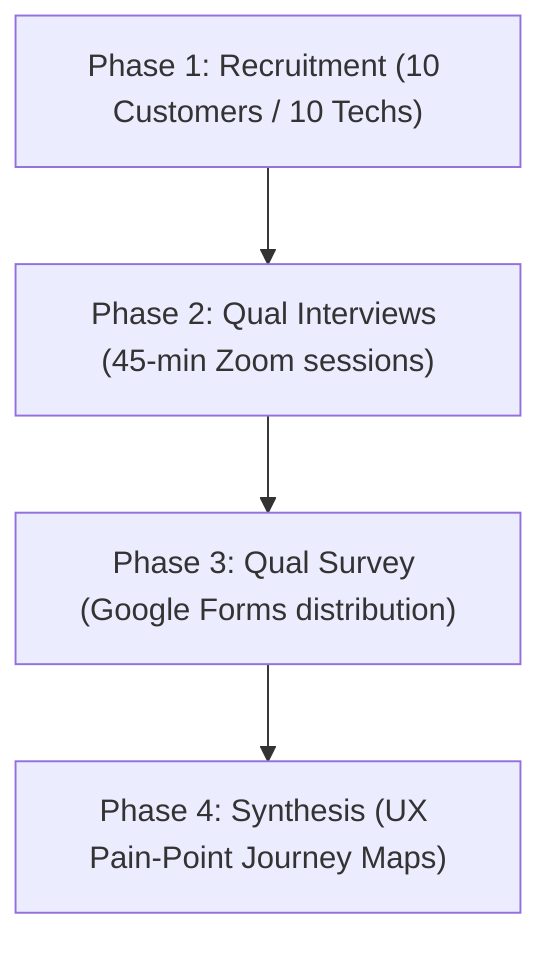

# HomeHero - Customer UX Research & Interview Plan

**Prepared by**: UX Research Lead  
**Target Audience**: Product Management, UX Design, & Engineering Teams  
**Focus**: User Persona Validation, Interview Scripts, & UX Opportunity Mapping

---

## 1. Research Objectives

The goal of this research plan is to understand customer and technician behaviors in hyperlocal home services:
1. Identify friction points in current booking systems (directories, classifieds, premium apps).
2. Validate trust markers (background checks, reviews, online/offline status tags) that affect booking decisions.
3. Test payment workflows, specifically customer comfort with escrow-locked holds and instant technician payouts.
4. Establish baseline feature requirements for the MVP client application interfaces.

---

## 2. Target User Personas

### 2.1 Customer Persona: "Busy Urban Parent" (Priya Iyer, 34)
*   **Demographic**: Married, two children, dual-income household, residing in Gachibowli, Hyderabad.
*   **Context**: Tech-literate, heavily uses delivery apps, values time over cost, highly concerned about home safety.
*   **Core Goal**: Quickly hire trusted, vetted handymen for urgent repairs (e.g. leaking sink) without taking time off work.
*   **Friction**: Frustrated by arbitrary pricing, late technicians, and lack of follow-up support if repairs fail.

### 2.2 Technician Persona: "Independent Hero" (Ramesh Kumar, 29)
*   **Demographic**: Freelance electrician with 6 years of experience, residing in Kukatpally, Hyderabad.
*   **Context**: Relies on phone calls and local references; owns a smartphone, but has limited experience with complex apps.
*   **Core Goal**: Fill empty booking slots, avoid travel delays, and get paid instantly upon work completion.
*   **Friction**: Platform commission rates above 20%, delayed payouts (1-2 weeks), and clients disputing labor rates.

---

## 3. Qualitative User Interview Scripts

### 3.1 Homeowner (Customer) Interview Script
1. "Walk me through the last time something broke in your home (e.g. tap, light). How did you find a technician?"
2. "What was your biggest worry when inviting that technician into your house?"
3. "How did you negotiate the final price? Were there any surprises on the bill?"
4. "If you were told a platform holds your payment in escrow and only releases it to the technician once you sign off on the completed work, how would you feel about that?"

### 3.2 Technician (Hero) Interview Script
1. "How do you currently find new clients? How many hours a week do you spend waiting for jobs?"
2. "What is your biggest frustration when dealing with platform apps like Urban Company or local directories?"
3. "How do clients typically pay you, and how often do you face payment delays or disputes?"
4. "If an app offered you a lower platform fee (15%) and cleared your earnings instantly to your wallet upon customer sign-off, how would that change your work routine?"

---

## 4. Quantitative Survey Questions (Scale of 1-5)

1. **Safety**: "How important is it that a service platform shows background checks and ID verifications for technicians?"
2. **Pricing Transparency**: "How frustrated are you when final repair bills are higher than the initial quote?"
3. **Speed of Service**: "Rate your level of urgency when booking an emergency repair (e.g., active water leak)."
4. **Escrow Payments**: "How comfortable are you with a platform holding your payment in escrow until you approve the work?"

---

## 5. Research Methodology

---

## 6. UX Pain Point & Opportunity Analysis

| Observed Pain Point | Product Opportunity | MVP Feature Translation |
| :--- | :--- | :--- |
| **Safety Concerns**: Customers dislike inviting unvetted workers into their homes. | Visible background checks and verification status badges. | Add a **"Verified Hero" badge** on the technician's profile page. |
| **Hidden Charges**: Unexpected fees on final invoices cause disputes. | Upfront labor rate estimators and flat platform service fees. | Implement a **Standard pricing calculator** based on service parameters. |
| **Payout Delays**: Technicians struggle with weekly platform payout cycles. | Instant escrow releases upon digital customer sign-off. | Add an **"Instant Release" wallet feature** for technicians. |

---

## 7. Next Steps

1. **Recruitment**: Recruit 10 customers and 10 technicians in Hyderabad for virtual interviews.
2. **Execution**: Conduct qualitative interviews and run quantitative surveys over the next two weeks.
3. **UX Synthesis**: Synthesize findings to define the design tokens, user journeys, and wireframes for **Volume 2: Product Design**.
