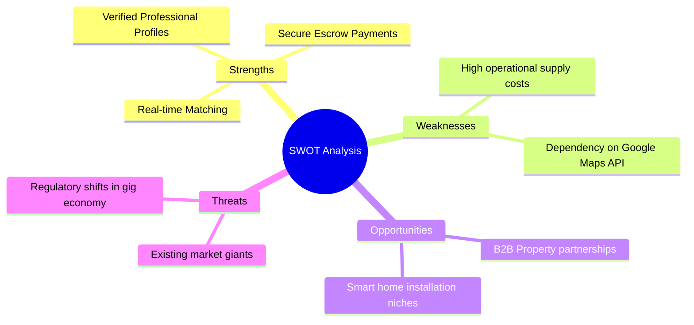

# HomeHero - Startup Idea Validation Report

**Prepared by**: Senior Startup Consulting Group  
**Target Audience**: Seed & Venture Investors  
**Focus**: Hyperlocal On-Demand Home Services Marketplace

---

## 1. Executive Summary & Problem Statement

The residential repairs and home maintenance market is highly fragmented, localized, and plagued by inefficiencies. Homeowners face a significant challenge: finding reliable, verified service providers (electricians, plumbers, carpenters, and AC technicians) during emergencies.

### The Problem
1. **Lack of Trust**: Consumers invite unvetted technicians into their homes, creating safety concerns.
2. **Pricing Opacity**: Arbitrary quotes, hidden fees, and lack of standard labor rates cause transaction disputes.
3. **Execution Delay**: Average emergency service wait times range from 3 to 24 hours due to scheduling overheads.
4. **Poor Quality Controls**: Lack of warranty or formal recourse when repairs fail shortly after completion.

---

## 2. Existing Solutions vs. Pain Points

| Competitor Tier | Providers | Consumer Pain Points |
| :--- | :--- | :--- |
| **Traditional Local Directories** | Yellow Pages, Justdial | Just lists numbers; no booking, validation, or pricing guarantees. |
| **Online Classifieds** | Sulekha, OLX | High spam rate; no quality verification, high security risks. |
| **First-Generation Service Apps** | Urban Company, TaskRabbit | Premium pricing; long booking windows, lack of real-time emergency matching. |

---

## 3. Customer & Provider Pain Points

### Consumer Pain Points
- **Unpredictability**: Booking a service is a gamble; arrival times and prices are rarely guaranteed.
- **Safety Concerns**: Lack of transparent background checks on technicians.
- **No Recourse**: If a repair fails after the technician leaves, there is no system to report it or request a redo.

### Service Provider Pain Points
- **Inconsistent Income**: High dependency on local word-of-mouth with empty hours during the day.
- **Marketing Overhead**: Spending significant time and money on classified ads with low conversion rates.
- **Delayed Payouts**: Clients delay payments, or platforms hold funds for weeks.

---

## 4. The Market Gap

First-generation platforms focus heavily on *scheduled, premium grooming or standardized home cleaning package contracts*. A significant market gap exists for **on-demand, real-time emergency repairs** (e.g. active pipe bursts, electrical short circuits) matching customers with nearby, active technicians immediately.

---

## 5. Target Customer Segments

1. **Urban Working Professionals**: High income, low free time, tech-savvy, and willing to pay for convenience and safety.
2. **Elderly Residents & Single Homemakers**: Prioritize safety verification, predictable pricing, and reliable service.
3. **Property Managers & Landlords**: Need quick, recurring maintenance for tenant turnovers.

---

## 6. Value Proposition

### For Customers
- **Real-Time Matching**: Find a nearby technician within minutes.
- **Upfront Pricing**: Clear billing based on standardized labor rates and dynamic pricing rules.
- **Vetted Safety**: Every technician undergoes background checks and license validation.
- **Escrow-Secured Payments**: Funds are held in escrow until the customer signs off on the completed work.

### For Technicians (Heroes)
- **Zero Customer Acquisition Cost**: Jobs are dispatched directly via the app.
- **Instant Payout Release**: Escrow funds are transferred to the technician's wallet immediately upon customer sign-off.
- **Flexible Work Hours**: Control availability using the online/offline toggle.

---

## 7. Unique Selling Proposition (USP)

> **"Real-Time Proximity Match with Escrow-Secured Sign-Off"**
> Unlike traditional directories or booking sites, HomeHero is a real-time matching system. It matches the customer with the nearest available technician and secures the payment in escrow, releasing it only when the job is completed to the customer's satisfaction.

---

## 8. Business & Operational Risks

1. **Supply Side Disengagement**: Technicians bypassing the app for offline relationships after the first match.
   - *Mitigation*: Offer platform perks like tool insurance, parts purchase discounts, and instant payouts.
2. **Liability for Damages**: Technicians causing accidental damage during repairs.
   - *Mitigation*: Require all technicians to hold third-party liability insurance.
3. **Geospatial Liquidity Limits**: Failure to match users during high-demand hours or in low-density neighborhoods.
   - *Mitigation*: Use dynamic surge pricing to incentivize technicians to travel to high-demand areas.

---

## 9. Growth Opportunities

*   **B2B Property Management Partnerships**: Offer recurring maintenance packages to real estate firms and co-living providers.
*   **Retail Supply Chain Integrations**: Partner with hardware and appliance stores to offer installation services at checkout.
*   **Vertical Expansion**: Expand into high-ticket installations like solar panels, EV chargers, and smart home setups.

---

## 10. SWOT Analysis



---

## 11. Problem-Solution Fit Matrix

```
┌──────────────────────────────────────────────┐
│  CUSTOMER PROBLEM     ──>   HOMEHERO SOLVE   │
├──────────────────────────────────────────────┤
│ 1. Emergency delays   ──> 15km Proximity Match│
│ 2. Safety concerns    ──> Background Checks  │
│ 3. Pricing disputes   ──> Standardized Rates │
│ 4. Unreliable work    ──> Escrow Lock Payout │
└──────────────────────────────────────────────┘
```

---

## 12. Long-Term Vision

HomeHero aims to become the operating system for residential infrastructure management. Our long-term vision is to transition from reactive repairs to proactive maintenance: using smart home IoT sensors to detect leaks and electrical anomalies before they fail, automatically dispatching a technician to resolve the issue.
