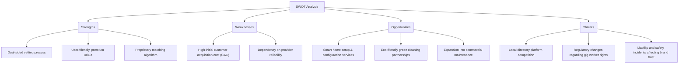

# HomeHero - Market Research & Feasibility Report

## 1. Executive Summary
HomeHero is an on-demand home services platform designed to bridge the gap between homeowners/renters and trusted, verified local service professionals ("Heroes"). By leveraging modern technology, real-time tracking, transparent pricing, and a robust vetting process, HomeHero aims to redefine the local services economy. This report analyzes the market landscape, target demographics, competitive positioning, and strategic growth avenues.

---

## 2. Industry Analysis & Market Size
### 2.1 The On-Demand Economy Boom
The global on-demand home services market has experienced exponential growth over the past decade. Driven by increasing smartphone penetration, rapid urbanization, and a shift in consumer behavior toward convenience-based services, the market is poised to grow at a Compound Annual Growth Rate (CAGR) of over 15% through 2030.

- **Market Valuation:** Estimated at $300B+ globally, with significant untapped potential in regional and suburban markets.
- **Consumer Shift:** Time-poverty (especially among dual-income families) has made consumers more willing to pay a premium for time-saving home services.

### 2.2 Key Growth Drivers
1. **Busy Lifestyles & Dual-Income Households:** Modern urban families have less disposable time for household chores, repairs, and maintenance.
2. **Technological Advancements:** Seamless mobile payment systems, GPS-based tracking, and AI-driven matching algorithms have made booking service providers easier than ever.
3. **Aging Population:** Elderly homeowners require reliable help with home maintenance, gardening, and heavy lifting.
4. **Rise of the Gig Economy:** Professionals are seeking flexible working hours, making freelancing on platform services highly attractive.

---

## 3. Target Audience & Customer Persona
### 3.1 Market Segmentation
Our target market is divided into two primary sides (a dual-sided marketplace):

#### End Users (Consumers)
*   **The Busy Professional (Age 25-45):** Urban individuals or couples who value their time highly. They look for instant booking, clean records, and cashless payments.
*   **Active Seniors (Age 65+):** Elderly individuals living independently who need physical assistance with home chores, repairs, and general upkeep.
*   **Property Managers & Landlords:** Individuals managing multiple rental units who require consistent, reliable, and recurring maintenance services.

#### Service Providers (Heroes)
*   **Independent Contractors:** Plumbers, electricians, cleaners, and handymen who want to fill gaps in their schedules.
*   **Gig Workers & Students:** Semi-skilled or skilled individuals looking for flexible, part-time earning opportunities.

### 3.2 Pain Points & Solutions
| Customer Pain Point | HomeHero Solution |
| :--- | :--- |
| **Unreliable Service Providers** | Rigorous background checks, verification, and rating systems. |
| **Lack of Pricing Transparency** | Upfront flat-rate pricing or clear hourly estimates prior to booking. |
| **Safety Concerns** | Fully insured services, SOS safety features, and tracked locations. |
| **Inefficient Booking Processes** | Instant, single-tap booking with automated matching. |

---

## 4. Competitor Landscape
### 4.1 Direct Competitors
1.  **TaskRabbit:**
    *   *Strengths:* Strong brand recognition, backed by IKEA, wide range of odd-job categories.
    *   *Weaknesses:* Higher platform fees, varying service quality, and lack of professional trade focus (e.g., complex plumbing/electrical).
2.  **Thumbtack:**
    *   *Strengths:* Large directory of certified professionals, good for large-scale remodeling projects.
    *   *Weaknesses:* The lead-generation model charges pros upfront, leading to frustrated providers and delayed response times for users.
3.  **Angi (formerly Angie's List):**
    *   *Strengths:* Deep historical database of reviews, trusted by older demographics.
    *   *Weaknesses:* Outdated interface, high advertising costs for pros, and spam-heavy communication.

### 4.2 HomeHero’s Competitive Edge
*   **Instant Dispatch ("Hero Express"):** An option to get a professional to your home within 60 minutes for emergencies.
*   **Hero Academy:** A training and certification pipeline that upskills providers, ensuring a premium service standard.
*   **Subscription Model (Hero+):** A recurring membership offering free monthly health checks (e.g., plumbing inspection) and discounted service rates.

---

## 5. SWOT Analysis

---

## 6. Go-To-Market (GTM) & Marketing Strategy
### 6.1 Phase 1: Hyper-Local Launch
*   **Focus Area:** Launch in a single, high-density metropolitan area to refine matching algorithms and build a localized pool of service providers.
*   **Provider Acquisition:** Offer low commission rates for the first 100 registered providers ("Founding Heroes") and guarantees of minimum weekly earnings.
*   **User Acquisition:** Hyper-local digital ads (Google, Facebook, Instagram), partnerships with local real estate agencies, and neighborhood flyers.

### 6.2 Phase 2: Retention and Referral Networks
*   **Referral Loop:** Double-sided referral incentives (e.g., "$20 off your next service, and $20 for your friend").
*   **SEO & Content Marketing:** High-quality blog posts on home maintenance tips, DIY fixes (that lead to hiring a pro), and SEO-focused local landing pages (e.g., "Best Handyman in [Neighborhood]").

---

## 7. Monetization & Pricing Strategy
HomeHero will employ a multi-stream monetization strategy:
1.  **Platform Commission (Take Rate):** A standard 15-20% fee from the service provider's earnings for matching, insurance, and platform maintenance.
2.  **Platform Service Fee:** A small convenience fee ($2-$5) charged to the customer per booking.
3.  **Hero+ Subscription Plan:** A subscription for homeowners priced at $14.99/month, offering:
    *   Priority booking and no service fees.
    *   10% discount on all bookings.
    *   Annual home safety and utility check-ups.
4.  **Promoted Listings / Premium Ads:** Allowed for top-tier service providers who want higher visibility in search results.

---

## 8. Regulatory, Security & Insurance Considerations
*   **Liability Insurance:** A robust general liability insurance policy (up to $1M) covering property damage or injury caused by providers during jobs.
*   **Worker Classification:** Compliance with local labor laws, ensuring providers are classified properly as independent contractors, or implementing a hybrid model where premium providers are employees.
*   **Background Checks:** Mandatory criminal background checks and identity verification via integrations (e.g., Stripe Identity or Checkr).

---

## 9. Conclusion & Strategic Roadmap
The on-demand home services market presents a significant opportunity. By addressing the core paint points of reliability, safety, and price transparency, HomeHero can capture a substantial market share.

### 3-Month Roadmap:
1.  **Month 1:** Complete UI/UX designs and initiate backend development.
2.  **Month 2:** Run local marketing campaigns to onboard first cohort of Service Providers.
3.  **Month 3:** Launch closed beta in the initial target city and collect feedback.
