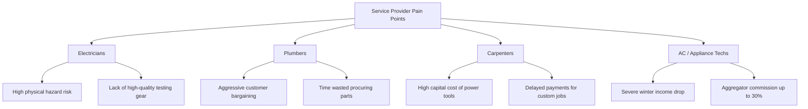
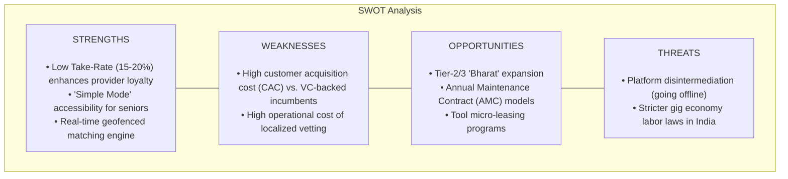

# HomeHero - Indian Hyperlocal Home Services Market Research Report
**Prepared by:** Market Research & Strategy Division  
**Date:** June 26, 2026  
**Project:** HomeHero (Hyperlocal Home Services Platform, India)  
**Status:** Final Version  

---

## 1. Executive Summary
The Indian home services market is undergoing a profound structural shift. Traditionally characterized by highly fragmented, unorganized, and word-of-mouth service delivery, the market is rapidly digitizing. Driven by rising disposable incomes, urban nuclearization, high smartphone penetration, and the ubiquity of Unified Payments Interface (UPI), consumers are shifting toward organized digital aggregators.

This report provides a comprehensive analysis of the Indian home services landscape, sizing the market opportunity, identifying core consumer and technician pain points, mapping the competitive environment (dominated by Urban Company), and evaluating strategic growth trends. We project that HomeHero’s value proposition—featuring localized operations, lower provider commission rates (15-20%), and a senior-friendly accessibility interface—positions it to capture significant market share in the emerging Tier-1 suburbs and Tier-2 "Bharat" markets.

---

## 2. Indian Home Services Market Overview
The Indian hyperlocal home services market refers to the ecosystem of on-demand household services including electrical work, plumbing, carpentry, appliance repair, beauty services, and home cleaning. Historically, this market has been dominated by the unorganized sector (local handymen operating via personal referrals), which accounts for over **85%** of all transactions. However, the organized sector is growing at twice the rate of the overall market as digital platforms standardise pricing, vetting, and service delivery.

### 2.1 Market Size & Sizing Methodology
To analyze the market size, we use a top-down sizing model segmented by geography (Tier-1 vs. Tier-2/3 cities) and service frequency.

```
+-------------------------------------------------------------------------------+
| TOTAL ADDRESSABLE MARKET (TAM)                                                |
| Approx. ₹90,000 Crore to ₹1,00,000 Crore ($11B - $12B USD)                    |
| Includes all unorganized & organized home repairs, cleaning, and care in India |
|                                                                               |
|   +-----------------------------------------------------------------------+   |
|   | SERVICEABLE ADDRESSABLE MARKET (SAM)                                  |   |
|   | Approx. ₹29,000 Crore ($3.5B USD)                                     |   |
|   | Focused on Tier-1 and Tier-2 urban households with smartphone access  |   |
|   |                                                                       |   |
|   |   +---------------------------------------------------------------+   |   |
|   |   | SERVICEABLE OBTAINABLE MARKET (SOM)                           |   |   |
|   |   | Approx. ₹580 Crore ($70M USD)                                 |   |   |
|   |   | Target of 2% market share of SAM in 3 years via HomeHero      |   |   |
|   |   +---------------------------------------------------------------+   |   |
|   +-----------------------------------------------------------------------+   |
+-------------------------------------------------------------------------------+
```

*   **Total Addressable Market (TAM):** The overall Indian home services market (including unorganized repair, maintenance, cleaning, and personal care) is estimated at **₹90,000 Crore to ₹1,00,000 Crore (~$11B - $12B USD)**.
*   **Serviceable Addressable Market (SAM):** Targeting the urban internet-using population across Tier-1 and major Tier-2 cities who actively use digital commerce platforms. This is valued at **₹29,000 Crore (~$3.5B USD)**.
*   **Serviceable Obtainable Market (SOM):** The market segment HomeHero aims to capture within the first 3 years of operations, representing a **2% share of urban centers**, valued at **₹580 Crore (~$70M USD)**.

### 2.2 Growth Rate & Forecasts
*   **Historical CAGR (2020-2025):** 16.5%
*   **Projected CAGR (2026-2031):** **18.8%**
*   **Key Growth Drivers:**
    *   **Nuclearization of Families:** The rapid rise of nuclear households in metropolitan cities reduces the availability of family members to manage home repair chores.
    *   **Dual-Income Households:** In urban areas, the opportunity cost of time has risen dramatically. Consumers prefer paying a premium for a reliable, scheduled service rather than spending weekends coordinating repairs.
    *   **UPI and Payment Digitization:** Real-time mobile payments via UPI (e.g., PhonePe, GPay, Paytm) have normalized cashless consumer transactions and enabled instant, transparent payouts to service providers.
    *   **Smartphone and Data Costs:** India has some of the lowest mobile data tariffs globally, enabling gig-workers to easily utilize resource-heavy partner applications with GPS tracking.

---

## 3. Target Customers & Segments

### 3.1 Customer Cohorts in Urban India
Our target demographic is segmented into four primary consumer profiles:

#### A. Busy Urban Professionals (The "Time-Poor" Class)
*   **Demographics:** Age 25–45, residing in Tier-1 IT corridors (e.g., Bengaluru, Hyderabad, Gurugram, Pune).
*   **Psychographic Profile:** Tech-savvy, value-convenience, high disposable income, active on quick-commerce apps (Zepto, Instamart).
*   **Behavioral Pattern:** Books services during late evenings or weekends. Demands high punctuality (within 1-hour slots) and professional communication.

#### B. Active Seniors & Independent Elderly
*   **Demographics:** Age 60+, residing independently in established residential colonies. Children are often NRIs or living in other cities.
*   **Psychographic Profile:** Price-sensitive but highly concerned about safety and trust. Often intimidated by complex app flows.
*   **Behavioral Pattern:** Prefers voice-based bookings or simple interfaces. Highly loyal to technicians who are polite and respectful.

#### C. Gated Gentry (Apartment Residents)
*   **Demographics:** Age 30–50, living in multi-story high-rise apartments.
*   **Psychographic Profile:** Driven by community recommendations, values home cleanliness, complies with community security rules (e.g., MyGate registrations).
*   **Behavioral Pattern:** Prefers providers who bring standard professional tools, clean up post-work, and wear uniform badges.

#### D. Transient Tenants & Students
*   **Demographics:** Age 18–30, living in rented accommodation.
*   **Psychographic Profile:** High mobility, cost-conscious, seeks basic functionality rather than premium upgrades.
*   **Behavioral Pattern:** Books minor repair works to avoid lease deposit deductions. Prefers flat-rate upfront quotes to share costs with flatmates.

---

## 4. Customer & Service Provider Pain Points

### 4.1 Consumer Pain Points (Demand Side)
1.  **The Haggling Loop & Opaque Pricing:** Standard local technicians quote prices arbitrarily based on the customer’s residential address or perceived wealth.
2.  **Safety & Security Anxiety:** Inviting unvetted strangers into homes poses a physical security risk, particularly for vulnerable populations.
3.  **Unreliability of Timings:** The unorganized sector operates without SLAs. Customers are frequently forced to wait for hours due to uncommunicated delays.
4.  **Absence of Post-Service Warranty:** Once a local repairman leaves, there is no guarantee of work. If the repair fails, getting the technician to return is extremely difficult.
5.  **Messy Work Environments:** Plumbers and carpenters often leave dust and debris behind, transferring the cleanup cost and effort to the customer.

### 4.2 Service Provider Pain Points (Supply Side)



*   **Electricians:** High occupational safety risks due to lack of safety gear (insulated boots, standard-compliant gloves) and dependence on uncertified, cheap testers.
*   **Plumbers:** Extreme price pressure and low social status lead to aggressive bargaining by customers, despite the intense physical demands of the trade. Plumbers also spend unpaid hours sourcing replacement pipes from distant markets.
*   **Carpenters:** Capital constraints prevent independent carpenters from buying modern power tools (planners, circular saws), forcing slow manual labor. They also suffer from payment delays as clients negotiate completed custom work.
*   **AC & Appliance Technicians:** Suffer from extreme seasonality. AC technicians earn 80% of their annual income during the summer months (March-June) and face near-zero revenue in winter. Meanwhile, current market aggregators squeeze their margins with high commission cuts (up to 30%).

---

## 5. Competitor Analysis

### 5.1 Competitive Mapping

| Competitor | Business Model | Strengths | Weaknesses | Take-Rate | Target Segment |
| :--- | :--- | :--- | :--- | :--- | :--- |
| **Urban Company (UC)** | Managed closed-loop marketplace | • Strong brand equity<br>• Standardized training academies<br>• High-quality service standards | • High provider churn due to steep commissions<br>• Frequent gig-worker protests<br>• Premium pricing limits Tier-2 reach | 22% - 30% | Affluent urban households |
| **Justdial / Sulekha** | Open-directory lead generation | • Massive directory database<br>• Low cost per lead<br>• Established brand presence | • No quality control or vetting<br>• Arbitrary pricing<br>• Leads spam customers with multiple calls | Flat listing subscription | Value-seeking consumers |
| **Local Handymen / Contractors** | Hyper-local unorganized networks | • Immediate local availability<br>• Personal relationship-driven trust<br>• Flexible pricing | • Zero transparency<br>• No background vetting<br>• No safety guarantee or warranty | 0% | General public, neighborhood-centric |
| **HomeHero (Proposed)** | Hybrid matching & subscription platform | • Lower take-rates (15-20%) improving Hero retention<br>• Senior-friendly "Simple Mode" interface<br>• Escrow-based payment safety | • New brand, high initial customer acquisition cost (CAC) | 15% - 20% | Middle-class families, Apartment residents, Seniors |

### 5.2 Key Vulnerabilities in Incumbent Strategies
1.  **Exploitative Partner Commissions:** High commission rates (up to 30%) have resulted in organized partner unions and strikes, driving the best technicians to seek platforms with lower commissions.
2.  **Lack of Local Hardware Integration:** Competitors do not partner with local hardware stores, leading to delays when parts are needed.
3.  **Neglect of the Senior Citizen Demographic:** Complex app architectures, small fonts, and rigid scheduling menus exclude less tech-literate elderly populations who are the most frequent users of home maintenance services.

---

## 6. SWOT Analysis



### 6.1 Strengths (Internal)
*   **Optimized Partner Commissions:** A 15-20% take-rate (vs. UC's 30%) positions HomeHero as the preferred platform for top-tier service providers, reducing disintermediation.
*   **Accessibility Design:** Simple Mode UI attracts elder care bookings, a high-frequency, trust-dependent consumer base.
*   **Automated Escrow Protocol:** Razorpay/UPI split pay ensures transparent, instant payouts to partners, minimizing supply side friction.

### 6.2 Weaknesses (Internal)
*   **Brand Awareness Deficit:** Competing against established brands requires significant initial marketing spend.
*   **Operational Bootstrapping:** Localized physical verification and onboarding are resource-intensive, limiting rapid geographical scaling.

### 6.3 Opportunities (External)
*   **The "Bharat" Opportunity:** Extending structured services to rapid-growth Tier-2/3 cities (e.g., Coimbatore, Lucknow, Jaipur) where organized competition is negligible.
*   **Hero+ AMC Subscriptions:** Establishing a stable, predictable recurring revenue stream via yearly maintenance contracts for middle-class apartments.
*   **Tool Leasing Partnerships:** Partnering with hardware manufacturers to rent specialized tools to technicians, boosting platform loyalty and service quality.

### 6.4 Threats (External)
*   **Customer Bypass (Disintermediation):** The tendency of customers and providers to swap phone numbers and transact directly to avoid platform fees.
*   **Regulatory Changes:** Potential mandate of minimum wages and social security benefits for gig workers under the Indian Code on Social Security (2020), which could impact unit economics.

---

## 7. Key Market Trends
1.  **Professionalization of Gig Work:** Gig-workers are actively seeking social recognition and standardisation, including carrying brand identity badges, wearing uniforms, and utilizing modern tools.
2.  **Growth of the Subscription Economy:** Urban consumers are increasingly adopting Annual Maintenance Contracts (AMCs) for home appliances (ACs, RO water filters) to avoid unexpected repair costs.
3.  **Eco-Friendly and Health-Conscious Cleaning:** A growing preference for non-toxic, chemical-free cleaning agents, driven by health-conscious families and pet owners.
4.  **Smart Home Device Installation:** Rising demand for technicians skilled in installing and configuring IoT smart-locks, security cameras, and automated lighting systems.

---

## 8. Strategic Opportunities & Threats Analysis

### 8.1 Countering Disintermediation (The Leakage Problem)
To mitigate the risk of platform bypass:
*   **Service Warranties:** HomeHero must offer a mandatory 30-day, platform-backed warranty. If a repair fails, a free follow-up is provided only if the transaction was recorded on the app.
*   **Liability Insurance:** Every booking includes ₹50,000 in property damage insurance, which is voided if the job is taken offline.
*   **Hero Progression Tiers:** Heroes who keep bookings on-platform unlock lower tool-rental rates and priority dispatch routing.

### 8.2 Overcoming AC Seasonality
To stabilize income for AC technicians during winter months, HomeHero will implement a **Cross-Skilling Certification Program**:
*   AC technicians will receive subsidized training in winter-demand appliances, such as water geysers, room heaters, and general electrical maintenance, ensuring stable year-round bookings.

### 8.3 Regulatory Compliance Roadmap
To proactively address upcoming Indian labor regulations:
*   HomeHero will establish a **"Hero Welfare Fund"** funded by a small portion of the platform fee (₹5 per booking) to provide accident insurance and micro-pension benefits, demonstrating regulatory compliance and enhancing partner retention.
