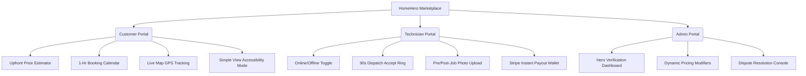

# HomeHero - Product Requirements Document (PRD)

**Document Version:** 2.0 (Startup-Grade Complete Edition)  
**Author:** Product Management & Strategy Team  
**Date:** June 17, 2026  
**Status:** Approved for Scaffolding & Development  

---

## 1. Vision & Mission

### 1.1 Vision
To become India’s most trusted, accessible, and transparent hyperlocal home services platform, transforming a highly fragmented offline economy into a digitized, standard-driven ecosystem.

### 1.2 Mission
To empower skilled local professionals ("Heroes") with fair wages, occupational safety, and flexible hours, while providing households with friction-free, background-verified, and upfront-priced home care services.

---

## 2. Problem Statement
The Indian hyperlocal home services market (estimated at $10B+) is currently plagued by three structural bottlenecks:

1.  **The Consumer Trust Deficit:** Lack of reliable technician vetting leads to safety concerns for families (especially women and senior citizens living alone).
2.  **Arbitrary Pricing Cartels:** Unorganized service providers negotiate arbitrary rates based on perceived customer wealth, leading to buyer fatigue.
3.  **Service Provider Exploitation:** Existing aggregators charge high commissions (up to 30%), causing high provider churn, labor strikes, and direct platform bypass (disintermediation).

---

## 3. User Personas

### 3.1 Customer Persona A: Priya Sharma (34)
*   **Role:** Tech Manager & Mother of two, residing in Gachibowli, Hyderabad.
*   **Goals:** Needs immediate, certified, and clean deep-cleaning/plumbing assistance without spending hours on coordination.
*   **Frustrations:** Vague 4-hour service arrival windows, messy cleanups, and haggling over parts pricing.

### 3.2 Customer Persona B: Rajesh Nair (68)
*   **Role:** Retired Government Officer living independently in Jaipur.
*   **Goals:** Needs help with simple tasks (changing high smoke-alarm batteries, minor carpentry repairs).
*   **Frustrations:** Small fonts and complex navigation menus on modern apps; feels unsafe letting unverified workers inside his home.

### 3.3 Technician Persona: Suresh Kumar (29)
*   **Role:** Independent AC and Appliance Technician.
*   **Goals:** Wants steady, nearby bookings to fill his schedule and prompt payouts.
*   **Frustrations:** High platform lead-generation fees, customers cancelling appointments at the last minute with no compensation, and long payment delays.

---

## 4. User Stories

| ID | As a... | I want to... | So that... |
| :--- | :--- | :--- | :--- |
| **US-01** | Customer | See a flat-rate price estimate based on room count. | I can check my budget before finalizing booking. |
| **US-02** | Customer | Pick an exact 1-hour schedule slot. | I do not have to waste half a day waiting for the technician. |
| **US-03** | Customer | Toggle "Simple View" accessibility settings. | I can read clear text and place bookings easily (Rajesh). |
| **US-04** | Technician | Switch my availability status to "Online". | I can receive nearby job dispatches based on my location. |
| **US-05** | Technician | Fill out a checklist with pre-job and post-job photos. | I am protected against false customer property-damage claims. |
| **US-06** | Admin | Review background-check logs and license uploads. | I can verify and activate new Heroes onto the platform. |
| **US-07** | Admin | Adjust dynamic pricing multipliers (holiday surge, etc.). | The platform can manage peak demand fluctuations. |

---

## 5. Feature Specifications

### 5.1 Customer Portal Features
*   **Upfront Flat-Rate Estimator:** Computes final costs using specific service inputs (e.g., number of rooms, AC unit tonnage, materials selection).
*   **1-Hour Appointment Booking:** Enforces precise scheduling slots.
*   **Live Map GPS Tracking:** Displays real-time driver coordinates on a map once the Hero toggles status to "En-Route".
*   **Senior-Friendly "Simple Mode" Toggle:** Switches app layouts to double font sizes, high-contrast buttons, and enables quick voice-recording booking descriptions.
*   **Secure Escrow Payments:** Credit card or UPI authorizations are held securely in escrow, and only transferred to the technician once the customer confirms completion.

### 5.2 Technician (Hero) Portal Features
*   **Online/Offline Status Switch:** Activates GPS tracking and triggers dispatch offers.
*   **90-Second Dispatch Accept Ring:** Circular alert screen displaying job details, customer distance, and gross pay. The Hero has 90s to accept before it routes to the next best match.
*   **Pre/Post-Job Checklists:** Mandatory step requiring upload of "before" and "after" inspection photos to protect both parties.
*   **Stripe Connect Earnings Wallet:** Logs completed payouts and supports "Instant Payout" transfers directly to the Hero's bank account.
*   **Cancellation Payout Protection:** Automatically credits the Hero with 80% of the customer's cancellation fee if booking is cancelled within 12 hours.

### 5.3 Admin Portal Features
*   **Hero Verification Dashboard:** Console for administrative agents to review ID proofs, background checks (Checkr API status), and license validities before activating accounts.
*   **Dynamic Pricing Modifier Configurator:** Allows admins to apply holiday multipliers, rain/summer heatwave surges, and regional cost offsets.
*   **Dispute & Escrow Resolution Console:** Ticket system for customer disputes (e.g., incomplete cleaning, damage claims). Admins can hold, release, or refund escrow funds.

---

## 6. Success Metrics (KPIs)

| Metric | Target | Tracked Via |
| :--- | :--- | :--- |
| **Booking Completion Rate** | > 88% of matched bookings | Backend Database Logs |
| **Average Match Latency** | < 45 seconds | Analytics / Event Pipelines |
| **Customer Retention** | > 35% repeat bookings within 60 days | Mixpanel / Stripe logs |
| **Escrow Dispute Frequency** | < 1.5% of total bookings | Admin Console Tickets |
| **Provider Retention Rate** | > 90% active monthly retention | Hero portal logins |

---

## 7. Future Product Roadmap

### Phase 1: MVP Core Dispatch (Target: Q3 2026)
*   Deploy core registration, background verification (Stripe Identity), dynamic price estimator, real-time geofencing matching, and standard split payments.
*   Launch Web App and Android client in a single metropolitan city.

### Phase 2: Hero+ & Tool Leasing (Target: Q4 2026)
*   **Hero+ Annual Maintenance Contract (AMC):** Subscription billing for recurring maintenance checks.
*   **Tool Micro-Leasing:** Partners with tool manufacturers to rent modern power-drills, safety gear, and testing kits to registered Heroes.
*   **Cross-Training Program:** Interactive modules to retrain seasonal AC technicians in appliance repairs for winters.

### Phase 3: AI Predictive Maintenance & Smart Home Setup (Target: Q1 2027)
*   **Smart Home Services:** Launch installation, mapping, and diagnostics for smart-locks, security cameras, and automated appliances.
*   **Predictive Routing:** AI algorithms optimized to group nearby bookings for a single Hero, minimizing fuel and transit overheads.
