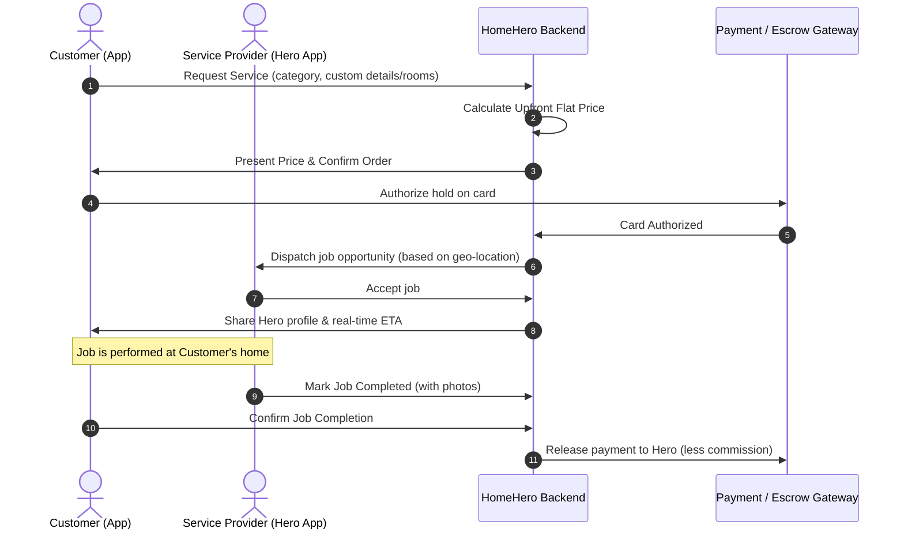

# HomeHero - Product Requirements Document (PRD)

## 1. Document Control
*   **Product:** HomeHero Mobile & Web Marketplace
*   **Version:** 1.0 (MVP Draft)
*   **Date:** June 17, 2026
*   **Author:** Product Development Team
*   **Status:** Under Review

---

## 2. Product Vision & Goals
### 2.1 Vision Statement
HomeHero is the ultimate on-demand local marketplace that connects homeowners and renters with certified, trusted, and verified home service professionals ("Heroes") instantly. HomeHero removes transaction friction by providing upfront pricing, transparent schedules, and a highly vetted network of experts.

### 2.2 Business Goals & Key Results (OKRs)
1.  **Objective: Build a trusted local network of providers.**
    *   *KR 1:* Onboard 200 fully vetted and background-checked providers in the launch city within 60 days.
    *   *KR 2:* Maintain a provider safety/compliance rate of 100%.
2.  **Objective: Deliver an effortless booking experience.**
    *   *KR 1:* Achieve a booking completion rate of >85% (matches that result in completed jobs).
    *   *KR 2:* Keep the average booking time (from opening app to checkout completion) under 2 minutes.

---

## 3. User Personas
### 3.1 The Busy Consumer (e.g., Sarah)
*   Needs instant gratification, precise schedule times, and high trust (knows who is coming into the house).
*   Prefers digital-first, cashless, in-app payments.

### 3.2 The Service Provider / Hero (e.g., Marcus)
*   Needs flexible ways to source jobs without paying upfront fee-per-lead charges.
*   Requires guaranteed payments and protection from late customer cancellations.

---

## 4. System Architecture & High-Level User Flow

---

## 5. Functional Requirements (MVP Scope)

### 5.1 Onboarding & Identity Vetting
*   **REQ-001 (Customer Sign-Up):** Users must be able to register using phone number (OTP verified), email, or third-party auth (Google/Apple).
*   **REQ-002 (Hero Application):** Providers must upload government-issued ID, professional licenses, and submit to a background check powered by Checkr.
*   **REQ-003 (Verification Status):** Heroes cannot accept bookings until their background check is approved and "Verified Hero" status is granted by admins.

### 5.2 Interactive Booking Engine & Upfront Pricing
*   **REQ-004 (Category Selection):** Users can choose from core service verticals: Deep Cleaning, General Handyman, Plumbing, and Electrical.
*   **REQ-005 (Price Builder):** Users configure the service details (e.g., house size, tasks). The system must output a binding flat-rate estimate before final checkout.
*   **REQ-006 (Exact Scheduling):** Users select a specific 1-hour window for the Hero's arrival instead of multi-hour blocks.

### 5.3 Real-Time Matching & Dispatch
*   **REQ-007 (Geofenced Matching):** The backend matches booking requests with Heroes who are currently online and within a 15-mile operating radius.
*   **REQ-008 (Instant Push Notifications):** Dispatch jobs to nearby Heroes. Heroes have 90 seconds to accept the dispatch before it routes to the next best provider.
*   **REQ-009 (Real-time Location Tracking):** Once the Hero is en route, the customer can view their real-time vehicle coordinates on a map within the app.

### 5.4 Secure Payments & In-App Escrow
*   **REQ-010 (Pre-Authorization):** Upon booking approval, HomeHero places a pre-authorization hold on the client's credit/debit card.
*   **REQ-011 (Escrow Payouts):** Payouts are held until the Hero uploads completion photos and the customer signs off on the job (or after a 24-hour auto-approval window).
*   **REQ-012 (Hero Payouts):** Funds are split automatically via Stripe Connect (e.g., 85% to Hero, 15% + $2.99 to HomeHero).

### 5.5 Hero Protection & Cancellation Engine
*   **REQ-013 (Cancellation Fee):** If a customer cancels a booking within 12 hours of the scheduled time, a flat 50% cancellation fee is charged. 80% of this fee goes directly to the Hero's wallet balance.

---

## 6. Non-Functional Requirements

### 6.1 Performance & Availability
*   **Latency:** API responses for matching and location tracking must be under 300ms.
*   **Uptime:** Target 99.9% uptime for backend services using auto-scaling cloud architectures.

### 6.2 Security & Compliance
*   **Data Protection:** All PII (Personally Identifiable Information) must be encrypted in transit (TLS 1.3) and at rest (AES-256).
*   **Compliance:** Fully GDPR/CCPA compliant for user data retrieval/deletion requests. Payment handling must comply with PCI-DSS Level 1 standards.

### 6.3 Accessibility
*   **Contrast & Text Sizes:** The application must comply with WCAG 2.1 AA standards, supporting high-contrast mode and system font size scaling for elderly accessibility.

---

## 7. Phased Release Plan

### Phase 1: MVP Release (Target: Q3 2026)
*   **Features:** Basic onboarding (SMS OTP), simple background verification integration, standard flat-rate pricing for cleaning and handyman services, and standard Stripe split-payment logic.
*   **Platforms:** Web app (desktop/mobile responsive) and basic iOS client.

### Phase 2: Scale & Loyalty (Target: Q4 2026)
*   **Features:** Hero+ Subscription launch, smart routing optimizations (grouping multiple nearby tasks for a single Hero), in-app video chat support, and Android client release.
