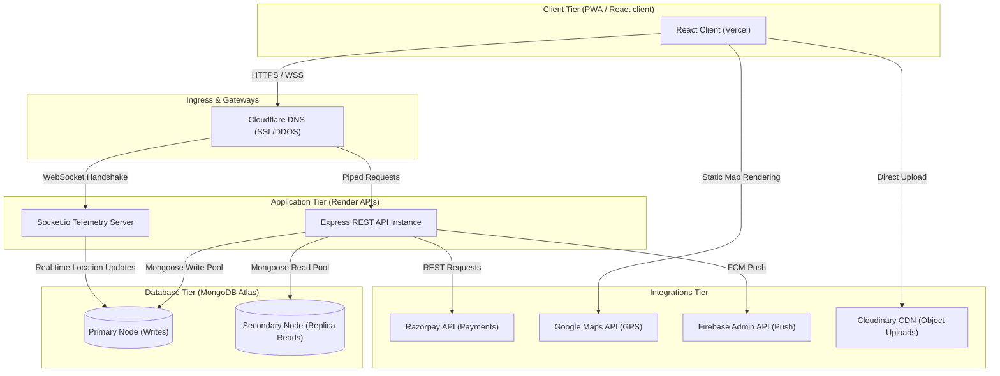

# HomeHero - High-Level Architecture (HLA) Specification

**Prepared by**: Principal Software Architect  
**Target Audience**: Engineering Leads, Devops Engineers, & Technical Stakeholders  
**Focus**: Multi-tier architecture, system interfaces, security structures, and scalability boundaries

---

## 1. High-Level System Architecture Diagram

This diagram maps out the data flows, service endpoints, and database connection paths:

---

## 2. Component Specifications

### 2.1 Frontend Architecture (React)
- **Framework**: Built using React, Vite, and Tailwind CSS.
- **State Management**: React Context handles authentication sessions and active socket tracking states.
- **Client Networking**: Axios intercepts incoming responses to manage JWT access token refreshes using HTTP-Only cookies.

### 2.2 Backend Architecture (Node & Express)
- **Express Core API**: Modular routing architecture (Auth, Service, Booking, Payment, Admin) gated by authentication and role-based permissions (`protect`, `authorize`).
- **Socket.io Telemetry Node**: Manages active rooms for real-time tracking (e.g. `booking_${id}`). Allows coordinates tracking and checklist synchronization.

### 2.3 Database Architecture (MongoDB Atlas)
- **Cluster**: Multi-region replica set in MongoDB Atlas to ensure database redundancy.
- **Indices**:
  - `2dsphere` index on `Technician.currentLocation` for proximity queries.
  - Unique compound index on `User.email` and `User.phone` to guarantee account integrity.

### 2.4 External Integrations
- **Razorpay**: Direct API checkout hooks, signature verification using SHA-256 HMAC, and wallet splits.
- **Google Maps SDK**: Customer location picker and technician distance/ETA calculations.
- **Firebase FCM**: Push notifications for matching and cancellation alerts.
- **Cloudinary**: Direct image uploads for avatars and post-job verification photos.

---

## 3. Security & Gateway Architecture

- **Token Lifecycle**: Short-lived JWT access tokens (15 mins) and 7-day refresh tokens delivered in HTTP-Only, SameSite cookies.
- **Escrow Integrity**: HMAC signature checks verify Razorpay checkout validations.
- **Sanitation Middlwares**: Express rate limiters protect authentication endpoints; `mongo-sanitize` filters payloads against NoSQL Injection.

---

## 4. Deployment & Scalability Considerations

- **Hosting**: React client on Vercel; Express backend on Render; Database on MongoDB Atlas.
- **Scaling Sockets**: To scale the Socket.io server horizontally, implement a **Redis Adapter** to coordinate events across multiple Render nodes.
- **Connection Pools**: Configure Mongoose connection limits (`maxPoolSize: 50`) to manage database traffic.
