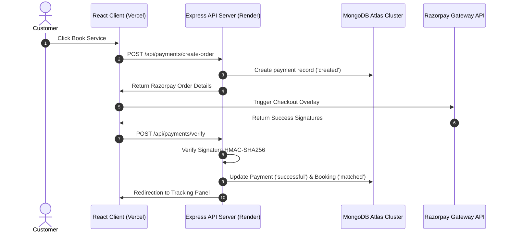
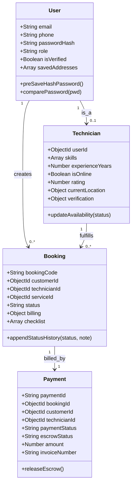

# HomeHero - Low-Level Design (LLD) Specification

**Prepared by**: Senior Software Engineer  
**Target Audience**: Backend Engineers, Technical Leads, & Database Administrators  
**Focus**: Schema definitions, class structures, API sequence diagrams, and folder layouts

---

## 1. Monorepo Backend Folder Structure

The Express API backend utilizes a MVC-inspired service layer architecture:

```
backend/
├── src/
│   ├── config/            # Database, socket, logger configurations
│   ├── controllers/       # HTTP Request routers and response mappings
│   ├── core/              # Custom exceptions and core domain logic
│   │   └── errors/        # Operational error classes (AppError.js)
│   ├── middleware/        # Authentication and validation intercepts
│   ├── models/            # Mongoose schemas and database models
│   ├── routes/            # REST API endpoints mappings
│   ├── validation/        # Joi schema payloads definitions
│   └── utils/             # Helper utilities (Haversine calculations)
├── app.js                 # App configuration and middlware stack
└── index.js               # Server bootstrap entry point
```

---

## 2. API Sequence Workflows

This diagram maps out the client-server database interactions for creating a booking and matching a technician:



---

## 3. Database Schema Models & Class Diagram

This diagram maps out the database relationships and properties:



---

## 4. Middleware & Validation Layers

1.  **Authentication Middleware (`protect`)**: Reads the HTTP Authorization Bearer token header, decodes the JWT using `process.env.JWT_SECRET`, checks if the user document exists in MongoDB, and attaches it to `req.user`.
2.  **Role Guard Middleware (`authorize(...roles)`)**: Checks `req.user.role` against the list of authorized roles. If unauthorized, returns a `403 Forbidden` response.
3.  **Validation Middleware (`validate`)**: Intercepts incoming requests and validates the payload using Joi schemas (e.g. `registerSchema` or `createBookingSchema`) before passing execution to the controller.

---

## 5. Database Interaction Hooks

### 5.1 Pre-Save Password Hashing
```javascript
userSchema.pre('save', async function (next) {
  if (!this.isModified('passwordHash')) return next();
  try {
    const salt = await bcrypt.genSalt(10);
    this.passwordHash = await bcrypt.hash(this.passwordHash, salt);
    next();
  } catch (err) {
    next(err);
  }
});
```

### 5.2 Technician Search Geospatial Query
```javascript
const nearbyTechnician = await Technician.findOne({
  isOnline: true,
  currentLocation: {
    $near: {
      $geometry: { type: 'Point', coordinates: [longitude, latitude] },
      $maxDistance: 15000 // 15 km limit
    }
  }
});
```

---

## 6. Centralized Error Handling

The application uses a custom operational error class `AppError` to classify errors:
*   **Operational Errors**: Trusted errors (validation failures, expired JWTs, missing funds) are handled cleanly and returned to the client using custom HTTP status codes.
*   **Programmer Bugs / System Errors**: Unknown exceptions (uncaught database connection drops, syntax crashes) are masked under generic `500 Internal Server Error` responses in production, while logging detailed stack traces via Winston.
