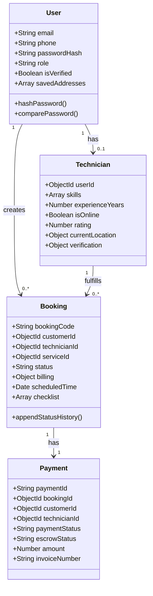

# HomeHero - Low-Level Design (LLD)

This document details the class structures, schema models, and event handlers for the HomeHero backend.

---

## 1. Class & Schema Specifications

---

## 2. Event Handlers & Middleware Logic

### 2.1 Cryptographic Password Hook (`userSchema.pre('save')`)
- Triggered when the `passwordHash` field is modified.
- Generates a bcrypt salt with 10 rounds and hashes the plaintext password before writing it to MongoDB.

### 2.2 JWT Authentication Middleware (`protect`)
- Intercepts requests, parses the `Authorization` header (`Bearer <token>`), and decodes the JWT using `process.env.JWT_SECRET`.
- Attaches the resolved user object (excluding the password hash) to `req.user`.

### 2.3 Role Authorization Middleware (`authorize(...roles)`)
- Gated behind `protect`.
- Compares `req.user.role` with allowed roles. If unauthorized, returns a `403 Forbidden` response.
