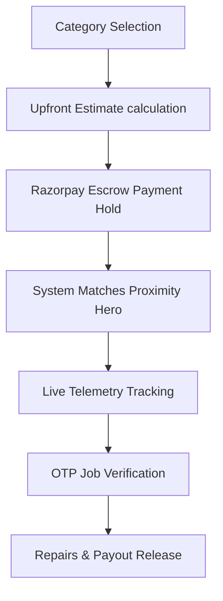

# Product Requirements Document (PRD) - HomeHero

**Prepared by**: Principal Product Manager  
**Status**: Approved (MVP Ready)  
**Target Release**: Phase 1 (Hyperlocal Launch)

---

## 1. Executive Summary & Product Vision

### 1.1 Executive Summary
HomeHero is a hyperlocal, on-demand marketplace connecting urban homeowners with vetted handymen (electricians, plumbers, carpenters, and AC technicians) for emergency home repairs. By integrating real-time proximity matchmaking, upfront pricing calculators, and secure Razorpay payment escrow holds, HomeHero removes transaction friction and builds trust in the unorganized home maintenance sector.

### 1.2 Product Vision
To build the most trusted and efficient residential maintenance infrastructure network in Tier-1 cities, transitioning from reactive emergency services to proactive smart home anomaly preventions.

### 1.3 Product Mission
To deliver quality repairs within 30 minutes at transparent rates, while providing independent technicians with lower commissions and immediate payout clearances.

---

## 2. Target Audience & Customer Personas

- **Time-Poor Homeowners**: Busy dual-income families seeking immediate, trusted repair dispatches during emergency household crises.
- **Safety-First Residents**: Elderly residents and single homemakers who prioritize background-checked, vetted workers.
- **Gig Professionals (Heroes)**: Independent technicians seeking consistent jobs, marketing-free client acquisitions, and instant payout deposits.

---

## 3. User Roles & Permissions Matrix

| User Role | Permissions Description | Allowed Actions |
| :--- | :--- | :--- |
| **Customer** | End user seeking maintenance repairs. | Create booking, pay escrow hold, track live GPS, release escrow, submit review. |
| **Technician (Hero)** | Vetted gig provider fulfilling requests. | Toggle availability (`isOnline`), accept/reject dispatches, view/update checklists, withdraw earnings. |
| **Admin** | Internal operations and support staff. | Approve/suspend user accounts, vet technician profiles, adjust pricing surge settings, manually mediate payment holds. |

---

## 4. Operational Flows & State Machines

### 4.1 Customer Service Flow


### 4.2 Booking State Machine Workflow
```
[Pending (Hold Payment)] ──> [Accepted (Tech matched)] ──> [Active (OTP entered)] ──> [Completed (Sign-off)] ──> [Released (Wallet Payout)]
```

*   **Pending**: Customer pays the pre-authorized hold; search queries are dispatched.
*   **Accepted**: A nearby technician confirms acceptance within the 90-second countdown.
*   **Active (In-Progress)**: Technician arrives and enters the 4-digit start OTP provided by the customer.
*   **Completed**: Technician completes checklist, customer reviews post-job photo uploads, and signs off. Payout releases instantly to the technician's wallet.

---

## 5. Functional & Non-Functional Requirements

### 5.1 Functional Requirements (P0 Features)
- **FR-1: JWT Mobile Auth**: Phone signup with 6-digit OTP verification and role-based session tokens.
- **FR-2: Upfront Billing Estimator**: Flat base fees + hourly labor calculation with active surge multipliers.
- **FR-3: Razorpay Escrow Integration**: Pre-authorized payment holds before matches, HMAC-SHA256 signature verifications, and instant splits.
- **FR-4: Proximity Matchmaker**: Geospatial query matching available technicians within 15 km coordinates.
- **FR-5: Live GPS Tracker**: Socket.io telemetry updating technician markers every 5 seconds.
- **FR-6: Checklist Photos**: Mandatory pre-work and post-work verification photo uploads.

### 5.2 Non-Functional Requirements (Performance & Security)
- **Response Latency SLA**: Geospatial dispatch queries must select and send offers to technicians in under 3 seconds.
- **Data Compliance**: Aadhaar uploads and bank account payout routing profiles must be encrypted at rest (AES-256).
- **Escrow Integrity Check**: Webhook endpoints must reject un-signed checkout confirmations.

---

## 6. Success Metrics & Key Performance Indicators (KPIs)

*   **Match Fulfillment Ratio (MFR)**: Target $>85\%$ of booking requests matched within 3 minutes.
*   **Customer Acquisition Cost (CAC) Payback**: Target $<2$ completed bookings to recoup customer acquisition costs.
*   **Average Resolution Time**: Goal is $<45$ minutes from booking creation to job completion.
*   **Supply Retention Rate**: Keep monthly technician churn rate $<5\%$.

---

## 7. Future Growth Roadmap (v2.0+)

- **IoT Anomaly Detection Integration**: Implement smart water flow and power meter integrations to detect anomalies and auto-dispatch technicians before emergencies occur.
- **Automated Aadhaar Approvals**: Move from manual admin queues to instant UIDAI API background checks.
- **Team B2B Maintenance Contracts**: Support subscription-based service passes for corporate housing networks.
