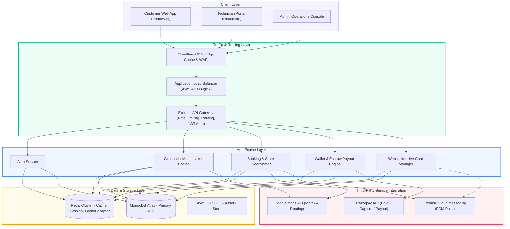
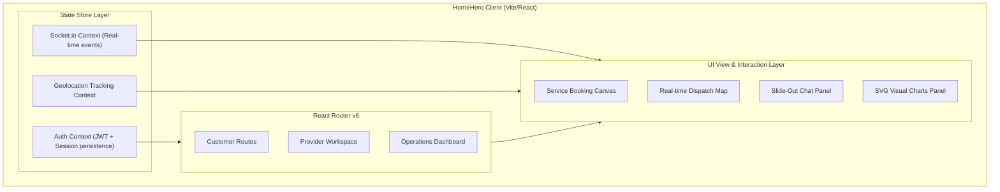
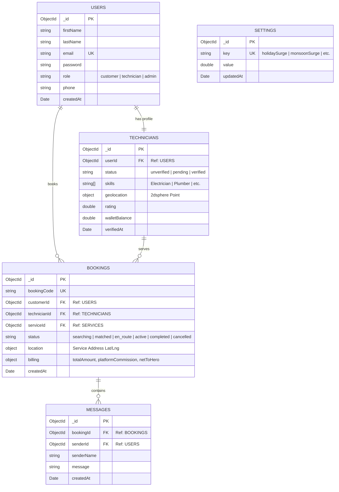
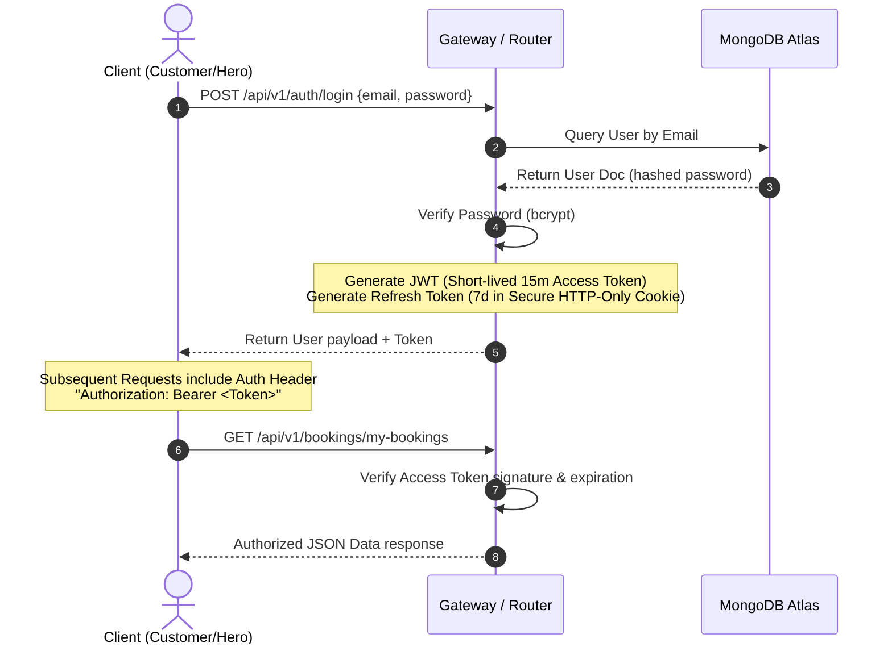
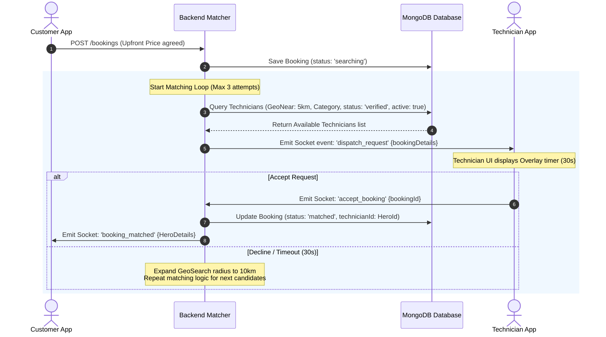
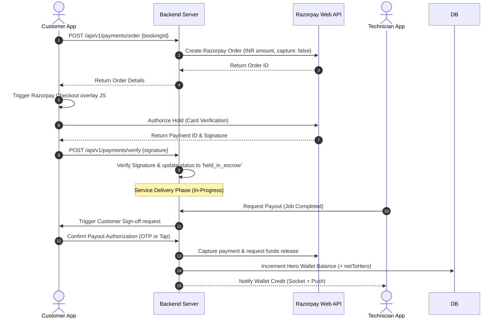
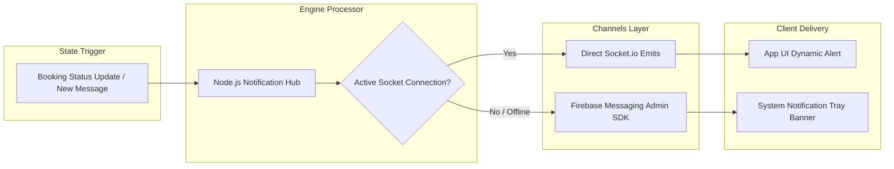
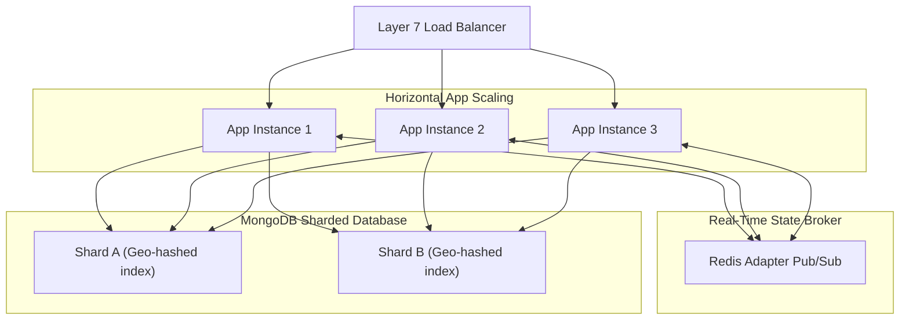
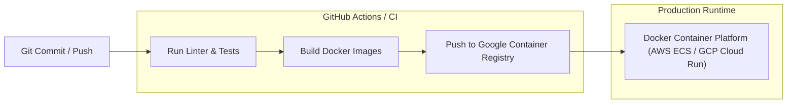
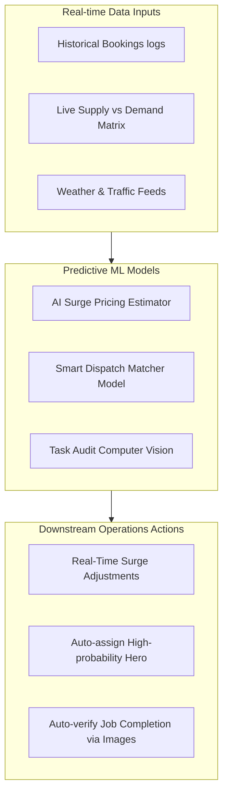

# HomeHero System Architecture Document
**Version:** 1.0.0  
**Author:** Principal Systems Architect  
**Platform Scope:** Hyperlocal Home Services Marketplace (Phase 1: Electrician, Plumber, Carpenter, AC Repair)

---

## 1. High-Level Architecture

HomeHero uses a microservices-inspired monolithic modular architecture designed for rapid scale, decoupling operations, and enabling high-concurrency real-time matchmaking. The system is split into three primary planes: the **Client/Interface Plane**, the **Gateway/Orchestration Plane**, and the **Core Engine Plane**.

### Systems Topology



### Key Architectural Patterns
1. **Event-Driven Communications**: The system leverages WebSocket (Socket.io) channels for dispatch telemetry, live location updates, and message logs. Offline handshakes default back to Firebase Push Notifications.
2. **State Synchronization**: All transaction holds and booking stages are governed by a central state machine transition schema in MongoDB, ensuring consistent audit history.
3. **Geospatial Processing**: The matching system uses MongoDB `2dsphere` index points and Google Maps distance matrix grids to match technicians with requests within a dynamic 5-10km range.

---

## 2. Frontend Architecture

The frontend is a monorepo setup running Vite + React 19. It uses vanilla CSS variables for a customized slate-dark theme. It is optimized to support responsive interfaces for both customers requesting services and mobile-first portals for technicians on the move.

### Components & State Distribution



### Key Technical Strategies
* **React 19 Hooks**: Using React 19's native action forms and transitions for smoother loading indicators.
* **Socket.io React Integration**: Reusable Socket context `SocketProvider` exposes client connections. Reference accesses are encapsulated inside `useEffect` hooks and callback handlers to adhere to React 19 render purity rules (no `.current` mutations during component render cycles).
* **Native Custom SVG Visual Charts**: Admin dashboards render daily commissions and category distributions using native React inline SVGs. Calculated offsets (`stroke-dasharray` and `stroke-dashoffset`) are calculated directly from JSON arrays, bypassing heavy third-party plotting libraries to guarantee instant load times and complete CSS customization.

---

## 3. Backend Architecture

The backend consists of a Node.js/Express application designed with clean architecture principles. It isolates HTTP concerns from business workflows, and is structured to scale to serverless containers.

```
┌────────────────────────────────────────────────────────┐
│                     Express app.js                     │
│    (Middleware: CORS, Helmet, Rate Limiters, Morgan)   │
└───────────────────────────┬────────────────────────────┘
                            ▼
┌────────────────────────────────────────────────────────┐
│                   Routing Layer (v1)                   │
│   (JWT Middleware, Role-Based Access Control, Sanitizers)│
└───────────────────────────┬────────────────────────────┘
                            ▼
┌────────────────────────────────────────────────────────┐
│                 Controller / Handler                   │
│         (Request Parsing, Status Schema Toggles)       │
└───────────────────────────┬────────────────────────────┘
                            ▼
┌─────────────────────────────────┐ ┌────────────────────┐
│         Business Domain         │ │ WebSocket Server   │
│  (Upfront Pricing, Matchmaker)  │ │   (Socket.io Hub)  │
└────────────────┬────────────────┘ └─────────┬──────────┘
                 │                            │
                 ├────────────────────────────┘
                 ▼
┌────────────────────────────────────────────────────────┐
│                   Data Access Object                   │
│             (Mongoose Models & Schema Rules)           │
└────────────────────────────────────────────────────────┘
```

### Critical Subsystems
* **Geospatial Matchmaker**: Executes a MongoDB `$geoNear` query. It retrieves online technicians who match the required service category within a defined radius, filtering out those already assigned to a job.
* **Surge Pricing Engine**: Evaluates base costs against active holiday variables, monsoon rain levels, and late-night surcharges to compute final billing values *before* booking generation.

---

## 4. Database Architecture

HomeHero uses MongoDB Atlas. The database uses a highly structured, relational-like document mapping approach, referencing keys to maintain schema flexibility while ensuring strict indexing rules.

### Entity Relationship Diagram



### Primary Indexes & Constraints
1. **Technicians Geolocation**:
   * Index: `db.technicians.createIndex({ "geolocation": "2dsphere" })`
   * Purpose: Required for `$near` and `$geoNear` matchmaking.
2. **Booking Audit Codes**:
   * Index: `db.bookings.createIndex({ "bookingCode": 1 }, { unique: true })`
   * Purpose: Prevents conflict during transaction references and invoice generations.
3. **Historical Messages Lookup**:
   * Index: `db.messages.createIndex({ "bookingId": 1, "createdAt": -1 })`
   * Purpose: Speeds up chat timeline rendering on client re-initialization.

---

## 5. Authentication Flow

Authentication uses JSON Web Tokens (JWT) signed via RSA/HMAC algorithms. Tokens are stored in memory or secure HTTP-only cookies on the client side to mitigate Cross-Site Scripting (XSS) risks.



---

## 6. Booking & Matchmaking Flow

The dispatch matchmaking loop uses dynamic radius expansion to resolve demand spikes while keeping matching times fast.



### Resolving Race Conditions (Double Bookings)
To prevent two technicians from accepting the same booking simultaneously:
1. The backend uses Mongoose optimistic locking or a transaction query:
   ```javascript
   const booking = await Booking.findOneAndUpdate(
     { _id: bookingId, status: 'searching' },
     { status: 'matched', technicianId: technician.userId },
     { new: true }
   );
   ```
2. If the return value is `null`, it indicates another technician has already accepted the booking. The system immediately rejects the second acceptance and notifies the technician app.

---

## 7. Escrow Payment Flow

To protect both customers and service providers, HomeHero implements an **Escrow Hold & Wallet Release** mechanism integrated with Razorpay.



---

## 8. Push Notification Architecture

WebSockets are ideal for real-time app telemetry, but push notifications are required for background tasks or offline delivery. Firebase Cloud Messaging (FCM) serves as the out-of-band communication layer.



---

## 9. Admin Dashboard Architecture

The Operations Portal serves as the administrative control center, managing operations logs, technician vetting, and surge parameters.

```
                  ┌───────────────────────────────┐
                  │   Admin Dashboard Frontend    │
                  └───────────────┬───────────────┘
                                  ▼
      ┌───────────────────────────┼───────────────────────────┐
      ▼                           ▼                           ▼
┌───────────────┐           ┌───────────────┐           ┌───────────────┐
│ Analytics tab │           │  Vetting tab  │           │  Pricing tab  │
│ - Native SVG  │           │ - Document    │           │ - Surge Sliders   │
│   Commissions │           │   reviews     │           │ - Flat rates  │
│ - Category    │           │ - Activation  │           │   adjustments │
│   donuts      │           │   toggle      │           │               │
└───────────────┘           └───────────────┘           └───────────────┘
```

* **Vetting Pipeline**: Technicians remain in a `pending` state until the administrator reviews their qualifications and clicks **Verify Profile**. This updates their state in MongoDB and enables them to receive dispatch requests.
* **SVG Optimization**: The charts recalculate layouts in response to viewport resizing without external library dependencies, maintaining consistent layout performance.

---

## 10. Security Architecture

HomeHero implements security controls across all application layers to protect customer data and financial transactions.

| Layer | Threat | Mitigation Control |
| :--- | :--- | :--- |
| **Transport** | Man-in-the-Middle (MitM) | Enforced HSTS, SSL/TLS 1.3 certificates, and Cloudflare WAF routing. |
| **Authentication**| Token Theft / CSRF | Short-lived JWTs (15 min) in memory + Refresh tokens in `httpOnly`, `Secure`, `SameSite=Strict` cookies. |
| **Authorization** | Privilege Escalation | Explicit Role-Based Access Control (RBAC) middleware verifying roles (`customer`, `technician`, `admin`) on every route. |
| **API Gateway** | Denial of Service / Scrapers | Rate-limiting middleware: `express-rate-limit` restricting IPs to 100 requests per 15 minutes. |
| **Database** | SQL / NoSQL Injection | Mongoose schema validation constraints; input sanitization via `express-mongo-sanitize`. |

---

## 11. Scalability Strategy

As user volume scales, the HomeHero architecture is designed to scale horizontally across servers, database shards, and cache layers.



1. **Caching and State Management**: Redis caches upfront pricing settings and tracks active technician coordinates, reducing the query load on MongoDB.
2. **WebSocket Pub/Sub Scaling**: Uses the `socket.io-redis` adapter. This allows clients connected to different backend instances to communicate seamlessly within the same booking rooms.
3. **Database Sharding Key**: MongoDB database shards are configured with a hashed key using geolocation points. This structures matching calculations regionally, avoiding cross-shard data lookups.

---

## 12. Deployment Architecture

Deployments are containerized and orchestrated through automated CI/CD pipelines to ensure consistent environments from development to production.



* **Vite Static Hosting**: The React application is built into static assets and hosted via CDN networks (e.g. AWS CloudFront or Vercel Edge Networks) to minimize load latencies.
* **Server Infrastructure**: The Node.js/Express application runs in Docker containers behind an Application Load Balancer (ALB). This setup automatically scales container counts based on CPU and request volumes.

---

## 13. Folder Structure

```
homehero/
├── backend/
│   ├── src/
│   │   ├── config/             # DB and WebSocket Socket.io configurations
│   │   ├── controllers/        # Controllers (Auth, Booking, Admin)
│   │   ├── middleware/         # JWT validations, RBAC controls
│   │   ├── models/             # Mongoose Schemas (User, Booking, Message, Setting)
│   │   ├── routes/             # REST endpoints (authRoutes, bookingRoutes, adminRoutes)
│   │   └── utils/              # Helper utilities (surge calculations, pricing)
│   ├── index.js                # Server entry point
│   ├── Dockerfile              # Container orchestration configuration
│   └── package.json            # Node backend dependencies configuration
├── frontend/
│   ├── src/
│   │   ├── assets/             # Branding style resources
│   │   ├── components/         # Reusable UI (ChatPanel, Navbar)
│   │   ├── context/            # Global React states (AuthContext, SocketContext)
│   │   ├── pages/              # Router views (TrackingPage, AdminDashboardPage)
│   │   ├── services/           # Axios HTTP client API integrations
│   │   ├── App.jsx             # Main Router and Portal wrapper
│   │   └── main.jsx            # React 19 bootstrap mount
│   ├── index.html              # Main DOM canvas wrapper
│   ├── vite.config.js          # Vite compiler configs
│   ├── tailwind.config.js      # Styling utilities configuration
│   └── package.json            # Frontend dependency specifications
└── docs/                       # Project system documentation directories
```

---

## 14. Recommended Third-Party Services

| Service Name | Architectural Purpose | Alternatives considered |
| :--- | :--- | :--- |
| **Razorpay Checkout & Webhook** | Handles customer payments (authorizations, escrow holds, and direct bank payouts for technicians). | Stripe (higher onboarding overhead in India). |
| **Google Maps SDK & APIs** | Provides address auto-complete and routes technician dispatch paths. | Mapbox (limited local address coverage). |
| **Firebase Cloud Messaging** | Delivers system push notifications when the app is in the background or offline. | OneSignal (introduces additional abstraction layers). |
| **AWS S3 / Cloudflare Images**| Stores technician identification documents, professional licenses, and task photos. | Local filesystem (compromises container scalability). |
| **Sentry** | Monitors production frontend and backend errors in real-time. | LogRocket / ELK stack. |

---

## 15. Future AI Architecture

As HomeHero scales, integrating an AI engine will optimize matching efficiency, dynamic pricing, and quality control.



### Key AI Implementations
1. **Dynamic Demand-Supply Pricing**: Machine learning models analyze historical request patterns alongside weather and traffic data. This allows the system to predict demand surges and adjust pricing multipliers in real-time to balance supply and demand.
2. **Predictive Dispatch Matching**: An AI routing model scores available technicians based on their job acceptance history, average travel speed, and customer ratings. This helps predict the technician most likely to accept and complete a job efficiently.
3. **Computer Vision Task Audit**: When a technician completes a service, they submit a photo of the completed work. A computer vision model verifies the quality of the repair (e.g. assessing a leak or checking wiring) before automatically releasing payment.
