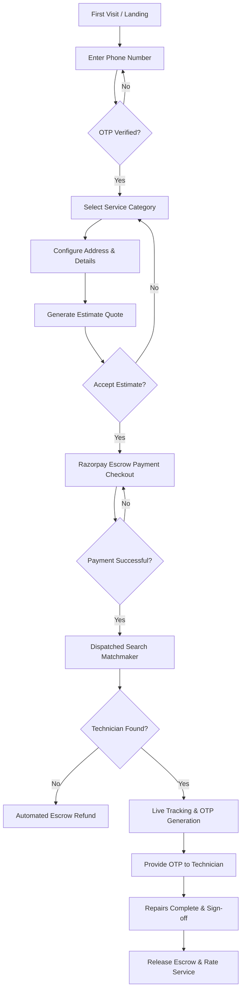
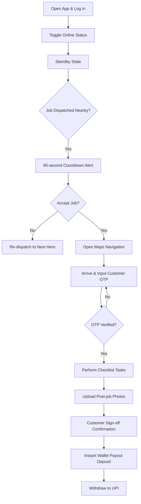
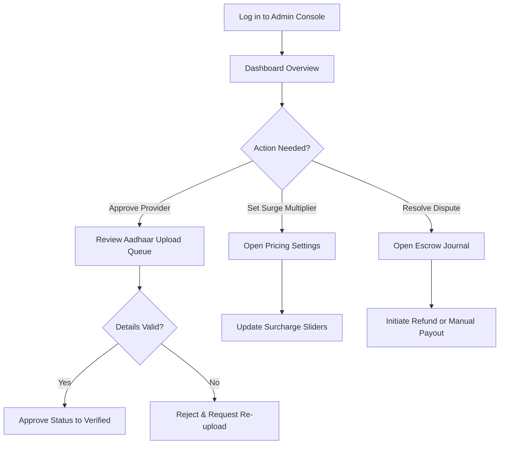

# HomeHero - User Journeys & Flowchart Specifications

This document defines the end-to-end user journeys for the **Customer**, **Technician**, and **Administrator** personas.

---

## 1. Customer User Journey

### 1.1 Customer Flow Diagram

### 1.2 Customer Pain Points, Decisions, & Edge Cases
*   **Edge Case: No Match Found**: If no technician accepts the job within 3 minutes, the platform cancels the booking and triggers an automatic refund to prevent funds from being locked in escrow.
*   **Error Recovery: Invalid OTP**: If the technician enters an incorrect OTP, the customer app prompts the customer to regenerate or view their secure start OTP on screen.

---

## 2. Technician (Hero) User Journey

### 2.1 Technician Flow Diagram

### 2.2 Technician Edge Cases & Decisions
*   **Edge Case: Customer Absent**: If the technician arrives but the customer is absent and does not answer their phone, the technician can trigger a "Customer No-Show" cancellation request after waiting 10 minutes, collecting a flat inconvenience fee.
*   **Error Recovery: Upload Failures**: If poor network coverage blocks checklist photo uploads, the app saves the media locally and syncs it automatically once the connection is restored.

---

## 3. Administrator User Journey

### 3.1 Admin Flow Diagram

### 3.2 Admin Edge Cases
*   **Edge Case: Fraudulent Document Uploads**: If a technician uploads a forged Aadhaar card, the admin suspends the account, logs the IP address, and blocks future registration attempts from that phone number.
