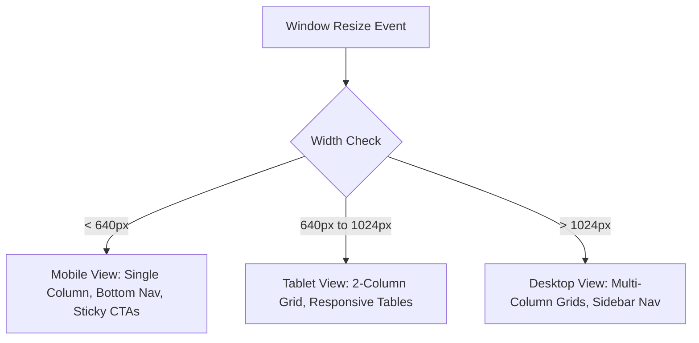

# HomeHero - Low-Fidelity Wireframes Specification

**Prepared by**: UX Wireframe Designer  
**Target Audience**: Frontend Developers, UI Designers, & Product Managers  
**Focus**: ASCII Layouts, Mermaid Layout Diagrams, and Component Outlines

---

## 1. Global Navigation Layouts

### 1.1 Mobile Bottom Tab Bar (Responsive: <640px)
```
┌──────────────────────────────────────────────┐
│  [🏠 Home]    [📅 Jobs]    [🔔 Notif]    [👤 Profile] │
└──────────────────────────────────────────────┘
```

### 1.2 Desktop Top Navigation Bar (Responsive: >1024px)
```
┌─────────────────────────────────────────────────────────────────────────┐
│ [Logo] HomeHero   Search... [Q]          Jobs  Alerts  Profile  [Logout]│
└─────────────────────────────────────────────────────────────────────────┘
```

---

## 2. Screen-by-Screen Wireframes

### 2.1 Splash Screen (Mobile View)
```
┌──────────────────────────────────────────────┐
│                                              │
│                                              │
│                   [Shield]                   │
│                                              │
│                   HomeHero                   │
│                                              │
│           "Resolved Instantly"               │
│                                              │
│                  ( • • • )                   │
│                                              │
└──────────────────────────────────────────────┘
```

### 2.2 Login & OTP Verification Screen (Mobile View)
```
┌──────────────────────────────────────────────┐
│ [← Back]                                     │
├──────────────────────────────────────────────┤
│  Enter Mobile Number                         │
│  [ +91 ] [ 90000 00000                     ] │
│                                              │
│  [        Send Verification Code        ]    │
├──────────────────────────────────────────────┤
│  Verification Code Sent!                     │
│  [ 4 ] [ 8 ] [ 2 ] [ 7 ] [ 1 ] [ 9 ]         │
│                                              │
│  [             Verify & Log in          ]    │
└──────────────────────────────────────────────┘
```

### 2.3 Home Screen (Mobile View)
```
┌──────────────────────────────────────────────┐
│ [Pin] Gachibowli, Hyd                    [👤]│
├──────────────────────────────────────────────┤
│  Search for a service...                 [Q] │
├──────────────────────────────────────────────┤
│  SELECT CATEGORY:                            │
│  ┌──────────────┐      ┌──────────────┐      │
│  │ Electrician  │      │ Plumber      │      │
│  └──────────────┘      └──────────────┘      │
│  ┌──────────────┐      ┌──────────────┐      │
│  │ Carpenter    │      │ AC Repair    │      │
│  └──────────────┘      └──────────────┘      │
├──────────────────────────────────────────────┤
│  [!] Active Job: Ramesh is en route.  [Track]│
└──────────────────────────────────────────────┘
```

### 2.4 Service Details Screen (Mobile View)
```
┌──────────────────────────────────────────────┐
│ [← Back]         Service details             │
├──────────────────────────────────────────────┤
│  PLUMBING EMERGENCY REPAIR                   │
│  Rate: ₹399 Base + ₹199/hr                   │
│  * Monsoon Surge active (1.2x multiplier)    │
├──────────────────────────────────────────────┤
│  Configure Details:                          │
│  Number of rooms/leaks: [ - ] [ 2 ] [ + ]    │
│  Has pets? [ ] Yes  [x] No                   │
├──────────────────────────────────────────────┤
│  Est. Total: ₹638        [ Proceed to Book ] │
└──────────────────────────────────────────────┘
```

### 2.5 Technician Profile Screen (Mobile View)
```
┌──────────────────────────────────────────────┐
│ [← Back]        Technician Profile           │
├──────────────────────────────────────────────┤
│  [Avatar]  Ramesh Kumar   (⭐ 4.9)           │
│  Verified Plumber • 5 Years Exp              │
├──────────────────────────────────────────────┤
│  SKILLS:                                     │
│  [Pipe Repair] [Taps Setup] [Leakage Audit]  │
├──────────────────────────────────────────────┤
│  BIO:                                        │
│  "Emergency plumber based in Cyberabad..."   │
├──────────────────────────────────────────────┤
│  REVIEWS:                                    │
│  - Amit S: "Resolved leak in 10 mins!" (5★)  │
└──────────────────────────────────────────────┘
```

### 2.6 Booking (Checkout) Screen (Mobile View)
```
┌──────────────────────────────────────────────┐
│ [← Back]           Checkout                  │
├──────────────────────────────────────────────┤
│  SCHEDULE TIME:                              │
│  [ Now (Emergency Match) ] [ Schedule Later ]│
├──────────────────────────────────────────────┤
│  SERVICE ADDRESS:                            │
│  Flat 4B, Cyber Towers, Gachibowli           │
├──────────────────────────────────────────────┤
│  BILLING SUMMARY:                            │
│  Base Price:           ₹399.00               │
│  Est. Labor (2 Hrs):   ₹398.00               │
│  Surge Surcharge:      ₹159.00               │
│  Total Amount:         ₹956.00               │
├──────────────────────────────────────────────┤
│  [           Confirm & Pay Escrow          ] │
└──────────────────────────────────────────────┘
```

### 2.7 Payment (Razorpay Interface) (Mobile View)
```
┌──────────────────────────────────────────────┐
│ [Close X]          Razorpay                  │
├──────────────────────────────────────────────┤
│  HomeHero Technologies • ₹956.00             │
├──────────────────────────────────────────────┤
│  PAYMENT METHODS:                            │
│  [ UPI / GPay / PhonePe ]                    │
│  [ Cards (Visa/MasterCard/RuPay) ]           │
│  [ NetBanking ]                              │
├──────────────────────────────────────────────┤
│  [✓] Pay Securely                            │
└──────────────────────────────────────────────┘
```

### 2.8 Booking Tracking Screen (Mobile View)
```
┌──────────────────────────────────────────────┐
│ [← Back]           Tracking          [En Route]│
├──────────────────────────────────────────────┤
│                                              │
│                                              │
│               [ Google Map Frame ]           │
│                                              │
│                                              │
├──────────────────────────────────────────────┤
│  Hero: Ramesh Kumar           ETA: 8 mins    │
│  [ Call Hero ]                               │
├──────────────────────────────────────────────┤
│  Start OTP: [ 4 ][ 8 ][ 2 ][ 7 ]             │
└──────────────────────────────────────────────┘
```

### 2.9 Notifications Screen (Mobile View)
```
┌──────────────────────────────────────────────┐
│ [Menu]          Notifications                │
├──────────────────────────────────────────────┤
│  - Hero Matched! (2 mins ago)                │
│    Ramesh is en route to your location.      │
│                                              │
│  - Payment Secured (15 mins ago)             │
│    ₹956 has been held in escrow.             │
└──────────────────────────────────────────────┘
```

### 2.10 Reviews Screen (Mobile View)
```
┌──────────────────────────────────────────────┐
│ [← Back]          Write a Review             │
├──────────────────────────────────────────────┤
│  Rate your experience:                       │
│  [ ⭐ ] [ ⭐ ] [ ⭐ ] [ ⭐ ] [ ⭐ ]          │
├──────────────────────────────────────────────┤
│  Write comments:                             │
│  [ Excellent plumbing repairs! Fast work. ]  │
├──────────────────────────────────────────────┤
│  Upload work photos (Optional):              │
│  [ + Add Photos ]                            │
├──────────────────────────────────────────────┤
│  [           Submit Review & Rating        ] │
└──────────────────────────────────────────────┘
```

### 2.11 Profile Screen (Mobile View)
```
┌──────────────────────────────────────────────┐
│ [Menu]             Profile                   │
├──────────────────────────────────────────────┤
│  [Avatar] Amit Sharma                        │
│  Email: amit@homehero.com                    │
├──────────────────────────────────────────────┤
│  SAVED ADDRESSES:                            │
│  [x] Home: Flat 4B, Gachibowli  [Edit]       │
│  [ ] Office: Block C, Hitec City [Edit]      │
├──────────────────────────────────────────────┤
│  [ Save Profile ]        [ Delete Account ]  │
└──────────────────────────────────────────────┘
```

### 2.12 Admin Dashboard Screen (Desktop Layout Grid)
```
┌─────────────────────────────────────────────────────────────────────────┐
│ [Logo] HomeHero Admin               User Logs  Surge Settings  [Logout] │
├───────────────────────────┬─────────────────────────────────────────────┤
│ METRICS:                  │ VETTING QUEUE:                              │
│ Users:   15,200           │ Name         Document       Action          │
│ Heroes:  450              │ Ramesh K.    Aadhaar.pdf    [Verify] [Reject]│
│ Revenue: ₹57,375.00       │ Suresh P.    License.pdf    [Verify] [Reject]│
├───────────────────────────┼─────────────────────────────────────────────┤
│ ANALYTICS (SVG Chart):    │ DISPATCH LOGS:                              │
│                           │ Code     Service    Amount    Status        │
│   /|                      │ BKG-482  Plumbing   ₹956      matched       │
│  / |__                    │ BKG-190  Electrical ₹450      completed     │
│ /______\                  │                                             │
└───────────────────────────┴─────────────────────────────────────────────┘
```

---

## 3. Layout Grid Specifications (Mermaid Breakpoints)


