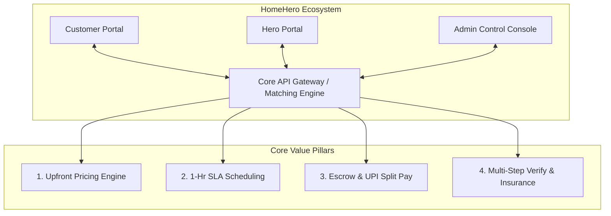

# HomeHero - Project Foundation Document
**Document Version:** 1.0 (Startup-Grade Complete Edition)  
**Author:** Co-Founding Team (Strategy, Product, & Architecture)  
**Date:** June 26, 2026  
**Status:** Approved & Baseline Established  

---

## 1. Startup Vision
To become India’s most trusted, transparent, and comprehensive hyperlocal home services ecosystem, transforming a highly fragmented, informal offline economy into a digitized, standard-driven marketplace that elevates the quality of life for urban households.

---

## 2. Mission
To empower skilled local trade professionals ("Heroes") with financial inclusion, dignity of labor, and sustainable livelihoods, while providing Indian households with safe, background-verified, upfront-priced, and top-tier home maintenance and care services within a guaranteed 1-hour booking window.

---

## 3. Problem Statement
The Indian hyperlocal home services market (estimated at over $10 Billion) is structurally inefficient and operates with high friction. The key problems are categorized into four dimensions:

### 3.1 The Consumer Trust & Safety Deficit
*   **Unverified Technicians:** Consumers (particularly women, elderly citizens living alone, and double-income households) experience anxiety letting unverified service providers into their private spaces.
*   **Lack of Redressal:** If property damage, theft, or poor quality of work occurs, there is no structured mechanism for dispute resolution or liability coverage.

### 3.2 Arbitrary & Opaque Pricing Cartels
*   **The "Wealth Tax" Bias:** In the unorganized market, service providers frequently charge arbitrary rates based on their perception of the customer's residence (e.g., charging more in premium gated societies) rather than the complexity of the job.
*   **Haggling Fatigue:** Consumers waste significant mental energy negotiating over basic repairs.

### 3.3 Quality & Professionalism Deficit
*   **Unpredictable SLA (Service Level Agreements):** Providers rarely arrive on time, often requiring consumers to take half-day leaves from work.
*   **Substandard Tools & Materials:** Many local technicians use outdated tools and unbranded spares, leading to repetitive breakdowns.
*   **No Post-Service Cleanup:** Technicians often leave the workspace messy, leaving the clean-up burden on the customer.

### 3.4 Service Provider Exploitation & Disintermediation
*   **High Aggregator Commissions:** Existing platforms charge high commissions (up to 30%), driving service providers to bypass the platform for future visits (disintermediation).
*   **Delayed Payouts:** Gig workers live cash-flow-to-cash-flow, but current systems delay earnings processing, causing financial stress.

---

## 4. Solution Statement
HomeHero solves these structural issues through a technology-driven, three-way marketplace connecting Customers, Service Providers (Heroes), and Platform Administrators.



### 4.1 Core Solution Pillars
1.  **Upfront Flat-Rate Estimator:** Eliminates haggling by offering standardized, transparent pricing based on inputs (e.g., number of electrical points, AC tonnage, pipe diameter).
2.  **1-Hour Precise Booking Slots:** A real-time dispatch engine that matches jobs with local Heroes within their immediate geographic cluster, ensuring punctuality.
3.  **Strict Verification and Escrow Payments:** All Heroes undergo background verification. Payments are held in secure escrow and released to the Hero only upon successful digital sign-off of the checklist.
4.  **Dedicated "Simple Mode" Accessibility:** A simplified interface with large typography, high-contrast UI, and voice-note booking options to assist elderly citizens and less tech-savvy users.

---

## 5. Target Audience

### 5.1 Customer Segments

| Customer Cohort | Key Characteristics | Core Pain Points | Target Value Proposition |
| :--- | :--- | :--- | :--- |
| **Middle-Class Families** | • Double-income households.<br>• Highly time-constrained.<br>• Tech-literate. | • Coordinating repairs around work schedules.<br>• Unreliable local service quality. | • 1-Hour guaranteed slots.<br>• Professional quality guarantees. |
| **Apartment Residents** | • Living in gated complexes.<br>• High expectation of safety and cleanliness. | • Gate security restrictions.<br>• Messy cleanups post-repair. | • Verified ID badges for security entry.<br>• Mandatory clean-work protocols. |
| **Homeowners** | • Invested in property long-term.<br>• Need preventative maintenance. | • High cost of recurring system breakdowns.<br>• Difficulty finding certified specialists. | • Hero+ Subscription (AMCs).<br>• Asset tracking (e.g., AC service history). |
| **Tenants / Migrant Professionals** | • Living in rented apartments.<br>• Move frequently.<br>• Cost-conscious. | • Landlord disputes regarding repair costs.<br>• Lack of local contacts. | • Invoiced service logs.<br>• Low-cost, quick-fix packages. |
| **Elderly / Independent Seniors** | • Retired, living independently.<br>• Children living in other cities/abroad. | • Complex mobile app navigations.<br>• High vulnerability to fraud. | • "Simple Mode" UI.<br>• Strict background checks & voice bookings. |

### 5.2 Service Provider Segments (Heroes)
*   **Independent Local Technicians:** Experienced but lack consistent demand, spending excessive time seeking leads offline.
*   **Vocational Grads/Apprentices:** Newly skilled youths who need a platform to build customer history and reputational capital.
*   **Micro-Contractors:** Small teams (2–5 members) looking for overflow work to fill down-time.

---

## 6. Business Goals
*   **Market Entry & Core Density (Year 1):** Launch in one major metro area (e.g., Bengaluru or Hyderabad), reaching 500+ verified Heroes and completing 15,000+ bookings in Year 1.
*   **Unit Economic Viability:** Achieve positive contribution margin per order (target: net margin > 12% after processing, insurance, and matching costs).
*   **Retention & LTV Expansion (Year 2):** Achieve a 35%+ repeat booking rate within 60 days, and expand into Annual Maintenance Contracts (AMCs) to drive predictable recurring revenue.
*   **Geographical Scaling (Year 3):** Expand to 5 Tier-1 and 10 Tier-2 cities in India using a highly standardized city-playbook.

---

## 7. Product Goals
*   **Under-45-Second Matching Latency:** Ensure high dispatch efficiency through real-time geofencing matching.
*   **Zero-Failure Escrow Infrastructure:** Seamlessly support Indian payment structures, specifically UPI (Unified Payments Interface), Netbanking, and Instant Wallets with automated split routing.
*   **Accessibility First UI/UX:** Deliver an experience that seniors can comfortably navigate independently through a dedicated accessibility toggle.
*   **Deterrence of Off-Platform Leakage:** Ensure high user retention through platform benefits (e.g., insurance coverage, warranty on parts, loyalty points).

---

## 8. Scope

### 8.1 Geographic Scope
*   **Initial Phase:** Focus on high-density residential and commercial pockets of a single metro city (e.g., Whitefield/HSR Layout in Bengaluru or Gachibowli/Kondapur in Hyderabad).
*   **Expansion Phase:** Full city coverage, followed by regional clusters.

### 8.2 Platform Deliverables
*   **HomeHero Customer App:** Available on Mobile Web and Native Android/iOS.
*   **HomeHero Partner App:** Available on Native Android (optimized for low-end devices and poor connectivity).
*   **HomeHero Admin Panel:** Web-based operational console.

### 8.3 Supported Services
*   **In-Scope (Phase 1):** Electrician, Plumber, Carpenter, AC Repair.
*   **In-Scope (Future Phases):** Maid, Cook, Babysitter, Elder Care, House Cleaning.

---

## 9. MVP Scope (Phase 1)
The Minimum Viable Product focuses on establishing the core transactional matching loop for the four pilot services.

```
+---------------------------------------------------------------------------------+
|                                 MVP CORE FLOW                                   |
|                                                                                 |
|  [Customer App] -----> [Upfront Price Engine] -----> [Geofenced Matcher (90s)]  |
|                                                                                         |
|  [Admin Verify] <----- [Stripe/UPI Escrow]    <----- [Hero Acceptance & GPS]   |
|                                                                                 |
|  [Hero Checklist] ----> [Escrow Release & Pay] ----> [Customer Feedback Loop]   |
+---------------------------------------------------------------------------------+
```

### 9.1 Customer Core Modules
*   **Standardized Category Catalog:** Browse Electrician, Plumber, Carpenter, and AC Repair options.
*   **Dynamic Quote Estimator:** Calculates flat-rate labor estimates based on selected line items (e.g., "Install Ceiling Fan", "Fix Tap Leak").
*   **1-Hour Appointment Scheduler:** Users choose specific 1-hour slots up to 7 days in advance.
*   **Live Tracker & ETA Map:** Real-time location updates of the matched Hero when "En Route" using Google Maps API.
*   **Escrow Payment Gateways:** Integration with Razorpay/Stripe supporting UPI, Credit/Debit cards, and Netbanking.
*   **Simple Mode Switch:** A persistent high-contrast toggle to simplify the booking interface.

### 9.2 Partner (Hero) Core Modules
*   **Onboarding & Profile Setup:** Digital submission of ID Proofs (Aadhaar/PAN), Bank details, and trade certifications.
*   **Duty Status Toggle:** Switch availability to "Online" or "Offline" to receive dispatches.
*   **90-Second Booking Request Ring:** Interactive matching card showing service requested, estimated distance, and earnings.
*   **Pre/Post-Job Inspection Uploads:** Mandatory camera interface to capture the site condition before and after completion to prevent false claims.
*   **Instant Wallet & Cash-out:** Direct payout initiation to their bank accounts.

### 9.3 Platform Admin Core Modules
*   **Provider KYC Dashboard:** Tool for admins to verify trade credentials, run background checks, and activate/block accounts.
*   **Service & Rate Configurator:** Dynamic pricing adjustments based on seasonal peaks, holiday surges, or extreme weather conditions.
*   **Escrow Dispute Console:** Interface to manage refund and payout holds when disputes are logged by customers.

---

## 10. Future Scope (Post-MVP Roadmap)

### 10.1 Expansion of Service Categories
*   **Daily Support Services:** On-demand and contract-based maids, home cooks, and house cleaners.
*   **Specialized Care:** Babysitters and elder care professionals with specialized certifications (e.g., geriatric care).

### 10.2 Product Feature Advancements
*   **Hero+ AMC (Annual Maintenance Contracts):** Subscription memberships providing unlimited call-outs, priority scheduling, and bi-annual appliance checks.
*   **Tool Leasing & Hardware Partnerships:** Collaborating with brands like Bosch or Stanley Black & Decker to lease high-quality power tools to Heroes directly through their wallet earnings.
*   **AI-Driven Route & Dispatch Optimization:** Multi-job matching that pools close-proximity service calls for single Heroes, reducing travel expenses and time.
*   **Multilingual Voice Assistant:** Enabling bookings in regional Indian languages (Hindi, Kannada, Telugu, Tamil, etc.) using natural language processing (NLP).

---

## 11. Success Metrics (KPIs)

### 11.1 Key Performance Indicators

| KPI Category | Metric Definition | Target baseline | Verification Channel |
| :--- | :--- | :--- | :--- |
| **Growth & Adoption** | Monthly Active Customers (MAC) | 10,000+ by Month 12 | Analytics dashboard |
| | Hero Acquisition Cost (HAC) | < ₹1,200 ($15 USD) | Marketing spend ledger |
| | Customer Acquisition Cost (CAC) | < ₹800 ($10 USD) | Marketing spend ledger |
| **Marketplace Health** | Match Rate | > 92% of bookings | System dispatch logs |
| | Match Latency | < 45 seconds | Event-stream telemetry |
| | Disintermediation Rate | < 2% of customer base | Repeat booking audit metrics |
| **Quality & Satisfaction**| Customer Net Promoter Score (NPS) | > 70 | Post-job automated surveys |
| | Hero Retention Rate | > 88% active monthly | Partner app login tracking |
| | Dispute Rate | < 1.2% of total orders | Admin dispute logs |
| **Financial Health** | Average Order Value (AOV) | ₹1,500 ($18 USD) | Database transaction logs |
| | Net Margin per Job | > 12% | Financial ledgers |

---

## 12. Risks & Mitigation Strategies

### 12.1 Marketplace Disintermediation (Leakage)
*   **Risk:** Customers and Heroes coordinate directly to bypass the platform fee on subsequent visits.
*   **Mitigation:** 
    *   Offer platform-exclusive benefits: a 30-day warranty on all repairs, property damage insurance coverage up to ₹50,000, and customer loyalty rewards.
    *   Implement high penalties for Heroes taking offline bookings, combined with a progression system where higher-tier platform Heroes get better tools and cheaper financing.

### 12.2 Safety & Liability
*   **Risk:** Incident involving theft, property damage, or physical safety of customers or Heroes.
*   **Mitigation:** 
    *   100% background screening (including criminal record checks and Aadhaar validation) before profile activation.
    *   Partner with insurance firms to bundle general liability insurance for every active booking.

### 12.3 Service Provider Quality Inconsistency
*   **Risk:** Technicians delivering sub-standard work, showing up late, or exhibiting unprofessional behavior.
*   **Mitigation:** 
    *   Mandatory customer rating threshold (e.g., minimum 4.2 stars).
    *   Standardized onboarding training (customer communication, hygiene, post-job cleanup).
    *   Mandatory digital checklists (pre/post-job photos).

### 12.4 Indian Regulatory & Gig Labor Compliance
*   **Risk:** Dynamic labor regulations around gig workers requiring changes to employee/contractor classifications.
*   **Mitigation:** 
    *   Incentivize partners using benefit pools (accident insurance, health covers) rather than structured salaries.
    *   Ensure contracts explicitly classify Heroes as independent service contractors.

---

## 13. Assumptions
*   **UPI Infrastructure:** Both customers and service partners have access to stable UPI services and digital wallets.
*   **High Mobile Penetration:** Partners possess smartphones running Android 8.0+ and stable 4G/5G mobile internet.
*   **Availability of Labor:** A sufficient base of tradespeople is willing to migrate from unorganized offline word-of-mouth models to structured platforms for consistent earnings.
*   **Price Premium Acceptance:** Urban consumers are willing to pay a 10–15% premium over unorganized technicians in exchange for safety, speed, and warranties.

---

## 14. Milestones
The project is structured into 5 key operational milestones over a 12-month timeline:

*   **Milestone 1: Foundation & Market Research (Month 1–2)**
    *   Finalize regulatory contracts.
    *   Conduct customer and trade surveys.
    *   Publish database schemas and UI wireframes.
*   **Milestone 2: Alpha Development & Architecture Setup (Month 3–5)**
    *   Build backend matching APIs.
    *   Complete basic UI workflows for both apps.
    *   Set up escrow payment integrations.
*   **Milestone 3: Hero Onboarding & Beta Deployment (Month 6)**
    *   Onboard the first 50 pilot Heroes in target zones.
    *   Conduct private beta testing with 100 select families.
*   **Milestone 4: Public Launch & Marketing Push (Month 7–9)**
    *   Open App Stores access to public.
    *   Deploy local search engine marketing (SEM) and physical community campaigns.
*   **Milestone 5: Optimization & Scale (Month 10–12)**
    *   Roll out "Simple Mode" optimizations.
    *   Integrate dynamic pricing adjustments.
    *   Evaluate Phase 2 expansion checklist.

---

## 15. Deliverables

### 15.1 Product & Architecture Deliverables
*   **Interactive Wireframes:** User journeys for Simple Mode and standard layouts.
*   **Database Schema & API Specs:** API endpoints mapped to matching, escrow, and dispatch triggers.
*   **System Architecture Document:** Deployment structures covering real-time messaging, map interfaces, and payment webhooks.

### 15.2 Operational & Legal Deliverables
*   **Hero Training Manuals:** Standard operating procedures for service execution and behavior.
*   **Vendor SLA Agreements:** Contracts outlining platform fees, contractor status, and insurance details.
*   **KYC Verification Pipeline:** Integrations with background screening partners.

### 15.3 Marketing & Growth Deliverables
*   **Customer Referral Engine:** Logic for promo codes and referral credits.
*   **Hyperlocal SEO & BTL Plan:** Out-of-home (OOH) media targets and search console optimizations.

---

## 16. Project Timeline
The timeline outlines the sequencing of deliverables across all tracks.

```
Month:        01   02   03   04   05   06   07   08   09   10   11   12
Track:
Product       [====] (Wireframes & Specs)
Eng (Back)         [=========] (APIs & Matching)
Eng (Front)             [=========] (Apps & Admin Web)
Operations    [===] (Contracts)     [===] (Hero Onboarding)
QA & Beta                                [====] (Beta Testing)
Marketing                                     [======================] (Growth)
Review & Mod                                                 [=======] (Optimize)
```

### 16.1 Detailed Task Sequencing

#### Months 1-2: Setup & Discovery
*   Conduct localized user surveys and pricing reviews.
*   Define the DB Schema and final API specifications.
*   Draft Hero terms of service and platform agreements.

#### Months 3-4: Alpha Core Build
*   Build backend matching logic and geo-location APIs.
*   Implement Razorpay/Stripe escrow split payment flows.
*   Build basic mobile UI screens.

#### Months 5-6: Beta Prep & Pilot
*   Perform end-to-end sandbox testing.
*   Establish physical touchpoints for Hero recruitment and document collection.
*   Launch Private Beta.

#### Months 7-9: Scale & Go-To-Market
*   Launch App and Partner portals on Google Play and Apple App Stores.
*   Execute hyper-local marketing campaigns.
*   Monitor match latency and dispute rates closely.

#### Months 10-12: Optimization
*   Fine-tune dynamic surge algorithms.
*   Implement accessibility upgrades (Simple Mode).
*   Plan regional expansion pipeline.
