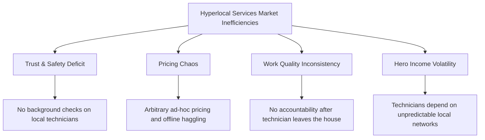

# Project Foundation Document: HomeHero

**Author:** Founder, Product Manager, & Software Architect, HomeHero Technologies Pvt. Ltd.  
**Version:** 1.0.0  
**Date:** June 26, 2026  

---

## 1. Vision
To become India’s most trusted, reliable, and frictionless hyperlocal infrastructure for household services, transforming how urban households maintain their homes and how blue-collar professionals build sustainable, dignified livelihoods.

## 2. Mission
*   **For Customers:** To deliver a standardized, safe, and premium home service experience within 30 minutes, backed by transparent pricing, verified professionals, and escrow payment protection.
*   **For Partners (Technicians):** To uplift home service professionals by offering them steady job dispatches, standardized fair pricing, automated digital payments, and digital respect.

---

## 3. Problem Statement
The Indian hyperlocal home services market, valued at over $30B, is highly fragmented and characterized by severe inefficiencies:



1.  **Trust & Safety Deficit:** Customers are hesitant to allow unverified, random local technicians into their homes, especially in nuclear families and apartments with security locks.
2.  **Pricing Chaos:** There is no standard pricing. Local technicians charge arbitrary fees based on the customer’s residential area, leading to friction and haggling.
3.  **Work Quality Inconsistency:** A lack of standardized procedures means services range from excellent to destructive, with zero recourse or warranty once the technician leaves.
4.  **Technician (Hero) Income Volatility:** Skilled blue-collar workers depend on word-of-mouth or exploitative local contractors, suffering from unstable daily wages and delayed cash payouts.

---

## 4. Solution Statement
HomeHero solves these bottlenecks by introducing a high-fidelity, real-time matching loop that couples standardized service checklists with automated escrow financial guards:

*   **Geospatial Matchmaking:** A 90-second broadcast loop that targets the nearest active, background-verified technicians matching the client's required skill.
*   **Standardized Checklists:** Mandatory pre-job and post-job verification photo uploads and checklist checkoffs built directly into the client and technician apps.
*   **Razorpay Escrow Holds:** Upfront digital payments are held securely in escrow upon booking creation, preventing disputes and guaranteeing technician payouts upon verified completion.
*   **Operations Vetting Queues:** Administrative vetting consoles to inspect government IDs and certify technician credentials before they are activated on the network.

---

## 5. Business Goals
*   **Unit Economics Viability:** Achieve a positive contribution margin per booking by enforcing a 15% platform take-rate, covering payment gateway costs and matching telemetry overhead.
*   **Provider Lifetime Value (LTV):** Build partner loyalty to minimize recruitment acquisition costs, targeting a partner retention rate of $>85\%$ over 12 months.
*   **Geographic Market Penetration:** Establish strong local density in Tier 1 cities (starting with Hyderabad, Bangalore, and Mumbai) before scaling to Tier 2 markets.

---

## 6. Product Goals
*   **Frictionless Matching SLA:** Connect customers with verified technicians in under 3 minutes, maintaining a booking matching completion rate of $>95\%$.
*   **High Trust & Completion Index:** Maintain a 4.75+ average star rating across service categories through strict quality audits and checklists.
*   **Zero-Dispute Escrow Releases:** Automate Razorpay escrow release dispatches immediately upon customer sign-off, targeting a transfer latency of under 5 minutes to the technician’s digital wallet.

---

## 8. Target Audience

```
+-----------------------------------------------------------------------------+
|                               TARGET AUDIENCE                               |
+------------------------------------+----------------------------------------+
|           Segment                  |               Use Case                 |
+------------------------------------+----------------------------------------+
| Dual-Income Urban Households       | Time-poor professionals needing        |
|                                    | reliable, quick emergency repairs.     |
+------------------------------------+----------------------------------------+
| Apartment & Gated Community        | Demanding high-security vetting,       |
| Residents                          | cashless payments, and premium service.|
+------------------------------------+----------------------------------------+
| Urban Homeowners & Landlords       | Seeking transparent pricing and long-  |
|                                    | term home maintenance logs.            |
+------------------------------------+----------------------------------------+
| Skilled Blue-Collar Technicians    | Seeking income stability, fair pricing,|
|                                    | and professional respect.              |
+------------------------------------+----------------------------------------+
```

---

## 9. MVP Scope (Phase 1)
The MVP targets the 4 core emergency services that represent 70% of initial household search volumes:

### 1. Services Catalog
*   **Electrician:** Board repairs, short-circuit diagnostics, appliance wiring, inverter setups.
*   **Plumber:** Leak repairs, pipe fittings, pump maintenance, sanitary installs.
*   **Carpenter:** Hinge repairs, door locks installation, furniture adjustments, custom shelf mounts.
*   **AC Repair:** Gas refilling, filter cleaning, compressor diagnostics, thermostat repairs.

### 2. Core Functional Modules
*   **Customer Web App:** Service selector, price estimator, Razorpay payment flow, live map tracking with Google Maps, ratings and review submission.
*   **Technician App (Hero Portal):** Working mode toggle (Online/Offline), incoming dispatch ring console, mandatory work checklists, wallet ledgers, UPI bank payouts.
*   **Admin Operations Panel:** Registered users data tables, manual technician KYC document vetting queue, dynamic pricing surge configurator, and transaction audits.
*   **Geospatial Dispatch Engine:** Nearest-neighbor matching loop with Socket.io real-time coordinate broadcasts.

---

## 10. Future Scope (Phases 2 & 3)
As local density increases, HomeHero will introduce high-frequency maintenance services and corporate integrations:

*   **Expansion Services:**
    *   **High Frequency:** Daily/Weekly Maid and Cook dispatches.
    *   **Care-centric:** Verified Babysitters, complete House Deep Cleaning, and certified Elder Care.
*   **Subscription Models ("HeroPass"):** Monthly passes offering zero convenience fees, priority emergency dispatches, and free monthly maintenance checks.
*   **Real-time SOS Telemetry:** Integrations with local police authorities and emergency response hubs for client and provider safety during in-home visits.
*   **Automated KYC Integrations:** Connect directly with Aadhaar (UIDAI API) and background verification agencies (Checkr, SpringVerify) for instant, automated vetting.

---

## 11. Risks & Mitigations

> [!WARNING]
> | Risk | Severity | Mitigation Strategy |
> | :--- | :--- | :--- |
> | **Safety & Liability Claims** | Critical | Enforce strict double-document KYC vetting. Mandatory check-in/check-out photo uploads. General liability insurance covering up to ₹50,000 for damages. |
> | **Platform Disintermediation** | High | Technicians attempting to bypass the platform for future work. Mitigated by offering technicians wallet rewards, insurance coverages, and consistent booking dispatches that they lose access to if they bypass the platform. |
> | **Escrow Dispute Locks** | Medium | Customers refusing to confirm service completions to lock technician funds. Mitigated by an automated 24-hour auto-release rule if the customer does not raise a dispute ticket within 2 hours of technician-marked completion. |
> | **Low Local Partner Density** | High | Extended matching times in suburban areas. Mitigated by launching in strictly bound local regions (micro-markets) and scaling only when provider densities in those zones exceed 5 heroes per square kilometer. |

---

## 12. Assumptions
*   **Mobile Literacy:** Technicians own smartphones and have stable 4G/5G internet connections.
*   **Payment Adaption:** Indian customers are comfortable pre-authorizing payments via UPI, credit cards, or net banking.
*   **KYC Adherence:** Technicians are willing to submit Aadhaar cards and certificates of skill in exchange for platform access.

---

## 13. Success Metrics (KPIs)

### Primary KPIs (North Star)
*   **Monthly Completed Bookings:** Total completed bookings per month.
*   **Platform Gross Merchandise Value (GMV):** Total transaction throughput across Razorpay.
*   **Platform Net Revenue:** Accumulated 15% platform commissions.

### Secondary KPIs (Operations)
*   **Match Latency:** Median time from booking creation to partner acceptance (Target: $<90$ seconds).
*   **Provider Cancellation Rate:** Percentage of matched dispatches declined by providers (Target: $<3\%$).
*   **Review Index:** Percentage of services yielding a 5-star customer feedback rating (Target: $>80\%$).

---

## 14. Proposed Timeline

```
+-------------------------------------------------------------------+
|                         PROPOSED TIMELINE                         |
+----------------------+----------------------+---------------------+
|        Month         |        Focus         |     Deliverables    |
+----------------------+----------------------+---------------------+
| Month 1              | Backend & Datastore  | Core schemas, REST  |
|                      | Architecture         | API endpoints, JWT  |
|                      |                      | auth configurations.|
+----------------------+----------------------+---------------------+
| Month 2              | Real-time Telemetry  | Matchmaking dis-    |
|                      | & Payments           | patch loop, Razorpay|
|                      |                      | escrow integration. |
+----------------------+----------------------+---------------------+
| Month 3              | React Frontends      | Customer, Partner,  |
|                      |                      | and Operations      |
|                      |                      | consoles.           |
+----------------------+----------------------+---------------------+
| Month 4              | Pilot Launch         | Beta launch in Jubi-|
|                      |                      | ills (Hyd) for 500  |
|                      |                      | select users.       |
+----------------------+----------------------+---------------------+
```

---

## 15. Project Deliverables
1.  **Backend codebase:** Node.js, Express, MongoDB schemas, and Socket.io dispatch servers.
2.  **Frontend codebase:** React-Vite client dashboards (Customer, Technician, Admin views).
3.  **Dynamic Pricing & Escrow Services:** Integrated Razorpay checkout and signature verification engines.
4.  **Operational Vetting pipeline:** Administrative consoles and background check screening portals.
5.  **Documentation assets:** API specs, product requirements, and system architecture blueprints.
