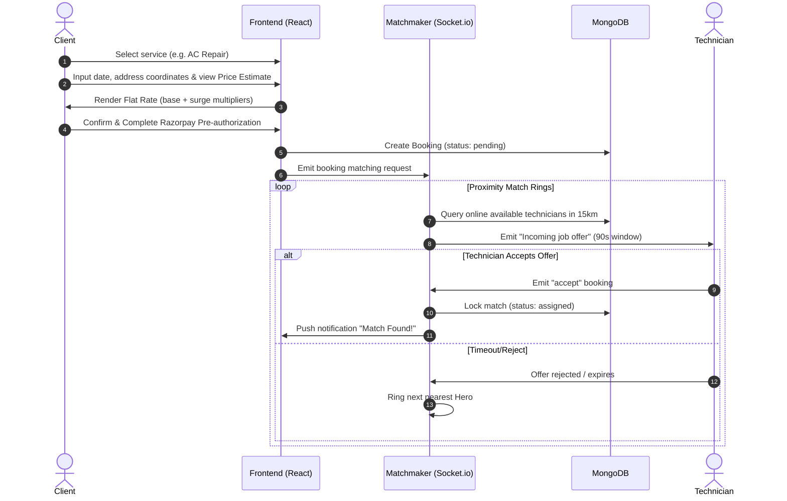
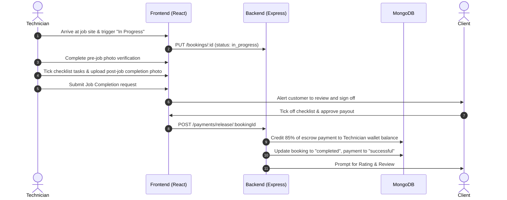

# HomeHero Hyperlocal Home Services - User Experience & Interface Design

**Author:** Senior UI/UX Designer, HomeHero Technologies Pvt. Ltd.  
**Version:** 1.0.0  
**Date:** June 26, 2026  
**Status:** Approved for Frontend Implementation

---

## 1. Brand Visual Design System

HomeHero’s design system uses a premium **dark-mode glassmorphism** aesthetic, tailored to evoke trust, precision, and ease of use in fast-paced hyperlocal scenarios. The layout integrates a custom **Senior Accessibility Mode** to assist users with visual or physical impairments.

### 1.1 Color Tokens & HSL Palette

The colors are selected to match dark themes, providing high contrast and clear visual hierarchy.

```
 Slate Dark (Base BG)    #0D1117 (hsl(220, 20%, 10%))
 Card / Glass Background  #161B22 (hsla(220, 20%, 15%, 0.7))
 Primary Indigo          #4D39E6 (hsl(245, 75%, 55%))
 Primary Hover           #3925C2 (hsl(245, 75%, 45%))
 Accent Violet           #9B51E0 (hsl(270, 80%, 65%))
 Success Mint            #27AE60 (hsl(155, 65%, 45%))
 Warning Amber           #F2994A (hsl(38, 90%, 55%))
 Alert Red               #EB5757 (hsl(5, 85%, 55%))
 Text Primary            #F0F3F6 (hsl(220, 10%, 95%))
 Text Secondary          #B1B8C0 (hsl(220, 10%, 70%))
```

### 1.2 Typography & Type Scales

* **Headings Font:** `Outfit` (for brand identity, section titles, and action figures).
* **Body Font:** `Inter` (for readability, forms, lists, and transaction receipts).

| Token Name | Font Family | Weight | Font Size | Line Height | Usage Example |
| :--- | :--- | :--- | :--- | :--- | :--- |
| **Display Heading** | Outfit | 800 (Extra Bold) | 2.5rem (40px) | 1.2 | Hero sections / Big value counters |
| **H1 Title** | Outfit | 700 (Bold) | 1.8rem (28px) | 1.3 | Page Titles / Modals |
| **H2 Section** | Outfit | 600 (Semi-Bold) | 1.4rem (22px) | 1.4 | Section Headings |
| **Body Lead** | Inter | 500 (Medium) | 1.1rem (18px) | 1.5 | Category subtitle / Booking summaries |
| **Body Standard** | Inter | 400 (Regular) | 0.95rem (15px)| 1.6 | Descriptive notes / Addresses |
| **Button Text** | Inter | 600 (Semi-Bold) | 1.0rem (16px) | 1.0 | Action CTAs / Tab selectors |
| **Caption / Small**| Inter | 400 (Regular) | 0.8rem (12px)  | 1.4 | Timestamps / Booking codes |

### 1.3 Glassmorphism & Elevation Parameters

To create a premium feel, layers are stacked using glassmorphic borders and blur filters.

* **Base Layer:** HSL Slate Dark Background.
* **Surface Card Layer (`.glass-card`):**
  * `background: hsla(220, 20%, 15%, 0.7)`
  * `backdrop-filter: blur(12px);`
  * `border: 1px solid hsla(220, 10%, 25%, 0.4)`
  * `box-shadow: 0 10px 30px -10px rgba(0, 0, 0, 0.7)`
* **Overlay Layer (Modals/Offer Rings):**
  * `background: hsla(220, 20%, 20%, 0.95)`
  * `backdrop-filter: blur(20px);`
  * `border: 1px solid hsla(270, 80%, 65%, 0.5)` (Vibrant Violet Accent Border).

---

### 1.4 Senior Accessibility Mode (`.accessibility-mode`)

Accessible with a toggle in the navigation header, this mode modifies the design for older users or those with visual impairments:

1. **Increased Font Sizes:** Standard body font increases to `1.25rem (20px)`. Headings scale proportionally.
2. **Larger Target Areas:** Touch targets increase to a minimum of `56px x 56px` to prevent accidental clicks.
3. **Thicker Borders:** Card and input borders increase to `3px` solid with high-contrast lines.
4. **Disabled Transparency:** Glass cards transition to solid, opaque backgrounds (`#161B22`) with `backdrop-filter` disabled, improving readability.

---

## 2. Information Architecture & Sitemap

The platform is divided into three distinct portal experiences managed by a central **Portal Selector** component in the header.

```mermaid
graph TD
    %% Portals
    root[Portal Selector Header] --> Cust[Customer Experience Portal]
    root --> Tech[Technician Experience Portal]
    root --> Adm[Admin Console Experience]

    %% Customer Sitemap
    subgraph Customer Portal
        Cust --> CHome[Home / Category Selection]
        Cust --> CList[Service Listing / Pricing Options]
        Cust --> CBook[Booking & Price Estimator Screen]
        Cust --> CPay[Payment Gateways / Escrow Hold]
        Cust --> CTrack[Live Real-time Location Tracking]
        Cust --> CHist[Customer Booking History]
        Cust --> CProfile[Profile / Saved Addresses]
    end

    %% Tech Sitemap
    subgraph Technician Portal
        Tech --> THome[Dashboard / Offer Match Rings]
        Tech --> TJobs[Active Jobs / Checklists]
        Tech --> TEarn[Earnings Log & Wallet Balances]
        Tech --> TProfile[Technician KYC Profile]
    end

    %% Admin Sitemap
    subgraph Admin Portal
        Adm --> AUsers[User Management & Suspensions]
        Adm --> ATech[KYC Vetting & Approvals]
        Adm --> ABook[Global Booking Dispatch Logs]
        Adm --> APay[Razorpay Escrow Audits & Releases]
        Adm --> ARep[Analytics Reports & Surge Pricing Config]
    end
```



---

## 3. Core Interaction User Flows

### 3.1 Customer Booking & Matching Flow
This flow details how a customer searches, estimates prices, pays, and matches with nearby technicians.



---

### 3.2 Service Execution & Payout Escrow Release
This flow details the checklist verification and automatic payment distribution upon completion.



---

## 4. Viewport Wireframe Specifications

### 4.1 Home Screen (Hyperlocal Service Finder)
* **Viewport:** Mobile (375px width / 812px height)

```
+---------------------------------------------+
| [HH] HomeHero                 (⚡) ACCESSIBLE|
+---------------------------------------------+
| Deliver to:                                 |
| [ Jubilee Hills, Hyderabad ▾ ]              |
+---------------------------------------------+
|                                             |
|   What repair service do you need today?    |
|                                             |
|   [ Search for services...              🔍 ] |
|                                             |
+---------------------------------------------+
|                                             |
|  CORE SERVICES (Phase 1)                    |
|  +--------------+     +--------------+      |
|  |    ( 🔌 )    |     |    ( 🔧 )    |      |
|  |  Electrician |     |   AC Repair  |      |
|  +--------------+     +--------------+      |
|  +--------------+     +--------------+      |
|  |    ( 🪚 )    |     |    ( 🚰 )    |      |
|  |   Carpenter  |     |   Plumber    |      |
|  +--------------+     +--------------+      |
|                                             |
+---------------------------------------------+
|  COMING SOON (Phase 2)                      |
|  [ Maid ]  [ House Cleaning ]  [ Babysitter]|
+---------------------------------------------+
| [⚡] 100% Verified Heroes  [🛡️] Escrow Secured|
+---------------------------------------------+
| (🏠) Home    (📅) Bookings    (👤) Account   |
+---------------------------------------------+
```

---

### 4.2 Booking Checkout & Estimator Page
* **Viewport:** Mobile (375px width / 812px height)

```
+---------------------------------------------+
| ‹ Back         AC Deep Cleaning             |
+---------------------------------------------+
| CHOOSE ADDRESS                              |
| (•) Home: Flat 402, Oakwood Towers          |
| ( ) Office: Mindspace IT Park               |
| [ + Add New Address ]                       |
+---------------------------------------------+
| SELECT SCHEDULE                             |
| [ Saturday, June 27, 2026               📅 ] |
| [ 10:30 AM                              🕒 ] |
+---------------------------------------------+
| BILLING DETAILS                             |
| Base Rate:                           ₹499.00|
| Surge Fee (Monsoon Multiplier 1.15x): ₹75.00|
| GST (18%):                            ₹103.00|
| Coupon [ FIRST100 ] Applied:       -₹100.00|
|---------------------------------------------|
| TOTAL PAYABLE:                       ₹577.00|
+---------------------------------------------+
| Escrow Hold Guarantee:                      |
| Funds are held in escrow by Razorpay        |
| and only released when you approve.         |
+---------------------------------------------+
|        [ PROCEED TO SECURE PAYMENT ]        |
+---------------------------------------------+
```

---

### 4.3 Real-Time Matching & Dispatch Radar
* **Viewport:** Mobile (375px width / 812px height)

```
+---------------------------------------------+
| Booking Code: HH-2026-9831                  |
+---------------------------------------------+
|                                             |
|            FINDING YOUR HERO...             |
|                                             |
|                   .  *  .                   |
|                *     |     *                |
|              .--- ( 🛰️ ) ---.              |
|                *     |     *                |
|                   .  *  .                   |
|                                             |
|        Contacting technicians within         |
|             1.2 km of Madhapur              |
|                                             |
+---------------------------------------------+
| Ringing matchmaker queue... [ 01:24 ]       |
+---------------------------------------------+
|  [🚨 SOS ]              [ Cancel Request ]  |
+---------------------------------------------+
```

---

### 4.4 Technician dashboard (Offer Match Ring Modal)
* **Viewport:** Mobile (375px width / 812px height)

```
+---------------------------------------------+
| Rajesh Kumar                     [ ONLINE ] |
+---------------------------------------------+
| +-----------------------------------------+ |
| |        ⚡ NEW INCOMING JOB OFFER        | |
| |-----------------------------------------| |
| | Service: Split AC Jet Wash              | |
| | Distance: 1.4 Km (Jubilee Hills)        | |
| | Schedule: Today, 10:30 AM               | |
| | Notes: "AC cooling is weak."            | |
| |-----------------------------------------| |
| | ESTIMATED EARNINGS:                     | |
| | ₹534.00 (85% Split)                     | |
| |-----------------------------------------| |
| | Time remaining to accept:  [ 42s ]      | |
| |                                         | |
| |   [ REJECT ]        [ ACCEPT OFFER ]    | |
| +-----------------------------------------+ |
+---------------------------------------------+
| (🏠) Home    (💼) Jobs    (👛) Wallet (👤)  |
+---------------------------------------------+
```

---

### 4.5 Admin Operations Dashboard
* **Viewport:** Desktop Responsive (1200px width / 900px height)

```
+-----------------------------------------------------------------------------------+
|  [HH] HomeHero Admin Console                                      (👤) Admin Mode |
+-----------------------------------------------------------------------------------+
|  [ USERS ]  [ TECHNICIANS ]  [ BOOKINGS ]  [ PAYMENTS ]  [ ANALYTICS & REPORTS ]  |
+-----------------------------------------------------------------------------------+
|  ANALYTICS & REPORTS PANEL                                                        |
|  +-------------------------------------+   +------------------------------------+ |
|  | REVENUE TRAJECTORY (Past 7 Days)    |   | SERVICE CATEGORY DISTRIBUTION      | |
|  |                                     |   |                                    | |
|  |  ₹50k |   █                         |   |     (🟢) AC Repair   : 42%         | |
|  |  ₹25k | █ █ █ █                     |   |     (🔵) Electrician : 38%         | |
|  |    ₹0 +---------                    |   |     (🟡) Plumber     : 12%         | |
|  |         M T W T F S S               |   |     (🔴) Carpenter   : 8%          | |
|  +-------------------------------------+   +------------------------------------+ |
|                                                                                   |
|  SURGE PRICING MULTIPLIERS (Dynamic Configuration)                                |
|  Monsoon Multiplier : [=========||=======] 1.15x                                 |
|  Night Shift Multiplier: [===========||===] 1.20x                                 |
|  Holiday Surge Rate:  [======||==========] 1.10x                                 |
|                                                                                   |
|  [ Save Pricing Configurations ]                                                  |
+-----------------------------------------------------------------------------------+
```

---

## 5. Responsive Layout Strategy

HomeHero utilizes a mobile-first responsive layout to support different user environments.

```
       MOBILE                 TABLET                 DESKTOP
   (up to 480px)          (481px - 1024px)        (above 1024px)
+------------------+   +--------------------+   +----------------------+
|  - Single col    |   |  - Two column grid |   |  - Full sidebar/tabs |
|  - Bottom nav    |   |  - Collapsed nav   |   |  - Expansive detail  |
|  - Full width    |   |  - Scrollable lists|   |  - Double panel map  |
+------------------+   +--------------------+   +----------------------+
```

### 5.1 Viewport Breakpoints & Media Query Classes
```css
/* Mobile First Layout Default */
.main-wrapper {
  display: flex;
  flex-direction: column;
  padding: 12px;
}

/* Tablet Layout (Portrait & Landscape) */
@media (min-width: 481px) and (max-width: 1024px) {
  .main-wrapper {
    padding: 24px;
  }
  .grid-layout {
    grid-template-columns: 1fr 1fr;
    gap: 16px;
  }
}

/* Desktop Monitors */
@media (min-width: 1025px) {
  .main-wrapper {
    max-width: 1200px;
    margin: 0 auto;
    padding: 40px;
  }
  .grid-layout {
    grid-template-columns: 1.6fr 1fr;
    gap: 30px;
  }
}
```

### 5.2 Layout Rules & Guidelines
1. **Fluid Grid Containers:** All elements utilize relative styling units (`rem`, `%`, `vw`, `vh`) instead of static pixels.
2. **Touch Safety Targets:** On touch interfaces (mobile and tablet), all buttons and input boxes are styled with `padding: 14px 20px` to maintain a target space > `48px x 48px`.
3. **Viewport Height Stability:** Matchmaker and live tracking screens use `dvh` (Dynamic Viewport Height) rather than standard `vh` to prevent layout breaking when address search bars or virtual keyboards open in mobile browsers.
