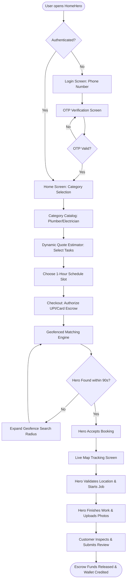

# HomeHero - UI/UX Design Specification & Design System
**Prepared by:** Senior UX Designer  
**Date:** June 26, 2026  
**Project:** HomeHero (Hyperlocal Home Services Platform, India)  
**Status:** Baseline Established for UI Engineers  

---

## 1. Design System & Brand Identity

The HomeHero interface is designed around a premium, modern, and high-trust aesthetic. It utilizes a deep slate canvas paired with vibrant accents, elegant glassmorphic surfaces, clear typography, and subtle glowing micro-interactions to create a professional and engaging user experience.

### 1.1 Color Tokens & Palette

To establish visual hierarchy and trust, we define HSL-based color tokens. These ensure high contrast (WCAG AAA compliant in accessibility mode) and consistent visual accents:

| Token Name | Hex Code | HSL Value | Application / Role |
| :--- | :--- | :--- | :--- |
| **Primary (Royal Indigo)** | `#3B3FE6` | `hsl(238, 78%, 56%)` | Core brand identity, primary buttons, active tab states. |
| **Accent (Hero Violet)** | `#9B51E0` | `hsl(270, 70%, 60%)` | Interactive highlights, sub-headers, promotional badges. |
| **Success (Verified Mint)** | `#27AE60` | `hsl(145, 63%, 41%)` | Verified Hero badges, checkout confirmation, complete status. |
| **Warning (Alert Amber)** | `#F2994A` | `hsl(29, 87%, 60%)` | Pending state indicators, cancellation fee alerts, warning text. |
| **Danger (SOS Coral)** | `#EB5757` | `hsl(0, 81%, 63%)` | In-app Emergency SOS trigger, error states, delete actions. |
| **Background (Deep Slate)** | `#0D1117` | `hsl(215, 28%, 7%)` | Main dark-theme canvas background. |
| **Card (Glass Base)** | `#161B22B3` | `hsla(215, 20%, 11%, 0.7)` | 70% opacity card surfaces with background-blur filters. |
| **Border (Slate Highlight)** | `#30363D` | `hsl(215, 12%, 21%)` | Low-contrast containment borders. |

### 1.2 Spacing & Grid System
The interface uses a 4px-based grid system to ensure consistent alignment and rhythm across mobile and web interfaces:
*   **Base Spacing Unit:** `4px`
*   **Layout Spacers:** `xs (4px)`, `sm (8px)`, `md (16px)`, `lg (24px)`, `xl (32px)`, `xxl (48px)`
*   **Mobile Padding:** Standard `16px (md)` horizontal padding on all view edges.
*   **Card Border Radius:** Standardized at `16px (md)` for a modern, friendly feel.

### 1.3 Typography Scale
We utilize two Google Web Fonts to balance style with clarity:
*   **Headers & Accents:** *Outfit* (Geometric Sans-serif) - Rounded, modern shapes for headings.
*   **Body & Form Input:** *Inter* (Neo-Grotesque Sans-serif) - Highly legible at small sizes.

| Level | Size (rem) | Size (px) | Weight | Line Height |
| :--- | :--- | :--- | :--- | :--- |
| **Display H1** | `2.25rem` | `36px` | Bold (700) | `1.2` |
| **Section H2** | `1.5rem` | `24px` | Semi-Bold (600) | `1.3` |
| **Card Header H3**| `1.125rem` | `18px` | Medium (500) | `1.4` |
| **Body Default** | `1.0rem` | `16px` | Regular (400) | `1.5` |
| **Caption / Small**| `0.8125rem` | `13px` | Light (300) | `1.5` |

### 1.4 Glassmorphism UI Token Specifications
To create depth on the dark background, interactive cards must use the following CSS properties:
```css
.hero-glass-card {
  background: rgba(22, 27, 34, 0.70);
  backdrop-filter: blur(12px);
  -webkit-backdrop-filter: blur(12px);
  border: 1px solid rgba(255, 255, 255, 0.08);
  box-shadow: 0 8px 32px 0 rgba(0, 0, 0, 0.37);
  border-radius: 16px;
}
```

---

## 2. Interactive User Flow

The following map defines the workflow of a user booking an emergency plumber, handling payment escrow, live location tracking, and payment release upon validation.



---

## 3. Wireframes & Core Mobile Screens

All wireframes are based on a 360dp mobile screen layout. The core UI elements are designed to prioritize safety and ease of use.

### Screen 1: The Simple-Mode Configured Home Screen

This screen represents the main dashboard. It highlights the "Simple Mode" toggle, designed for accessibility and senior users:

```
+----------------------------------------------------+
| 📍 HSR Layout, Sector 4, Blr ▼          👓 [SIMPLE] |
| "Namaste, Rajesh Ji"                               |
+----------------------------------------------------+
| [ 🔍 Search services (eg: tap, fan, AC)          ] |
+----------------------------------------------------+
|                                                    |
|  [⚡ ELECTRICIAN]             [🚰 PLUMBER]          |
|  • Light/Fan installs         • Tap leak repair    |
|  • Socket replacement         • Drain block fix    |
|                                                    |
|  [🔨 CARPENTER]               [❄️ AC REPAIR]        |
|  • Door hinge fixing          • Filter cleaning    |
|  • Lock installation          • Cooling fix        |
|                                                    |
+----------------------------------------------------+
| ⭐ HERO+ ANNUAL AMC PLAN (₹999/yr)                  |
| - Zero convenience fees on all bookings            |
| - 2 Free preventative checkups included            |
|   [ Subscribe Now ]                                |
+----------------------------------------------------+
| 🏠 Home           📅 Bookings            👤 Profile|
+----------------------------------------------------+
```

### Screen 2: Dynamic Quote Estimator

This screen allows customers to build their service booking dynamically. The final labor charge updates in real time to avoid surprise pricing:

```
+----------------------------------------------------+
| ← Plumber: Tap Leak Repair                         |
+----------------------------------------------------+
| Select Leaky Tap Quantity:                         |
|   [ - ]             2 Taps Selected        [ + ]   |
|                                                    |
| Diagnostic Fee:                     ₹150           |
| Labor Rate (₹150 x 2):              ₹300           |
+----------------------------------------------------+
| Surcharges & Options:                              |
| [x] Needs Replacement Taps Sourced (+₹600)         |
| [ ] Urgent Booking (Under 1 hour) (+₹100)          |
+----------------------------------------------------+
| Choose 1-Hour Arrival Slot:                        |
| +-----------------+ +-----------------+            |
| | 1:00 PM - 2:00  | | 2:00 PM - 3:00  |            |
| | (Recommended)   | |                 |            |
| +-----------------+ +-----------------+            |
+----------------------------------------------------+
| Total Escrow Value:                 ₹1,050         |
|   [ Authorize UPI Escrow Payment ]                 |
+----------------------------------------------------+
```

### Screen 3: Live Map Tracking & Security Control

Once a Hero is matched, this screen provides real-time location tracking. It features an prominent SOS Panic Button to address customer safety concerns:

```
+----------------------------------------------------+
| [ 🚗 Interactive Map - Tracking Suresh (Hero) ]   |
|                                                    |
|                      [Home]                        |
|                         |                          |
|                         .                          |
|                         . [🚗 Suresh - 1.2km away] |
|                                                    |
+----------------------------------------------------+
| 👨‍🔧 Suresh Kumar (Rating: 4.9 ★)                    |
| ID: Verified Aadhaar  |  Equipped with standard kit |
|                                                    |
| ETA: 8 Minutes                                     |
|                                                    |
|   [📞 Masked Voice Call]     [💬 Chat Message]     |
+----------------------------------------------------+
| 🆘 EMERGENCY SOS BUTTON                            |
| (Instantly alerts local patrol and security hub)    |
+----------------------------------------------------+
```

---

## 4. Responsive Design & Layout Adaptation

HomeHero utilizes a responsive layout system to support diverse devices. While the customer app is mobile-first, the administrative console and operations dashboards adapt to desktop viewports.

### 4.1 Grid Adaptations

| Device Class | Breakpoint | Columns | Container Margin | Layout Strategy |
| :--- | :--- | :--- | :--- | :--- |
| **Mobile (Handset)** | `< 600px` | 4-col | `16px` | Single-column stacks, sticky bottom-nav sheets. |
| **Tablet (Portrait)**| `600px - 960px`| 8-col | `24px` | Double-column grids, collapsible side drawers. |
| **Desktop (Admin)** | `> 1200px` | 12-col | `32px` | Multi-pane layouts (sidebars, data grids, audit logs). |

### 4.2 UI Component Adaptations (Desktop Admin Dashboard)

```
+---------------------------------------------------------------------------------+
|  Logo  |  [🔍 Search users, bookings...]                            👤 Admin   |
+--------+------------------------------------------------------------------------+
| 📊 Stats    |  VETTING QUEUE (Pending Verification)                              |
| ⚙️ Setup    |  +------------------------------------------------------------------+ |
| 🛡️ Escrow   |  | Name: Amit P.   | Trade: AC Repair   | Docs: Aadhaar, PAN, Certs  | |
| 📁 Log      |  | Action: [📄 View Aadhaar]  [✓ Verify Profile]  [✕ Reject Application] | |
|             |  +------------------------------------------------------------------+ |
|             |  DYNAMIC PRICING CALCULATOR                                        |
|             |  Surge Multiplier: [--- 1.2x ---●] (Active: Raining in Indiranagar)  |
+-------------+--------------------------------------------------------------------+
```

---

## 5. Accessibility Guidelines & Accessibility Mode

To ensure the product is accessible to all demographics in India—particularly senior citizens—designers and developers must enforce the following rules:

### 5.1 Simple View Mode Specification
*   **The AAA Contrast Mandate:** In accessibility mode, background elements must shift from dark slate to pure black (`#000000`) and text colors to stark white (`#FFFFFF`) or bright yellow (`#FFCC00`) to guarantee contrast ratios greater than **7:1**.
*   **Touch Targets:** Interactive components (buttons, toggles, form fields) must be expanded to a minimum size of **56px x 56px** to accommodate users with limited motor control.
*   **Voice-Note Booking:** For users who struggle to type or search, a microphone icon must be displayed. Tapping it records up to 30 seconds of audio. This audio is routed directly to the operations desk for manual dispatch booking.
*   **Screen-Reader Attributes:** All icons and buttons must include descriptive `aria-label` HTML attributes (e.g., `<button aria-label="Toggle Simple Mode and Increase Font Sizes">`).
