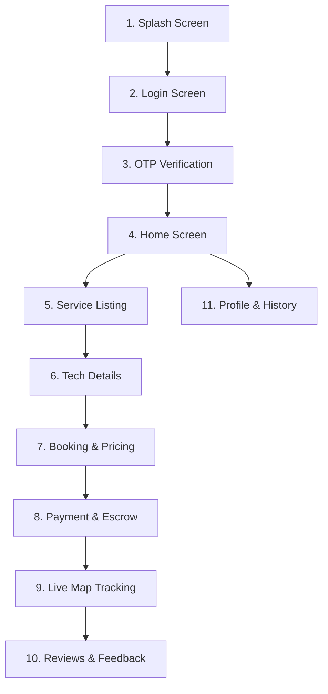

# HomeHero - UI/UX Design System & Mobile App Flow Specification

**Document Version:** 3.0 (Senior UX Designer Blueprint Edition)  
**Author:** Senior UX Designer  
**Date:** June 17, 2026  
**Status:** Approved for Frontend Scaffolding  

---

## 1. Design System Foundation (Style Guide)
HomeHero’s interface is designed around a premium, modern aesthetic utilizing a dark slate theme, HSL-tailored colors, soft glowing gradients, glassmorphism card layouts, and micro-animations to convey a premium, trustworthy look and feel.

### 1.1 Color Palette

| Token | HSL / Hex Code | Usage |
| :--- | :--- | :--- |
| **Primary (Royal Indigo)** | `hsl(245, 75%, 55%)` | Primary CTAs, active highlights, key navigation states. |
| **Accent (Hero Violet)** | `hsl(270, 80%, 65%)` | Secondary options, brand accents, decorative card borders. |
| **Success (Verified Mint)** | `hsl(155, 65%, 45%)` | Verification badges, completed indicators, success states. |
| **Warning (Alert Amber)** | `hsl(38, 90%, 55%)` | Cancellation notices, transaction status alerts. |
| **Danger (Alert Red)** | `hsl(5, 85%, 55%)` | Action declines, errors, SOS triggers. |
| **Background (Slate Dark)** | `hsl(220, 20%, 10%)` | Main dark-theme background. |
| **Card (Glass Overlay)** | `hsla(220, 20%, 15%, 0.7)`| Glassmorphism card surfaces. |

### 1.2 Typography
*   **Primary Typeface:** *Outfit* (Google Fonts) - Clean, round geometric lines for headings and brand elements.
*   **Secondary Typeface:** *Inter* - Optimized for readability in text-heavy lists, prices, and forms.
*   **Scale Hierarchy:**
    *   `h1` (Page Title): `2.0rem (32px)` / Bold
    *   `h2` (Card Titles / Section Header): `1.3rem (20.8px)` / Medium
    *   `body` (Paragraph text): `1.0rem (16px)` / Regular
    *   `caption` (Subtext & details): `0.85rem (13.6px)` / Light

---

## 2. Complete 11-Screen Mobile App Flow

Below is the step-by-step wireframe layout structure for all 11 core screens of the HomeHero customer application.



---

### Screen 1: Splash Screen
*   **Visual Layout:** Centered glowing brand logo of HomeHero (`🦸‍♂️`) set against a deep Royal Indigo background with a subtle radar-pulse animation.
*   **Wireframe Blueprint:**
    ```
    +------------------------------------------+
    |                                          |
    |                                          |
    |                                          |
    |                  🦸‍♂️                      |
    |               HomeHero                   |
    |                                          |
    |                                          |
    |    "Hyperlocal Home Care, Verified."     |
    |                                          |
    +------------------------------------------+
    ```
*   **UX Recommendation:** Maintain launch duration under 1.5 seconds, pre-fetching regional configurations in the background.

---

### Screen 2: Login Screen
*   **Visual Layout:** Sleek top-aligned brand logo with an interactive phone number input card.
*   **Wireframe Blueprint:**
    ```
    +------------------------------------------+
    |               🦸‍♂️ HomeHero                |
    |  Access your verified dashboard          |
    |                                          |
    |  +------------------------------------+  |
    |  | Mobile Number                      |  |
    |  | [+91] [ Enter phone number       ] |  |
    |  +------------------------------------+  |
    |                                          |
    |  [ Request OTP Verification             ] |
    |                                          |
    |  - OR -                                  |
    |  [ G Continue with Google               ] |
    |  [ A Continue with Apple                ] |
    +------------------------------------------+
    ```
*   **UX Recommendation:** Auto-focus the mobile input field on mount and display the numeric keyboard by default.

---

### Screen 3: OTP Verification Screen
*   **Visual Layout:** Clean layout showing the verification inputs digits.
*   **Wireframe Blueprint:**
    ```
    +------------------------------------------+
    |              ← Back to Login             |
    |  Verify Mobile                           |
    |  Code sent to +91 98XXX-XX210            |
    |                                          |
    |    [ 4 ]  [ 8 ]  [ 9 ]  [ 2 ]  [ _ ]  [ _ ]|
    |                                          |
    |  Resend Code in 45s                      |
    |                                          |
    |  [ Verify & Sign In                     ] |
    +------------------------------------------+
    ```
*   **UX Recommendation:** Integrate automatic SMS reader API to fetch and paste the OTP code instantly.

---

### Screen 4: Home Screen (Customer Dashboard)
*   **Visual Layout:** Structured top search bar with double column grid tiles for service categories.
*   **Wireframe Blueprint:**
    ```
    +------------------------------------------+
    | 📍 Jubilee Hills, Hyd ▼             [👓] |
    | "Good Morning, Sarah"                    |
    +------------------------------------------+
    | [ Search for tapping, AC repair...     ] |
    +------------------------------------------+
    |  Categories:                             |
    |  +------------------+ +----------------+ |
    |  |  ❄️ AC Repair     | | 🚰 Plumbing   | |
    |  +------------------+ +----------------+ |
    |  |  ⚡ Electrical   | | 🔧 Handyman   | |
    |  +------------------+ +----------------+ |
    +------------------------------------------+
    |  🌟 Promo: Hero+ subscription at ₹999/yr  |
    |  Waived service fees & annual home checks|
    +------------------------------------------+
    |  🏠 Home     🔔 Alerts    👤 Profile      |
    +------------------------------------------+
    ```
*   **UX Recommendation:** Place a persistent "Simple View" toggle at the top right for senior-friendly accessibility layouts.

---

### Screen 5: Service Listing Screen
*   **Visual Layout:** Single column vertical cards showing standard service packages.
*   **Wireframe Blueprint:**
    ```
    +------------------------------------------+
    | ← Plumbing Services                      |
    +------------------------------------------+
    | +--------------------------------------+ |
    | | Leaky Tap Repair       [Popular]     | |
    | | Fix leaking faucets, washers & pipes | |
    | | Est Time: 45 min     Price: ₹450     | |
    | | [ Add to Plan ]                      | |
    | +--------------------------------------+ |
    | +--------------------------------------+ |
    | | Washbasin Installation               | |
    | | Complete basin replacement           | |
    | | Est Time: 90 min     Price: ₹1,200   | |
    | | [ Add to Plan ]                      | |
    | +--------------------------------------+ |
    | +--------------------------------------+ |
    | | Items in plan: 1       Total: ₹450   | |
    | | [ Configure Schedule ]               | |
    | +--------------------------------------+ |
    +------------------------------------------+
    ```
*   **UX Recommendation:** Use clear illustration thumbnails for each package to increase confidence.

---

### Screen 6: Technician Details Screen
*   **Visual Layout:** Upper third shows profile; lower two-thirds shows reviews and verification checkpoints.
*   **Wireframe Blueprint:**
    ```
    +------------------------------------------+
    | ← Hero Profile                           |
    |   👨‍🔧 Marcus Fernandes                     |
    |   ★ 4.9 (140+ jobs completed)            |
    |   ✓ Verified Hero                        |
    +------------------------------------------+
    | Vetting Checkpoints:                     |
    | [✓] Identity Checked (Stripe ID)         |
    | [✓] Background Check Passed (Checkr)     |
    | [✓] Covered under ₹50k liability pool    |
    +------------------------------------------+
    | Customer Reviews:                        |
    | "Super clean work and friendly behavior" |
    |  - Priya S. (★★★★★)                      |
    | "Completed tapping repair in 30 minutes"  |
    |  - Rajesh K. (★★★★☆)                     |
    +------------------------------------------+
    ```
*   **UX Recommendation:** Emphasize the "Verified" indicator to reduce client safety anxieties.

---

### Screen 7: Booking Screen (Price Estimator)
*   **Visual Layout:** Form-based layout compiling totals dynamically.
*   **Wireframe Blueprint:**
    ```
    +------------------------------------------+
    | ← Booking: Deep Cleaning                 |
    +------------------------------------------+
    | Select Room Count:                       |
    | [ - ]          2 Rooms           [ + ]   |
    +------------------------------------------+
    | Options:                                 |
    | [x] Have pets (+₹300)                    |
    | [ ] Eco-friendly supplies (+₹200)        |
    +------------------------------------------+
    | Schedule Window (1-Hour Slots):          |
    | +--------+ +--------+ +--------+         |
    | | 10 AM  | | 11 AM  | | 12 PM  |         |
    | | Rec    | |        | |        |         |
    | +--------+ +--------+ +--------+         |
    +------------------------------------------+
    | [ Confirm & Hold Escrow (₹1500) ]        |
    +------------------------------------------+
    ```
*   **UX Recommendation:** Avoid full page refreshes. Calculate price parameters inline as selections change.

---

### Screen 8: Payment Screen (Escrow Authorization)
*   **Visual Layout:** Checkout layout focusing on secure payment structures.
*   **Wireframe Blueprint:**
    ```
    +------------------------------------------+
    | ← Secure Checkout                        |
    +------------------------------------------+
    | Booking Escrow Bill:                     |
    | Base Cleaning:     ₹1200                 |
    | Pet Surcharge:     ₹300                  |
    | Total Escrow:      ₹1500                 |
    +------------------------------------------+
    | Select Payment Option:                   |
    | ( ) UPI (GPay / PhonePe)                 |
    | ( ) Credit / Debit Card (Stripe Connect) |
    | ( ) Netbanking                           |
    +------------------------------------------+
    | 🛡️ Payment held securely in escrow.       |
    | [ Authorize Hold on ₹1500 ]              |
    +------------------------------------------+
    ```
*   **UX Recommendation:** Place the Stripe Secure checkout branding logo prominently to build trust.

---

### Screen 9: Live Tracking Screen
*   **Visual Layout:** Full-screen geofenced map layer with profile card overlay.
*   **Wireframe Blueprint:**
    ```
    +------------------------------------------+
    |              [ Map View ]                |
    |                                          |
    |      [Home]                              |
    |         |                                |
    |         . . . . [🚗 Marcus (Hero)]       |
    |                                          |
    +------------------------------------------+
    | 👨‍🔧 Marcus Fernandes                       |
    | ✓ Verified Hero   ★ 4.9                  |
    | ETA: 8 minutes (1.2 km away)             |
    | +--------------------------------------+ |
    | | [📞 Call via App]   [💬 Text Message]| |
    | +--------------------------------------+ |
    | [🆘 Emergency SOS Panic Trigger ]        |
    +------------------------------------------+
    ```
*   **UX Recommendation:** Maintain a clear vehicle path and provide a push notification when the tech is within 100 meters.

---

### Screen 10: Reviews & Ratings Screen
*   **Visual Layout:** Simple card feedback collection form.
*   **Wireframe Blueprint:**
    ```
    +------------------------------------------+
    | Share Your Feedback                      |
    +------------------------------------------+
    | How was your repair with Marcus?         |
    |                                          |
    |       ★   ★   ★   ★   ☆                  |
    |            (4 Stars)                     |
    +------------------------------------------+
    | What went well?                          |
    | [x] Punctual    [ ] Clean cleanup        |
    | [x] Fair behavior                        |
    +------------------------------------------+
    | Comments:                                |
    | [ Excellent tapping service!           ] |
    +------------------------------------------+
    | [ Submit Review & Release Payout ]       |
    +------------------------------------------+
    ```
*   **UX Recommendation:** Prompt the review screen immediately upon job completion for maximum capture.

---

### Screen 11: Profile & History Screen
*   **Visual Layout:** Clean account options menu.
*   **Wireframe Blueprint:**
    ```
    +------------------------------------------+
    | 👤 Sarah Chen                            |
    | +91 98765-43210 (Verified Customer)      |
    +------------------------------------------+
    | Past Bookings:                           |
    | 12-Jun: Deep Cleaning - ₹1,700           |
    |         Hero: Marcus F. [Rebook pro]     |
    | 05-Jun: Faucet Repair - ₹450             |
    |         Hero: Rajesh S. [Rebook pro]     |
    +------------------------------------------+
    | Support:                                 |
    | [?] Raise Dispute Ticket                 |
    | [!] Cancellation Policies                |
    +------------------------------------------+
    ```
*   **UX Recommendation:** Simplify receipt downloads and repeat booking procedures.

---

## 3. Accessibility Options & UX Best Practices

### 3.1 Senior-Friendly Accessibility Toggle
*   **Trigger:** Persistent toggle labeled "Simple View" (glasses icon 👓) located on home and profile screens.
*   **Behavior:**
    *   Enforces double body font size (`1.5rem / 24px`).
    *   Transforms all multi-column layouts into single-column vertical grids.
    *   Allows voice-recording inputs instead of picking complex dropdown selections.

### 3.2 Escrow Payment Trust Prompts
*   Throughout checkout, include micro-copy: *"Your funds are safe. Payout is released to Suresh only after you sign off on the work checklist."*
