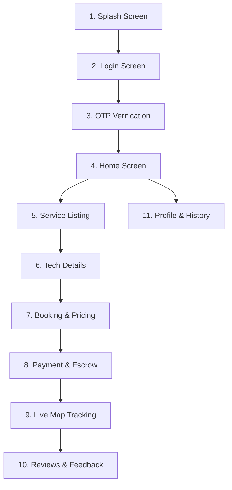

# HomeHero - UI/UX Design System & Mobile App Flow Specification

**Document Version:** 2.0 (Senior UX Designer Complete Specification)  
**Author:** Senior UX Designer  
**Date:** June 17, 2026  
**Status:** Approved for Frontend Scaffolding  

---

## 1. Design System Foundation (Style Guide)
HomeHero’s interface is designed around a premium, modern aesthetic utilizing a dark slate theme, HSL-tailored colors, soft glowing gradients, glassmorphism card layouts, and micro-animations to convey a premium, trustworthy look and feel.

### 1.1 Color Palette

| Token | HSL / Hex Code | Usage |
| :--- | :--- | :--- |
| **Primary (Royal Indigo)** | `hsl(245, 75%, 55%)` | Primary CTAs, active highlights, key navigation states. |
| **Accent (Hero Violet)** | `hsl(270, 80%, 65%)` | Secondary options, brand accents, decorative card borders. |
| **Success (Verified Mint)** | `hsl(155, 65%, 45%)` | Verification badges, completed indicators, success states. |
| **Warning (Alert Amber)** | `hsl(38, 90%, 55%)` | Cancellation notices, transaction status alerts. |
| **Danger (Alert Red)** | `hsl(5, 85%, 55%)` | Action declines, errors, SOS triggers. |
| **Background (Slate Dark)** | `hsl(220, 20%, 10%)` | Main dark-theme background. |
| **Card (Glass Overlay)** | `hsla(220, 20%, 15%, 0.7)`| Glassmorphism card surfaces. |

### 1.2 Typography
*   **Primary Typeface:** *Outfit* (Google Fonts) - Clean, round geometric lines for headings and brand elements.
*   **Secondary Typeface:** *Inter* - Optimized for readability in text-heavy lists, prices, and forms.
*   **Scale Hierarchy:**
    *   `h1` (Page Title): `2.0rem (32px)` / Bold
    *   `h2` (Card Titles / Section Header): `1.3rem (20.8px)` / Medium
    *   `body` (Paragraph text): `1.0rem (16px)` / Regular
    *   `caption` (Subtext & details): `0.85rem (13.6px)` / Light

---

## 2. Complete 11-Screen Mobile App Flow

Below is the step-by-step wireframe layout structure for all 11 core screens of the HomeHero customer application.

---

### Screen 1: Splash Screen
*   **Visual Layout:** Centered glowing brand logo of HomeHero (`🦸‍♂️`) set against a deep Royal Indigo background with a subtle radar-pulse animation.
*   **Elements:** 
    *   Brand Icon (glowing vector).
    *   Typography: "HomeHero" in bold Outfit font.
    *   Dynamic load indicator: "Hyperlocal Home Care, Verified instantly."
*   **UX Recommendation:** Maintain launch duration under 1.5 seconds, pre-fetching regional configurations in the background.

---

### Screen 2: Login Screen
*   **Visual Layout:** Sleek top-aligned brand logo with an interactive phone number input card.
*   **Elements:**
    *   Input Field: Mobile phone number field with country code prefix selector (`+91`).
    *   Secondary Action: Social logins (Google/Apple) in glassmorphic pill buttons.
    *   CTA: Large "Request OTP" button using a linear primary-to-accent gradient.
*   **UX Recommendation:** Auto-focus the mobile input field on mount and display the numeric keyboard by default.

---

### Screen 3: OTP Verification Screen
*   **Visual Layout:** Clean layout showing the verification subtitle.
*   **Elements:**
    *   Text: "Code sent to +91 98XXX-XX210" with an Edit button to return.
    *   Input Fields: 6 individual, high-contrast numeric boxes with automatic active state focus changes.
    *   Countdown Timer: "Resend Code in 45s".
*   **UX Recommendation:** Integrate automatic SMS reader API to fetch and paste the OTP code instantly.

---

### Screen 4: Home Screen (Customer Dashboard)
*   **Visual Layout:** Structured top search bar with double column grid tiles for service categories.
*   **Elements:**
    *   Header: Greeting with user name and address dropdown selector.
    *   Search Input: "Search for Electrician, Plumber..."
    *   Category Grid: Large card buttons for **Electrician (⚡)**, **Plumber (🚰)**, **Carpenter (🔧)**, and **AC Repair (❄️)**.
    *   Hero+ Membership Promo Banner: Waived service fees info card.
*   **UX Recommendation:** Place a persistent "Simple View" toggle at the top right for senior-friendly accessibility layouts.

---

### Screen 5: Service Listing Screen
*   **Visual Layout:** Single column vertical cards showing standard service packages.
*   **Elements:**
    *   Category Header: e.g., "Plumbing Repairs" with back navigation.
    *   Package Cards: e.g., "Leaky Tap Repair", "Drain Blockage", "Washbasin Installation".
    *   Metadata: Base prices, typical duration, and popularity badges ("Most Booked").
    *   Sticky Footer: "Items in booking: 1 | Estimate: ₹450".
*   **UX Recommendation:** Use clear illustration thumbnails for each package to increase confidence.

---

### Screen 6: Technician Details Screen
*   **Visual Layout:** Split-screen overlay. Upper third shows profile; lower two-thirds shows reviews and verification.
*   **Elements:**
    *   Header: Profile photo, verified checkmark badge (`✓ Verified Hero`), overall score (`★ 4.9`), and completed job count.
    *   Vetting Panel: Explicit indicators ("Checkr background check passed", "License verified", "Fully Insured up to ₹50k").
    *   Recent Reviews List: Scrolling feed showing review details.
*   **UX Recommendation:** Emphasize the "Verified" indicator to reduce client safety anxieties.

---

### Screen 7: Booking Screen (Price Estimator)
*   **Visual Layout:** Form-based layout compiling totals dynamically.
*   **Elements:**
    *   Input Options: Incrementor selectors (e.g., number of appliances to service).
    *   Scheduler Grid: Calendar picker with 1-hour slots.
    *   Dynamic Cost Summary Panel: Real-time estimate breakdown showing base rates, surcharge parameters, and totals.
*   **UX Recommendation:** Avoid full page refreshes. Calculate price parameters inline as selections change.

---

### Screen 8: Payment Screen (Escrow Authorization)
*   **Visual Layout:** Checkout layout focusing on secure payment structures.
*   **Elements:**
    *   Billing Breakdown: Detailed cost summary listing total payment (held in escrow).
    *   Payment Methods: UPI (Google Pay / PhonePe) quick-actions, credit cards, or net-banking options.
    *   Trust Prompt: "Payment will be held securely. Only released to technician after job sign-off."
*   **UX Recommendation:** Place the Stripe Secure checkout branding logo prominently to build trust.

---

### Screen 9: Live Tracking Screen
*   **Visual Layout:** Full-screen geofenced map layer with profile card overlay.
*   **Elements:**
    *   Map layer: Showpins for home address, technician's real-time coordinate position (updated via WebSockets), and route trajectory.
    *   Hero Card Overlay: Marcus's photo, star rating, ETA text ("Arriving in 6 minutes"), call/chat quick actions, and an emergency SOS panic button.
*   **UX Recommendation:** Maintain a clear vehicle path and provide a push notification when the tech is within 100 meters.

---

### Screen 10: Reviews & Ratings Screen
*   **Visual Layout:** Simple card feedback collection form.
*   **Elements:**
    *   Star Rating: 5 large stars allowing tap interactions.
    *   Quick tags: Option tags ("Punctual", "Clean cleanup", "Fair behavior").
    *   Comment Box: Text area for detailed remarks.
    *   CTA: "Submit Review & Complete Escrow".
*   **UX Recommendation:** Prompt the review screen immediately upon job completion for maximum capture.

---

### Screen 11: Profile & History Screen
*   **Visual Layout:** Clean account options menu.
*   **Elements:**
    *   User Info: Name, phone, and verification badge.
    *   History List: Cards for past bookings detailing dates, services, costs, and a "Rebook Same Hero" quick-button.
    *   Support: Dispute center links and cancellation policies.
*   **UX Recommendation:** Simplify receipt downloads and repeat booking procedures.

---

## 3. Accessibility Options & UX Best Practices

### 3.1 Senior-Friendly Accessibility Toggle
*   **Trigger:** Persistent toggle labeled "Simple View" (glasses icon 👓) located on home and profile screens.
*   **Behavior:**
    *   Enforces double body font size (`1.5rem / 24px`).
    *   Transforms all multi-column layouts into single-column vertical grids.
    *   Allows voice-recording inputs instead of picking complex dropdown selections.

### 3.2 Escrow Payment Trust Prompts
*   Throughout checkout, include micro-copy: *"Your funds are safe. Payout is released to Suresh only after you sign off on the work checklist."*
